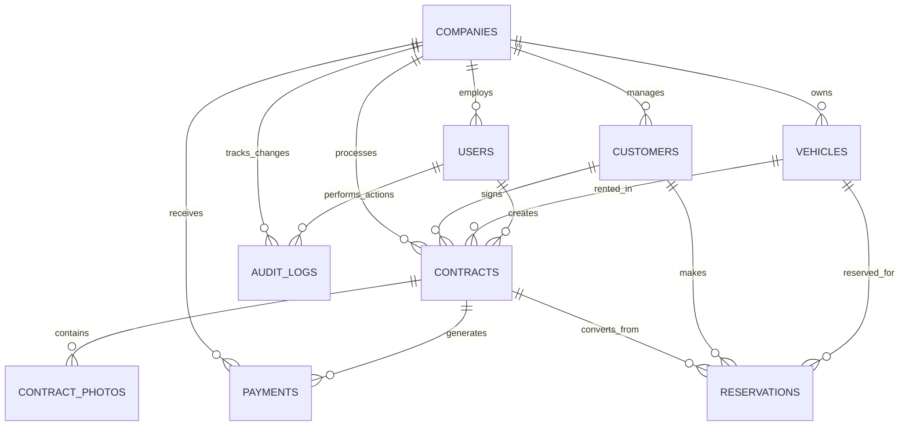

# Car Rental SaaS - Data Models & Database Schema

## Database Architecture Overview

The Car Rental SaaS uses PostgreSQL 15 with multi-tenant Row Level Security (RLS) for complete data
isolation. The schema is optimized for Swiss compliance, audit trails, and high-performance
operations.

## Schema Design Principles

1. **Multi-Tenant Isolation**: Every table includes `company_id` for data segregation
2. **UUID Primary Keys**: Globally unique identifiers prevent collisions
3. **Soft Deletes**: `is_active` flags maintain data history
4. **Audit Trails**: Comprehensive change tracking
5. **Swiss Compliance**: GDPR-ready fields and data retention
6. **Performance Optimized**: Strategic indexing and materialized views

## Core Entity Relationship Diagram



## Database Schema

### Companies Table (Multi-tenant Root)

```sql
CREATE TABLE companies (
    id UUID PRIMARY KEY DEFAULT gen_random_uuid(),
    name VARCHAR(255) NOT NULL,
    slug VARCHAR(100) UNIQUE NOT NULL, -- For subdomains
    vat_number VARCHAR(50) UNIQUE,

    -- Address information
    address TEXT NOT NULL,
    city VARCHAR(100) NOT NULL,
    postal_code VARCHAR(10) NOT NULL,
    canton VARCHAR(2) NOT NULL CHECK (canton IN (
        'AG','AI','AR','BE','BL','BS','FR','GE','GL','GR','JU',
        'LU','NE','NW','OW','SG','SH','SO','SZ','TG','TI','UR',
        'VD','VS','ZG','ZH'
    )),
    country VARCHAR(2) DEFAULT 'CH',

    -- Contact information
    phone VARCHAR(20) NOT NULL CHECK (phone ~ '^\+41[0-9\s\-]+$'),
    email VARCHAR(255) NOT NULL CHECK (email ~* '^[A-Za-z0-9._%+-]+@[A-Za-z0-9.-]+\.[A-Za-z]{2,}$'),
    website VARCHAR(255),

    -- Subscription and billing
    subscription_tier VARCHAR(20) DEFAULT 'starter' CHECK (
        subscription_tier IN ('starter', 'professional', 'business', 'enterprise')
    ),
    subscription_status VARCHAR(20) DEFAULT 'trial' CHECK (
        subscription_status IN ('trial', 'active', 'suspended', 'cancelled', 'expired')
    ),
    trial_ends_at TIMESTAMP,
    billing_cycle VARCHAR(20) DEFAULT 'monthly' CHECK (billing_cycle IN ('monthly', 'yearly')),
    next_billing_date DATE,

    -- Business settings
    business_hours JSONB DEFAULT '{"monday": {"open": "08:00", "close": "18:00"}, "tuesday": {"open": "08:00", "close": "18:00"}, "wednesday": {"open": "08:00", "close": "18:00"}, "thursday": {"open": "08:00", "close": "18:00"}, "friday": {"open": "08:00", "close": "18:00"}, "saturday": {"open": "09:00", "close": "17:00"}, "sunday": {"closed": true}}'::jsonb,
    settings JSONB DEFAULT '{
        "currency": "CHF",
        "vat_rate": 7.7,
        "default_fuel_price": 1.65,
        "km_price": 0.25,
        "late_return_fee": 50.00,
        "cleaning_fee": 30.00,
        "contract_templates": {
            "default": "standard_swiss"
        }
    }'::jsonb,

    -- Compliance and security
    gdpr_contact_email VARCHAR(255),
    data_retention_days INTEGER DEFAULT 2555, -- 7 years Swiss requirement

    -- Metadata
    created_at TIMESTAMP DEFAULT NOW(),
    updated_at TIMESTAMP DEFAULT NOW(),
    is_active BOOLEAN DEFAULT true,

    -- Constraints
    CONSTRAINT valid_email CHECK (email ~* '^[A-Za-z0-9._%+-]+@[A-Za-z0-9.-]+\.[A-Za-z]{2,}$'),
    CONSTRAINT valid_phone CHECK (phone ~ '^\+41[0-9\s\-]+$'),
    CONSTRAINT valid_slug CHECK (slug ~ '^[a-z0-9\-]+$')
);

-- Indexes for companies
CREATE INDEX idx_companies_slug ON companies(slug);
CREATE INDEX idx_companies_subscription ON companies(subscription_status, subscription_tier);
CREATE INDEX idx_companies_active ON companies(is_active) WHERE is_active = true;
```

### Users Table (Staff Management)

```sql
CREATE TABLE users (
    id UUID PRIMARY KEY DEFAULT gen_random_uuid(),
    company_id UUID NOT NULL REFERENCES companies(id) ON DELETE CASCADE,

    -- Authentication
    email VARCHAR(255) UNIQUE NOT NULL,
    email_verified_at TIMESTAMP,
    password_hash VARCHAR(255), -- Handled by Supabase Auth

    -- Profile information
    full_name VARCHAR(255) NOT NULL,
    first_name VARCHAR(100) NOT NULL,
    last_name VARCHAR(100) NOT NULL,
    phone VARCHAR(20) CHECK (phone ~ '^\+41[0-9\s\-]+$'),
    avatar_url TEXT,

    -- Role and permissions
    role VARCHAR(20) NOT NULL CHECK (role IN ('owner', 'manager', 'staff', 'viewer')),
    permissions JSONB DEFAULT '{}'::jsonb,
    department VARCHAR(50),
    job_title VARCHAR(100),

    -- Employment details
    employee_id VARCHAR(50),
    hire_date DATE,
    salary_range VARCHAR(20), -- For role-based access

    -- Security and access
    is_active BOOLEAN DEFAULT true,
    two_factor_enabled BOOLEAN DEFAULT false,
    last_login TIMESTAMP,
    last_login_ip INET,
    failed_login_attempts INTEGER DEFAULT 0,
    locked_until TIMESTAMP,
    password_changed_at TIMESTAMP,

    -- Preferences
    language VARCHAR(10) DEFAULT 'de-CH',
    timezone VARCHAR(50) DEFAULT 'Europe/Zurich',
    notifications JSONB DEFAULT '{
        "email": true,
        "push": true,
        "sms": false,
        "contract_created": true,
        "payment_received": true,
        "vehicle_maintenance": true
    }'::jsonb,

    -- Metadata
    created_at TIMESTAMP DEFAULT NOW(),
    updated_at TIMESTAMP DEFAULT NOW(),
    created_by UUID REFERENCES users(id),

    -- Constraints
    CONSTRAINT valid_user_email CHECK (email ~* '^[A-Za-z0-9._%+-]+@[A-Za-z0-9.-]+\.[A-Za-z]{2,}$'),
    CONSTRAINT valid_phone_format CHECK (phone IS NULL OR phone ~ '^\+41[0-9\s\-]+$')
);

-- Indexes for users
CREATE INDEX idx_users_company ON users(company_id) WHERE is_active = true;
CREATE INDEX idx_users_email ON users(email);
CREATE INDEX idx_users_role ON users(company_id, role) WHERE is_active = true;
```

### Customers Table

```sql
CREATE TABLE customers (
    id UUID PRIMARY KEY DEFAULT gen_random_uuid(),
    company_id UUID NOT NULL REFERENCES companies(id) ON DELETE CASCADE,

    -- Personal information
    first_name VARCHAR(100) NOT NULL,
    last_name VARCHAR(100) NOT NULL,
    full_name VARCHAR(201) GENERATED ALWAYS AS (first_name || ' ' || last_name) STORED,
    date_of_birth DATE NOT NULL,
    nationality VARCHAR(2) DEFAULT 'CH',

    -- Contact information
    email VARCHAR(255),
    phone VARCHAR(20) NOT NULL CHECK (phone ~ '^\+41[0-9\s\-]+$'),
    mobile VARCHAR(20) CHECK (mobile ~ '^\+41[0-9\s\-]+$'),

    -- Address
    address TEXT NOT NULL,
    address_2 TEXT,
    city VARCHAR(100) NOT NULL,
    postal_code VARCHAR(10) NOT NULL,
    canton VARCHAR(2),
    country VARCHAR(2) DEFAULT 'CH',

    -- Identification documents
    id_type VARCHAR(20) NOT NULL CHECK (id_type IN ('passport', 'swiss_id', 'residence_permit', 'driver_license')),
    id_number VARCHAR(50) NOT NULL,
    id_issuer VARCHAR(100),
    id_issue_date DATE,
    id_expiry DATE,

    -- Driver license information
    driver_license_number VARCHAR(50) NOT NULL,
    driver_license_country VARCHAR(2) DEFAULT 'CH',
    driver_license_issue_date DATE,
    driver_license_expiry DATE NOT NULL,
    driver_license_category VARCHAR(10) NOT NULL,
    license_points_balance INTEGER DEFAULT 0,

    -- Risk assessment
    is_blacklisted BOOLEAN DEFAULT false,
    blacklist_reason TEXT,
    blacklisted_at TIMESTAMP,
    blacklisted_by UUID REFERENCES users(id),
    risk_level VARCHAR(10) DEFAULT 'low' CHECK (risk_level IN ('low', 'medium', 'high')),
    risk_notes TEXT,

    -- Verification status
    identity_verified BOOLEAN DEFAULT false,
    identity_verified_at TIMESTAMP,
    identity_verified_by UUID REFERENCES users(id),
    license_verified BOOLEAN DEFAULT false,
    license_verified_at TIMESTAMP,

    -- GDPR compliance
    gdpr_consent BOOLEAN DEFAULT false,
    gdpr_consent_date TIMESTAMP,
    gdpr_consent_version VARCHAR(10),
    marketing_consent BOOLEAN DEFAULT false,
    data_processing_consent BOOLEAN DEFAULT true,
    gdpr_anonymized BOOLEAN DEFAULT false,
    gdpr_anonymized_at TIMESTAMP,

    -- Customer relationship
    customer_since DATE DEFAULT CURRENT_DATE,
    total_contracts INTEGER DEFAULT 0,
    total_revenue DECIMAL(12,2) DEFAULT 0.00,
    average_rental_days DECIMAL(5,2) DEFAULT 0,
    last_rental_date DATE,

    -- Notes and preferences
    notes TEXT,
    internal_notes TEXT, -- Staff only
    preferred_contact_method VARCHAR(20) DEFAULT 'email' CHECK (
        preferred_contact_method IN ('email', 'phone', 'sms', 'whatsapp')
    ),
    language_preference VARCHAR(10) DEFAULT 'de-CH',

    -- Metadata
    created_at TIMESTAMP DEFAULT NOW(),
    updated_at TIMESTAMP DEFAULT NOW(),
    created_by UUID REFERENCES users(id),
    is_active BOOLEAN DEFAULT true,
    version INTEGER DEFAULT 1,

    -- Constraints
    CONSTRAINT valid_age CHECK (date_of_birth < CURRENT_DATE - INTERVAL '18 years'),
    CONSTRAINT valid_license_expiry CHECK (driver_license_expiry > CURRENT_DATE),
    CONSTRAINT valid_customer_email CHECK (email IS NULL OR email ~* '^[A-Za-z0-9._%+-]+@[A-Za-z0-9.-]+\.[A-Za-z]{2,}$')
);

-- Indexes for customers
CREATE INDEX idx_customers_company ON customers(company_id) WHERE is_active = true;
CREATE INDEX idx_customers_search ON customers USING gin(
    company_id,
    to_tsvector('german', full_name || ' ' || coalesce(email, '') || ' ' || phone)
);
CREATE INDEX idx_customers_phone ON customers(company_id, phone);
CREATE INDEX idx_customers_email ON customers(company_id, email) WHERE email IS NOT NULL;
CREATE INDEX idx_customers_blacklist ON customers(company_id, is_blacklisted) WHERE is_blacklisted = true;
CREATE INDEX idx_customers_license_expiry ON customers(driver_license_expiry) WHERE is_active = true;
```

### Vehicles Table

```sql
CREATE TABLE vehicles (
    id UUID PRIMARY KEY DEFAULT gen_random_uuid(),
    company_id UUID NOT NULL REFERENCES companies(id) ON DELETE CASCADE,

    -- Vehicle identification
    license_plate VARCHAR(20) UNIQUE NOT NULL,
    vin VARCHAR(17) UNIQUE,
    vehicle_registration_number VARCHAR(50),

    -- Vehicle details
    make VARCHAR(50) NOT NULL,
    model VARCHAR(50) NOT NULL,
    variant VARCHAR(100),
    year INTEGER NOT NULL CHECK (year >= 1990 AND year <= EXTRACT(YEAR FROM CURRENT_DATE) + 2),
    color VARCHAR(30),

    -- Classification
    vehicle_type VARCHAR(20) NOT NULL CHECK (vehicle_type IN (
        'economy', 'compact', 'intermediate', 'standard', 'fullsize',
        'premium', 'luxury', 'convertible', 'suv', 'van', 'truck', 'electric'
    )),
    category VARCHAR(20) NOT NULL CHECK (category IN (
        'passenger', 'commercial', 'luxury', 'utility', 'electric'
    )),

    -- Technical specifications
    transmission VARCHAR(20) DEFAULT 'manual' CHECK (transmission IN ('manual', 'automatic', 'cvt')),
    fuel_type VARCHAR(20) DEFAULT 'petrol' CHECK (fuel_type IN (
        'petrol', 'diesel', 'hybrid', 'electric', 'lpg', 'cng'
    )),
    engine_size DECIMAL(3,1), -- In liters
    power_hp INTEGER,
    power_kw INTEGER,
    seats INTEGER NOT NULL CHECK (seats > 0 AND seats <= 20),
    doors INTEGER CHECK (doors IN (2, 3, 4, 5)),

    -- Pricing
    daily_rate DECIMAL(10,2) NOT NULL CHECK (daily_rate > 0),
    weekly_rate DECIMAL(10,2) NOT NULL CHECK (weekly_rate > 0),
    monthly_rate DECIMAL(10,2) NOT NULL CHECK (monthly_rate > 0),
    weekend_rate DECIMAL(10,2) CHECK (weekend_rate > 0),
    holiday_rate DECIMAL(10,2) CHECK (holiday_rate > 0),
    deposit_amount DECIMAL(10,2) NOT NULL CHECK (deposit_amount >= 0),

    -- Current status and condition
    status VARCHAR(20) DEFAULT 'available' CHECK (status IN (
        'available', 'rented', 'maintenance', 'cleaning', 'inspection', 'retired', 'sold'
    )),
    condition_rating INTEGER DEFAULT 5 CHECK (condition_rating >= 1 AND condition_rating <= 5),

    -- Mileage and fuel
    purchase_km INTEGER DEFAULT 0,
    current_km INTEGER NOT NULL CHECK (current_km >= 0),
    last_service_km INTEGER,
    fuel_level INTEGER NOT NULL CHECK (fuel_level >= 0 AND fuel_level <= 100),
    fuel_capacity DECIMAL(5,1) CHECK (fuel_capacity > 0), -- In liters
    fuel_efficiency DECIMAL(4,1), -- L/100km or kWh/100km

    -- Maintenance and service
    next_service_km INTEGER,
    next_service_date DATE,
    next_inspection_date DATE,
    service_interval_km INTEGER DEFAULT 15000,
    service_interval_months INTEGER DEFAULT 12,

    -- Insurance and registration
    insurance_policy_number VARCHAR(50),
    insurance_company VARCHAR(100),
    insurance_expiry DATE,
    registration_expiry DATE,
    road_tax_expiry DATE,

    -- Equipment and features
    features TEXT[] DEFAULT '{}',
    equipment JSONB DEFAULT '{}'::jsonb,
    accessories TEXT[],

    -- GPS and tracking
    gps_enabled BOOLEAN DEFAULT false,
    tracking_device_id VARCHAR(100),

    -- Financial information
    purchase_date DATE,
    purchase_price DECIMAL(12,2),
    current_value DECIMAL(12,2),
    depreciation_method VARCHAR(20) DEFAULT 'linear',

    -- Location
    current_location VARCHAR(100),
    home_location VARCHAR(100),

    -- Availability settings
    min_rental_days INTEGER DEFAULT 1,
    max_rental_days INTEGER DEFAULT 365,
    advance_booking_days INTEGER DEFAULT 90,

    -- Internal notes
    notes TEXT,
    maintenance_notes TEXT,
    damage_history TEXT[],

    -- Metadata
    created_at TIMESTAMP DEFAULT NOW(),
    updated_at TIMESTAMP DEFAULT NOW(),
    is_active BOOLEAN DEFAULT true,

    -- Constraints
    CONSTRAINT valid_rates CHECK (
        weekly_rate < daily_rate * 7 AND
        monthly_rate < daily_rate * 30
    ),
    CONSTRAINT valid_service_km CHECK (
        next_service_km IS NULL OR next_service_km > current_km
    )
);

-- Indexes for vehicles
CREATE INDEX idx_vehicles_company_active ON vehicles(company_id, status) WHERE is_active = true;
CREATE INDEX idx_vehicles_availability ON vehicles(company_id, status, is_active);
CREATE INDEX idx_vehicles_type ON vehicles(company_id, vehicle_type, category) WHERE is_active = true;
CREATE INDEX idx_vehicles_maintenance ON vehicles(next_service_date, next_service_km) WHERE is_active = true;
CREATE INDEX idx_vehicles_license_plate ON vehicles(license_plate);
CREATE INDEX idx_vehicles_vin ON vehicles(vin) WHERE vin IS NOT NULL;
```

### Contracts Table (Core Business Entity)

```sql
CREATE TABLE contracts (
    id UUID PRIMARY KEY DEFAULT gen_random_uuid(),
    company_id UUID NOT NULL REFERENCES companies(id) ON DELETE CASCADE,
    contract_number VARCHAR(20) UNIQUE NOT NULL,

    -- Relationships
    customer_id UUID NOT NULL REFERENCES customers(id),
    vehicle_id UUID NOT NULL REFERENCES vehicles(id),
    created_by UUID NOT NULL REFERENCES users(id),

    -- Contract dates and duration
    start_date TIMESTAMP NOT NULL,
    end_date TIMESTAMP NOT NULL,
    actual_start_date TIMESTAMP,
    actual_return_date TIMESTAMP,
    grace_period_hours INTEGER DEFAULT 1,

    -- Pickup information
    pickup_location TEXT,
    pickup_km INTEGER NOT NULL CHECK (pickup_km >= 0),
    pickup_fuel INTEGER NOT NULL CHECK (pickup_fuel >= 0 AND pickup_fuel <= 100),
    pickup_photos TEXT[],
    pickup_notes TEXT,
    pickup_staff UUID REFERENCES users(id),
    pickup_completed BOOLEAN DEFAULT false,
    pickup_completed_at TIMESTAMP,

    -- Return information
    return_location TEXT,
    return_km INTEGER CHECK (return_km >= pickup_km),
    return_fuel INTEGER CHECK (return_fuel >= 0 AND return_fuel <= 100),
    return_photos TEXT[],
    return_notes TEXT,
    return_staff UUID REFERENCES users(id),
    return_completed BOOLEAN DEFAULT false,
    return_completed_at TIMESTAMP,

    -- Pricing and billing
    rate_type VARCHAR(20) NOT NULL CHECK (rate_type IN ('hourly', 'daily', 'weekly', 'monthly')),
    base_rate DECIMAL(10,2) NOT NULL CHECK (base_rate > 0),
    total_days INTEGER NOT NULL CHECK (total_days > 0),

    -- Mileage pricing
    km_included INTEGER DEFAULT 0,
    extra_km_rate DECIMAL(10,4) DEFAULT 0.25,
    extra_km_used INTEGER DEFAULT 0,
    extra_km_charges DECIMAL(10,2) DEFAULT 0,

    -- Additional charges
    fuel_charge DECIMAL(10,2) DEFAULT 0,
    cleaning_charge DECIMAL(10,2) DEFAULT 0,
    damage_charge DECIMAL(10,2) DEFAULT 0,
    late_return_charge DECIMAL(10,2) DEFAULT 0,
    other_charges DECIMAL(10,2) DEFAULT 0,
    other_charges_description TEXT,

    -- Totals and tax
    subtotal DECIMAL(10,2) NOT NULL CHECK (subtotal >= 0),
    discount_amount DECIMAL(10,2) DEFAULT 0,
    discount_reason TEXT,
    vat_rate DECIMAL(5,2) DEFAULT 7.7 CHECK (vat_rate >= 0 AND vat_rate <= 100),
    vat_amount DECIMAL(10,2) NOT NULL CHECK (vat_amount >= 0),
    total_amount DECIMAL(10,2) NOT NULL CHECK (total_amount >= 0),

    -- Deposit handling
    deposit_amount DECIMAL(10,2) NOT NULL CHECK (deposit_amount >= 0),
    deposit_status VARCHAR(20) DEFAULT 'pending' CHECK (deposit_status IN (
        'pending', 'held', 'partial_held', 'released', 'forfeited'
    )),
    deposit_held_at TIMESTAMP,
    deposit_released_at TIMESTAMP,
    deposit_forfeited_amount DECIMAL(10,2) DEFAULT 0,

    -- Payment status
    payment_status VARCHAR(20) DEFAULT 'pending' CHECK (payment_status IN (
        'pending', 'partial', 'paid', 'overpaid', 'refunded', 'cancelled'
    )),
    amount_paid DECIMAL(10,2) DEFAULT 0,
    amount_due DECIMAL(10,2) GENERATED ALWAYS AS (total_amount - amount_paid) STORED,

    -- Contract status and workflow
    status VARCHAR(20) DEFAULT 'draft' CHECK (status IN (
        'draft', 'confirmed', 'active', 'completed', 'cancelled', 'void'
    )),

    -- Digital documents
    contract_pdf_url TEXT,
    contract_pdf_generated_at TIMESTAMP,

    -- Digital signatures
    customer_signature_url TEXT,
    customer_signed_at TIMESTAMP,
    customer_signature_ip INET,
    staff_signature_url TEXT,
    staff_signed_at TIMESTAMP,
    staff_signature_ip INET,

    -- Cancellation and modifications
    cancellation_reason TEXT,
    cancelled_at TIMESTAMP,
    cancelled_by UUID REFERENCES users(id),
    cancellation_fee DECIMAL(10,2) DEFAULT 0,

    -- Extensions and modifications
    original_end_date TIMESTAMP,
    extension_count INTEGER DEFAULT 0,
    modification_count INTEGER DEFAULT 0,

    -- Terms and conditions
    terms_version VARCHAR(10) DEFAULT '1.0',
    special_terms TEXT,

    -- Customer information snapshot (for historical purposes)
    customer_snapshot JSONB,
    vehicle_snapshot JSONB,

    -- Internal tracking
    notes TEXT,
    internal_notes TEXT,
    tags TEXT[],
    priority VARCHAR(10) DEFAULT 'normal' CHECK (priority IN ('low', 'normal', 'high', 'urgent')),

    -- Metadata
    created_at TIMESTAMP DEFAULT NOW(),
    updated_at TIMESTAMP DEFAULT NOW(),
    version INTEGER DEFAULT 1,

    -- Constraints
    CONSTRAINT valid_contract_dates CHECK (end_date > start_date),
    CONSTRAINT valid_actual_dates CHECK (
        actual_start_date IS NULL OR actual_start_date >= start_date
    ),
    CONSTRAINT valid_return_date CHECK (
        actual_return_date IS NULL OR actual_return_date >= start_date
    ),
    CONSTRAINT valid_amounts CHECK (
        subtotal >= 0 AND
        vat_amount >= 0 AND
        total_amount >= 0 AND
        deposit_amount >= 0
    )
);

-- Indexes for contracts
CREATE INDEX idx_contracts_company_active ON contracts(company_id, status)
    WHERE status IN ('active', 'confirmed', 'draft');
CREATE INDEX idx_contracts_dates ON contracts(company_id, start_date, end_date);
CREATE INDEX idx_contracts_customer ON contracts(customer_id, status);
CREATE INDEX idx_contracts_vehicle ON contracts(vehicle_id, status);
CREATE INDEX idx_contracts_payment_status ON contracts(company_id, payment_status)
    WHERE payment_status IN ('pending', 'partial');
CREATE INDEX idx_contracts_search ON contracts USING gin(
    to_tsvector('german', contract_number || ' ' || coalesce(notes, ''))
);
CREATE UNIQUE INDEX idx_contracts_number ON contracts(contract_number);
```

## Additional Supporting Tables

### Contract Photos Table

```sql
CREATE TABLE contract_photos (
    id UUID PRIMARY KEY DEFAULT gen_random_uuid(),
    contract_id UUID NOT NULL REFERENCES contracts(id) ON DELETE CASCADE,
    company_id UUID NOT NULL REFERENCES companies(id) ON DELETE CASCADE,

    -- Photo classification
    photo_type VARCHAR(20) NOT NULL CHECK (photo_type IN (
        'pickup_exterior', 'pickup_interior', 'pickup_damage', 'pickup_fuel', 'pickup_km',
        'return_exterior', 'return_interior', 'return_damage', 'return_fuel', 'return_km',
        'damage_detail', 'repair_evidence', 'customer_id', 'driver_license', 'signature'
    )),
    photo_category VARCHAR(20) NOT NULL CHECK (photo_category IN (
        'vehicle_exterior', 'vehicle_interior', 'dashboard', 'damage', 'document', 'signature', 'other'
    )),

    -- File information
    storage_path TEXT NOT NULL,
    storage_bucket VARCHAR(100) DEFAULT 'contract-photos',
    public_url TEXT,
    thumbnail_url TEXT,
    file_name VARCHAR(255) NOT NULL,
    file_size INTEGER,
    mime_type VARCHAR(100),
    image_width INTEGER,
    image_height INTEGER,

    -- Content information
    caption TEXT,
    description TEXT,
    damage_description TEXT,
    severity_level VARCHAR(10) CHECK (severity_level IN ('low', 'medium', 'high', 'critical')),

    -- Location and positioning
    position VARCHAR(20) CHECK (position IN (
        'front', 'rear', 'left_side', 'right_side', 'top', 'interior', 'dashboard', 'engine'
    )),
    gps_coordinates POINT,

    -- Annotations and markup
    annotations JSONB DEFAULT '[]'::jsonb,
    has_annotations BOOLEAN DEFAULT false,

    -- Processing status
    processing_status VARCHAR(20) DEFAULT 'uploaded' CHECK (processing_status IN (
        'uploading', 'uploaded', 'processing', 'processed', 'failed'
    )),
    compressed BOOLEAN DEFAULT false,

    -- Metadata
    uploaded_at TIMESTAMP DEFAULT NOW(),
    uploaded_by UUID NOT NULL REFERENCES users(id),
    processed_at TIMESTAMP,
    sort_order INTEGER DEFAULT 0,
    is_deleted BOOLEAN DEFAULT false,
    deleted_at TIMESTAMP,

    -- GDPR and compliance
    gdpr_sensitive BOOLEAN DEFAULT false,
    retention_until DATE
);

-- Indexes for contract photos
CREATE INDEX idx_contract_photos_contract ON contract_photos(contract_id) WHERE NOT is_deleted;
CREATE INDEX idx_contract_photos_type ON contract_photos(photo_type, photo_category);
CREATE INDEX idx_contract_photos_uploaded ON contract_photos(uploaded_at, uploaded_by);
```

### Payments Table

```sql
CREATE TABLE payments (
    id UUID PRIMARY KEY DEFAULT gen_random_uuid(),
    company_id UUID NOT NULL REFERENCES companies(id) ON DELETE CASCADE,

    -- Relationships
    contract_id UUID REFERENCES contracts(id),
    customer_id UUID REFERENCES customers(id),
    processed_by UUID REFERENCES users(id),

    -- Payment details
    amount DECIMAL(10,2) NOT NULL CHECK (amount != 0),
    currency VARCHAR(3) DEFAULT 'CHF',
    exchange_rate DECIMAL(10,6) DEFAULT 1.0,
    amount_local DECIMAL(10,2) GENERATED ALWAYS AS (amount * exchange_rate) STORED,

    -- Payment classification
    payment_type VARCHAR(20) NOT NULL CHECK (payment_type IN (
        'deposit', 'rental_fee', 'damage_charge', 'cleaning_fee', 'late_fee',
        'fuel_charge', 'extension_fee', 'cancellation_fee', 'refund', 'adjustment'
    )),
    payment_method VARCHAR(20) NOT NULL CHECK (payment_method IN (
        'cash', 'card', 'bank_transfer', 'twint', 'paypal', 'qr_bill', 'crypto', 'other'
    )),

    -- Payment status
    status VARCHAR(20) DEFAULT 'pending' CHECK (status IN (
        'pending', 'processing', 'completed', 'failed', 'cancelled', 'refunded', 'disputed'
    )),

    -- External references
    reference_number VARCHAR(50),
    transaction_id VARCHAR(100),
    authorization_code VARCHAR(50),

    -- Payment processor specific
    stripe_payment_intent_id VARCHAR(100),
    stripe_charge_id VARCHAR(100),
    paypal_transaction_id VARCHAR(100),

    -- Swiss QR-bill specific
    qr_bill_reference VARCHAR(27), -- Swiss QR reference
    qr_bill_url TEXT,
    qr_bill_iban VARCHAR(34),

    -- Processing information
    processed_at TIMESTAMP,
    gateway_response JSONB,

    -- Failure and dispute handling
    failure_reason TEXT,
    failure_code VARCHAR(50),
    retry_count INTEGER DEFAULT 0,
    dispute_reason TEXT,
    disputed_at TIMESTAMP,

    -- Refund information
    refund_reason TEXT,
    refunded_at TIMESTAMP,
    refunded_by UUID REFERENCES users(id),
    refund_amount DECIMAL(10,2),

    -- Cash handling
    cash_received DECIMAL(10,2),
    change_given DECIMAL(10,2),
    cash_drawer_id VARCHAR(50),

    -- Reconciliation
    reconciled BOOLEAN DEFAULT false,
    reconciled_at TIMESTAMP,
    bank_statement_reference VARCHAR(100),

    -- Notes and metadata
    notes TEXT,
    internal_notes TEXT,
    metadata JSONB DEFAULT '{}'::jsonb,

    -- Timestamps
    created_at TIMESTAMP DEFAULT NOW(),
    updated_at TIMESTAMP DEFAULT NOW(),

    -- Constraints
    CONSTRAINT valid_cash_amounts CHECK (
        payment_method != 'cash' OR (cash_received IS NOT NULL AND cash_received >= amount)
    ),
    CONSTRAINT valid_refund_amount CHECK (
        refund_amount IS NULL OR (refund_amount > 0 AND refund_amount <= ABS(amount))
    )
);

-- Indexes for payments
CREATE INDEX idx_payments_contract ON payments(contract_id, payment_type);
CREATE INDEX idx_payments_customer ON payments(customer_id, status);
CREATE INDEX idx_payments_status ON payments(company_id, status, payment_method)
    WHERE status = 'pending';
CREATE INDEX idx_payments_processed ON payments(processed_at, amount) WHERE status = 'completed';
CREATE INDEX idx_payments_reconciliation ON payments(reconciled, processed_at)
    WHERE status = 'completed' AND NOT reconciled;
```

## Materialized Views for Performance

### Dashboard Metrics View

```sql
CREATE MATERIALIZED VIEW mv_dashboard_metrics AS
SELECT
    company_id,
    DATE(created_at) as metric_date,

    -- Contract metrics
    COUNT(*) FILTER (WHERE status IN ('completed', 'active')) as contracts_count,
    COUNT(*) FILTER (WHERE status = 'active') as active_contracts,
    COUNT(*) FILTER (WHERE status = 'completed') as completed_contracts,
    COUNT(*) FILTER (WHERE status = 'cancelled') as cancelled_contracts,

    -- Revenue metrics
    SUM(total_amount) FILTER (WHERE status IN ('completed', 'active') AND payment_status = 'paid') as total_revenue,
    AVG(total_amount) FILTER (WHERE status IN ('completed', 'active')) as avg_contract_value,
    SUM(deposit_amount) FILTER (WHERE deposit_status = 'held') as deposits_held,

    -- Operational metrics
    AVG(total_days) FILTER (WHERE status IN ('completed', 'active')) as avg_rental_duration,
    SUM(extra_km_used) FILTER (WHERE status IN ('completed', 'active')) as total_extra_km,

    -- Customer metrics
    COUNT(DISTINCT customer_id) as unique_customers,

    -- Updated timestamp
    NOW() as refreshed_at

FROM contracts
WHERE created_at >= CURRENT_DATE - INTERVAL '2 years'
GROUP BY company_id, DATE(created_at);

-- Refresh schedule
CREATE INDEX idx_dashboard_metrics ON mv_dashboard_metrics(company_id, metric_date DESC);
```

### Fleet Utilization View

```sql
CREATE MATERIALIZED VIEW mv_fleet_utilization AS
SELECT
    v.company_id,
    v.id as vehicle_id,
    v.license_plate,
    v.vehicle_type,

    -- Utilization metrics (last 30 days)
    COUNT(c.id) FILTER (WHERE c.created_at >= CURRENT_DATE - INTERVAL '30 days') as contracts_30d,
    SUM(c.total_days) FILTER (WHERE c.created_at >= CURRENT_DATE - INTERVAL '30 days') as rental_days_30d,
    ROUND(
        (SUM(c.total_days) FILTER (WHERE c.created_at >= CURRENT_DATE - INTERVAL '30 days') / 30.0) * 100,
        2
    ) as utilization_rate_30d,

    -- Revenue metrics (last 30 days)
    SUM(c.total_amount) FILTER (
        WHERE c.created_at >= CURRENT_DATE - INTERVAL '30 days'
        AND c.payment_status = 'paid'
    ) as revenue_30d,

    -- Current status
    v.status as current_status,
    v.current_km,
    v.next_service_km,

    -- Updated timestamp
    NOW() as refreshed_at

FROM vehicles v
LEFT JOIN contracts c ON c.vehicle_id = v.id AND c.status IN ('completed', 'active')
WHERE v.is_active = true
GROUP BY v.company_id, v.id, v.license_plate, v.vehicle_type, v.status, v.current_km, v.next_service_km;

CREATE INDEX idx_fleet_utilization ON mv_fleet_utilization(company_id, utilization_rate_30d DESC);
```

## Database Functions and Triggers

### Contract Number Generation

```sql
CREATE OR REPLACE FUNCTION generate_contract_number(p_company_id UUID)
RETURNS VARCHAR AS $$
DECLARE
    company_prefix VARCHAR(3);
    year_prefix VARCHAR(4);
    sequential_number INT;
    contract_number VARCHAR(20);
BEGIN
    -- Get company prefix (first 3 letters of company name, uppercase)
    SELECT UPPER(LEFT(REGEXP_REPLACE(name, '[^a-zA-Z]', '', 'g'), 3))
    INTO company_prefix
    FROM companies
    WHERE id = p_company_id;

    year_prefix := TO_CHAR(CURRENT_DATE, 'YYYY');

    -- Get next sequential number for this company and year
    SELECT COALESCE(MAX(CAST(REGEXP_REPLACE(c.contract_number, '^[A-Z]+-\d{4}-', '') AS INT)), 0) + 1
    INTO sequential_number
    FROM contracts c
    WHERE c.company_id = p_company_id
    AND c.contract_number LIKE company_prefix || '-' || year_prefix || '-%';

    contract_number := company_prefix || '-' || year_prefix || '-' || LPAD(sequential_number::TEXT, 5, '0');

    RETURN contract_number;
END;
$$ LANGUAGE plpgsql;
```

### Audit Trail Trigger

```sql
CREATE OR REPLACE FUNCTION audit_trigger()
RETURNS TRIGGER AS $$
BEGIN
    INSERT INTO audit_logs (
        company_id,
        user_id,
        action,
        entity_type,
        entity_id,
        old_values,
        new_values
    ) VALUES (
        COALESCE(NEW.company_id, OLD.company_id),
        current_setting('app.current_user_id', true)::uuid,
        TG_OP,
        TG_TABLE_NAME,
        COALESCE(NEW.id, OLD.id),
        CASE WHEN TG_OP != 'INSERT' THEN row_to_json(OLD) END,
        CASE WHEN TG_OP != 'DELETE' THEN row_to_json(NEW) END
    );

    RETURN COALESCE(NEW, OLD);
END;
$$ LANGUAGE plpgsql;

-- Apply to key tables
CREATE TRIGGER contracts_audit AFTER INSERT OR UPDATE OR DELETE ON contracts
    FOR EACH ROW EXECUTE FUNCTION audit_trigger();

CREATE TRIGGER customers_audit AFTER INSERT OR UPDATE OR DELETE ON customers
    FOR EACH ROW EXECUTE FUNCTION audit_trigger();

CREATE TRIGGER payments_audit AFTER INSERT OR UPDATE OR DELETE ON payments
    FOR EACH ROW EXECUTE FUNCTION audit_trigger();
```

## Row Level Security (RLS) Policies

```sql
-- Enable RLS on all tables
ALTER TABLE companies ENABLE ROW LEVEL SECURITY;
ALTER TABLE users ENABLE ROW LEVEL SECURITY;
ALTER TABLE customers ENABLE ROW LEVEL SECURITY;
ALTER TABLE vehicles ENABLE ROW LEVEL SECURITY;
ALTER TABLE contracts ENABLE ROW LEVEL SECURITY;
ALTER TABLE contract_photos ENABLE ROW LEVEL SECURITY;
ALTER TABLE payments ENABLE ROW LEVEL SECURITY;
ALTER TABLE audit_logs ENABLE ROW LEVEL SECURITY;

-- Company isolation policies
CREATE POLICY company_isolation_companies ON companies
    FOR ALL USING (id = (current_setting('app.current_company_id', true))::uuid);

CREATE POLICY company_isolation_users ON users
    FOR ALL USING (company_id = (current_setting('app.current_company_id', true))::uuid);

CREATE POLICY company_isolation_customers ON customers
    FOR ALL USING (company_id = (current_setting('app.current_company_id', true))::uuid);

CREATE POLICY company_isolation_vehicles ON vehicles
    FOR ALL USING (company_id = (current_setting('app.current_company_id', true))::uuid);

CREATE POLICY company_isolation_contracts ON contracts
    FOR ALL USING (company_id = (current_setting('app.current_company_id', true))::uuid);

-- Role-based policies for sensitive operations
CREATE POLICY financial_data_access ON payments
    FOR SELECT USING (
        company_id = (current_setting('app.current_company_id', true))::uuid
        AND (
            current_setting('app.current_user_role', true) IN ('owner', 'manager')
            OR processed_by = (current_setting('app.current_user_id', true))::uuid
        )
    );
```

---

**Data Models Version:** 1.0  
**Last Updated:** 2025-08-07  
**Status:** Complete Analysis  
**Coverage:** Full Multi-tenant Schema with Swiss Compliance
