# Car Rental SaaS - Integration Architecture & External Services

## Integration Overview

The Car Rental SaaS integrates with multiple external services to provide comprehensive functionality while maintaining Swiss compliance and data residency requirements. All integrations are designed with fault tolerance, security, and audit trails.

## Integration Architecture Diagram

```mermaid
graph TB
    subgraph "Core Application"
        App[CRMS Application<br/>Next.js + Supabase]
        API[Internal API Layer<br/>REST + GraphQL]
        Queue[Background Jobs<br/>Bull Queue + Redis]
    end
    
    subgraph "Payment Processing"
        Stripe[Stripe API<br/>Credit Card Processing]
        QR[Swiss QR-Bill Service<br/>Payment Generation]
        Bank[Banking APIs<br/>Payment Validation]
    end
    
    subgraph "Swiss Services"
        SwissPost[Swiss Post API<br/>Address Validation]
        VAT[VAT Validation<br/>Swiss Tax System]
        Canton[Canton Services<br/>Registration Checks]
    end
    
    subgraph "Communication"
        Email[Resend<br/>Transactional Email]
        SMS[SMS Provider<br/>Twilio/MessageBird]
        Push[Push Notifications<br/>Web Push API]
        WhatsApp[WhatsApp Business<br/>Customer Communication]
    end
    
    subgraph "Document Services"
        PDF[PDF Generation<br/>Puppeteer/React-PDF]
        Storage[File Storage<br/>Supabase Storage]
        OCR[OCR Service<br/>Document Processing]
        Signature[Digital Signatures<br/>DocuSign/eIDAS]
    end
    
    subgraph "Location & Mapping"
        Maps[Maps API<br/>Google/MapBox]
        Geocoding[Geocoding Service<br/>Address to Coordinates]
        Routing[Route Planning<br/>Delivery Optimization]
    end
    
    subgraph "Business Intelligence"
        Analytics[Analytics<br/>PostHog/Mixpanel]
        Reporting[Reporting Engine<br/>Chart.js/D3]
        Export[Data Export<br/>CSV/Excel Generation]
    end
    
    subgraph "Security & Compliance"
        Auth[Identity Verification<br/>Onfido/Jumio]
        Compliance[Compliance APIs<br/>GDPR/AML Checks]
        Monitoring[Security Monitoring<br/>Sentry/DataDog]
    end
    
    App --> API
    API --> Queue
    API --> Stripe
    API --> QR
    API --> SwissPost
    API --> Email
    API --> PDF
    API --> Maps
    API --> Analytics
    API --> Auth
    Queue --> Bank
    Queue --> SMS
    Queue --> OCR
    Queue --> Export
```



## Payment Processing Integrations

### Stripe Integration
```typescript
// lib/integrations/stripe.ts
import Stripe from 'stripe'

const stripe = new Stripe(process.env.STRIPE_SECRET_KEY!, {
  apiVersion: '2023-10-16',
  appInfo: {
    name: 'CRMS',
    version: '1.0.0',
    url: 'https://crms.swiss'
  }
})

export class StripePaymentService {
  async createPaymentIntent(amount: number, customerId: string, contractId: string): Promise<Stripe.PaymentIntent> {
    try {
      const paymentIntent = await stripe.paymentIntents.create({
        amount: Math.round(amount * 100), // Convert to cents
        currency: 'chf',
        customer: customerId,
        metadata: {
          contract_id: contractId,
          company_id: getCurrentCompanyId(),
          source: 'crms'
        },
        automatic_payment_methods: {
          enabled: true,
        },
        // Swiss-specific settings
        payment_method_options: {
          card: {
            request_three_d_secure: 'automatic'
          },
          sepa_debit: {
            mandate_options: {
              reference: `CRMS-${contractId}`
            }
          }
        }
      })
      
      // Log for audit trail
      await this.logPaymentEvent('payment_intent_created', {
        payment_intent_id: paymentIntent.id,
        amount,
        contract_id: contractId
      })
      
      return paymentIntent
    } catch (error) {
      await this.logPaymentError('payment_intent_creation_failed', error, { amount, contractId })
      throw new PaymentError('Failed to create payment intent', error)
    }
  }
  
  async handleWebhook(event: Stripe.Event): Promise<void> {
    switch (event.type) {
      case 'payment_intent.succeeded':
        await this.handlePaymentSuccess(event.data.object as Stripe.PaymentIntent)
        break
      case 'payment_intent.payment_failed':
        await this.handlePaymentFailure(event.data.object as Stripe.PaymentIntent)
        break
      case 'charge.dispute.created':
        await this.handleDispute(event.data.object as Stripe.Dispute)
        break
      default:
        console.log(`Unhandled event type: ${event.type}`)
    }
  }
  
  private async handlePaymentSuccess(paymentIntent: Stripe.PaymentIntent): Promise<void> {
    const contractId = paymentIntent.metadata.contract_id
    
    await supabase
      .from('payments')
      .update({
        status: 'completed',
        processed_at: new Date().toISOString(),
        transaction_id: paymentIntent.id,
        gateway_response: paymentIntent
      })
      .eq('stripe_payment_intent_id', paymentIntent.id)
    
    // Update contract payment status
    await this.updateContractPaymentStatus(contractId)
    
    // Send confirmation email
    await EmailService.sendPaymentConfirmation(contractId, paymentIntent.amount / 100)
  }
}
```

### Swiss QR-Bill Integration
```typescript
// lib/integrations/qr-bill.ts
import { SwissQRBill } from 'swissqrbill'

export class QRBillService {
  async generateQRBill(paymentData: QRBillData): Promise<QRBillResult> {
    const qrBillConfig = {
      currency: 'CHF',
      amount: paymentData.amount,
      
      // Creditor (company receiving payment)
      creditor: {
        name: paymentData.company.name,
        address: paymentData.company.address,
        zip: paymentData.company.postal_code,
        city: paymentData.company.city,
        account: this.formatIBAN(paymentData.company.iban),
        country: 'CH'
      },
      
      // Debtor (customer making payment)
      debtor: paymentData.customer ? {
        name: `${paymentData.customer.first_name} ${paymentData.customer.last_name}`,
        address: paymentData.customer.address,
        zip: paymentData.customer.postal_code,
        city: paymentData.customer.city,
        country: paymentData.customer.country || 'CH'
      } : undefined,
      
      // Reference number (ESR format for automated reconciliation)
      reference: this.generateReference(paymentData.contract_id),
      
      // Additional information
      message: paymentData.description || `Rental payment - Contract ${paymentData.contract_number}`,
      additionalInformation: [
        `Contract: ${paymentData.contract_number}`,
        `Period: ${paymentData.rental_period}`,
        `Vehicle: ${paymentData.vehicle_info}`
      ].join('\n')
    }
    
    try {
      // Generate QR code and payment slip
      const pdf = new SwissQRBill(qrBillConfig)
      const pdfBuffer = await pdf.generatePDF()
      
      // Upload to secure storage
      const fileName = `qr-bill-${paymentData.contract_id}-${Date.now()}.pdf`
      const { data: uploadData, error } = await supabase.storage
        .from('payment-documents')
        .upload(fileName, pdfBuffer, {
          contentType: 'application/pdf',
          metadata: {
            contract_id: paymentData.contract_id,
            amount: paymentData.amount.toString(),
            type: 'qr-bill'
          }
        })
      
      if (error) throw error
      
      // Store payment record
      await supabase
        .from('payments')
        .insert({
          contract_id: paymentData.contract_id,
          amount: paymentData.amount,
          currency: 'CHF',
          payment_type: 'rental',
          payment_method: 'qr_bill',
          status: 'pending',
          qr_bill_reference: qrBillConfig.reference,
          qr_bill_url: uploadData.path,
          metadata: qrBillConfig
        })
      
      return {
        pdf_url: this.getSignedURL(uploadData.path),
        reference_number: qrBillConfig.reference,
        qr_code_data: pdf.qrCode(),
        expires_at: new Date(Date.now() + 30 * 24 * 60 * 60 * 1000) // 30 days
      }
    } catch (error) {
      throw new QRBillError('Failed to generate QR-bill', error)
    }
  }
  
  private generateReference(contractId: string): string {
    // Swiss ESR reference number format for automated reconciliation
    const companyReference = process.env.COMPANY_ESR_NUMBER || '0000001'
    const contractNumber = contractId.replace(/-/g, '').slice(-8).padStart(8, '0')
    const baseReference = companyReference + contractNumber
    
    // Calculate check digit using modulo 10 algorithm
    const checkDigit = this.calculateMod10CheckDigit(baseReference)
    
    return baseReference + checkDigit
  }
  
  async reconcilePayment(bankReference: string): Promise<ReconciliationResult> {
    // Match incoming bank reference with our QR-bill references
    const { data: payment } = await supabase
      .from('payments')
      .select('*, contracts(*)')
      .eq('qr_bill_reference', bankReference)
      .single()
    
    if (!payment) {
      return { matched: false, reason: 'Reference not found' }
    }
    
    // Update payment status
    await supabase
      .from('payments')
      .update({
        status: 'completed',
        processed_at: new Date().toISOString(),
        reconciled: true
      })
      .eq('id', payment.id)
    
    // Trigger contract status update
    await this.updateContractStatus(payment.contract_id)
    
    return {
      matched: true,
      payment_id: payment.id,
      contract_id: payment.contract_id,
      amount: payment.amount
    }
  }
}
```

## Swiss Service Integrations

### Swiss Post Address Validation
```typescript
// lib/integrations/swiss-post.ts
export class SwissPostService {
  private readonly baseUrl = 'https://webservices.post.ch'
  private readonly apiKey = process.env.SWISS_POST_API_KEY
  
  async validateAddress(address: AddressInput): Promise<AddressValidation> {
    try {
      const response = await fetch(`${this.baseUrl}/addressvalidation/v1/validate`, {
        method: 'POST',
        headers: {
          'Authorization': `Bearer ${this.apiKey}`,
          'Content-Type': 'application/json'
        },
        body: JSON.stringify({
          address: {
            street: address.street,
            houseNumber: address.house_number,
            zip: address.postal_code,
            city: address.city,
            country: 'CH'
          }
        })
      })
      
      const data = await response.json()
      
      if (!response.ok) {
        throw new Error(`Swiss Post API error: ${data.message}`)
      }
      
      return {
        valid: data.valid,
        corrected_address: data.correctedAddress ? {
          street: data.correctedAddress.street,
          house_number: data.correctedAddress.houseNumber,
          postal_code: data.correctedAddress.zip,
          city: data.correctedAddress.city,
          canton: this.getCantonFromPostalCode(data.correctedAddress.zip)
        } : null,
        suggestions: data.suggestions || [],
        confidence_score: data.confidenceScore
      }
    } catch (error) {
      console.error('Swiss Post address validation failed:', error)
      return {
        valid: false,
        error: 'Address validation service unavailable'
      }
    }
  }
  
  async lookupPostalInfo(postalCode: string): Promise<PostalInfo> {
    const response = await fetch(`${this.baseUrl}/postalcodes/v1/lookup/${postalCode}`, {
      headers: {
        'Authorization': `Bearer ${this.apiKey}`
      }
    })
    
    const data = await response.json()
    
    return {
      postal_code: data.zip,
      city: data.city,
      canton: data.canton,
      canton_code: data.cantonCode,
      valid: data.valid
    }
  }
  
  private getCantonFromPostalCode(postalCode: string): string {
    // Swiss postal code to canton mapping
    const cantonMap: Record<string, string> = {
      '1': 'VD', '2': 'NE', '3': 'BE', '4': 'SO', '5': 'AG',
      '6': 'LU', '7': 'BE', '8': 'ZH', '9': 'SG'
    }
    
    return cantonMap[postalCode.charAt(0)] || 'ZH'
  }
}
```

### Canton Registration Integration
```typescript
// lib/integrations/canton-services.ts
export class CantonService {
  async verifyBusinessRegistration(
    vatNumber: string, 
    canton: string
  ): Promise<BusinessVerification> {
    // Integration with Swiss business registries
    switch (canton) {
      case 'ZH':
        return this.verifyWithZurichRegistry(vatNumber)
      case 'BE':
        return this.verifyWithBernRegistry(vatNumber)
      case 'GE':
        return this.verifyWithGenevaRegistry(vatNumber)
      default:
        return this.verifyWithFederalRegistry(vatNumber)
    }
  }
  
  private async verifyWithFederalRegistry(vatNumber: string): Promise<BusinessVerification> {
    try {
      const response = await fetch('https://www.uid-wse.admin.ch/V5.0/PublicServices/Uid', {
        method: 'POST',
        headers: {
          'Content-Type': 'application/json',
          'SOAPAction': 'http://www.uid.admin.ch/xmlns/uid-wse/5/GetByUid'
        },
        body: JSON.stringify({
          uid: vatNumber
        })
      })
      
      const data = await response.json()
      
      return {
        valid: data.organisation?.uidOrganisationStatus === 'Active',
        company_name: data.organisation?.organisationName,
        legal_form: data.organisation?.legalForm,
        registration_date: data.organisation?.registrationDate,
        status: data.organisation?.uidOrganisationStatus
      }
    } catch (error) {
      return {
        valid: false,
        error: 'Registry service unavailable'
      }
    }
  }
}
```

## Communication Services

### Email Service Integration
```typescript
// lib/integrations/email.ts
import { Resend } from 'resend'

const resend = new Resend(process.env.RESEND_API_KEY)

export class EmailService {
  static async sendContractConfirmation(
    contractId: string,
    customerEmail: string
  ): Promise<void> {
    const contract = await this.getContractWithDetails(contractId)
    
    try {
      await resend.emails.send({
        from: 'CRMS <contracts@crms.swiss>',
        to: [customerEmail],
        subject: `Contract Confirmation - ${contract.contract_number}`,
        html: await this.renderTemplate('contract-confirmation', {
          contract,
          company: contract.company,
          customer: contract.customer,
          vehicle: contract.vehicle
        }),
        attachments: contract.contract_pdf_url ? [{
          filename: `contract-${contract.contract_number}.pdf`,
          content: await this.getFileContent(contract.contract_pdf_url)
        }] : undefined,
        tags: [
          { name: 'type', value: 'contract-confirmation' },
          { name: 'company', value: contract.company_id },
          { name: 'contract', value: contractId }
        ]
      })
      
      // Log email sent
      await supabase
        .from('audit_logs')
        .insert({
          company_id: contract.company_id,
          action: 'email_sent',
          entity_type: 'contracts',
          entity_id: contractId,
          new_values: {
            email_type: 'contract_confirmation',
            recipient: customerEmail,
            timestamp: new Date().toISOString()
          }
        })
    } catch (error) {
      console.error('Failed to send contract confirmation email:', error)
      throw new EmailError('Failed to send confirmation email', error)
    }
  }
  
  static async sendPaymentReminder(
    contractId: string,
    reminderType: 'first' | 'second' | 'final'
  ): Promise<void> {
    const contract = await this.getContractWithDetails(contractId)
    const overdueDays = this.calculateOverdueDays(contract.end_date)
    
    const emailData = {
      from: 'CRMS <billing@crms.swiss>',
      to: [contract.customer.email],
      subject: this.getPaymentReminderSubject(reminderType, contract.contract_number),
      html: await this.renderTemplate('payment-reminder', {
        contract,
        reminder_type: reminderType,
        overdue_days: overdueDays,
        late_fees: this.calculateLateFees(contract.total_amount, overdueDays)
      })
    }
    
    await resend.emails.send(emailData)
  }
  
  static async sendMaintenanceAlert(
    vehicleId: string,
    alertType: 'service_due' | 'inspection_due' | 'breakdown'
  ): Promise<void> {
    const vehicle = await this.getVehicleWithCompany(vehicleId)
    const companyStaff = await this.getCompanyManagers(vehicle.company_id)
    
    await resend.emails.send({
      from: 'CRMS <alerts@crms.swiss>',
      to: companyStaff.map(staff => staff.email),
      subject: `Vehicle Maintenance Alert - ${vehicle.license_plate}`,
      html: await this.renderTemplate('maintenance-alert', {
        vehicle,
        alert_type: alertType,
        company: vehicle.company
      })
    })
  }
}
```

### SMS Integration
```typescript
// lib/integrations/sms.ts
import { Twilio } from 'twilio'

const twilio = new Twilio(
  process.env.TWILIO_ACCOUNT_SID,
  process.env.TWILIO_AUTH_TOKEN
)

export class SMSService {
  static async sendPickupReminder(
    contractId: string,
    phoneNumber: string
  ): Promise<void> {
    const contract = await this.getContractDetails(contractId)
    const message = `Reminder: Your rental pickup is scheduled for ${this.formatDateTime(contract.start_date)} at ${contract.pickup_location}. Contract: ${contract.contract_number}`
    
    try {
      await twilio.messages.create({
        from: process.env.TWILIO_PHONE_NUMBER,
        to: phoneNumber,
        body: message,
        statusCallback: `${process.env.BASE_URL}/api/webhooks/sms/status`
      })
      
      await this.logSMSSent(contractId, phoneNumber, 'pickup_reminder')
    } catch (error) {
      console.error('Failed to send SMS reminder:', error)
      throw new SMSError('Failed to send SMS reminder', error)
    }
  }
  
  static async sendReturnReminder(
    contractId: string,
    phoneNumber: string,
    hoursBeforeReturn: number
  ): Promise<void> {
    const contract = await this.getContractDetails(contractId)
    const message = `Return reminder: Please return your rental vehicle in ${hoursBeforeReturn} hours. Return location: ${contract.return_location || contract.pickup_location}. Late returns incur additional charges.`
    
    await twilio.messages.create({
      from: process.env.TWILIO_PHONE_NUMBER,
      to: phoneNumber,
      body: message
    })
    
    await this.logSMSSent(contractId, phoneNumber, 'return_reminder')
  }
  
  static async sendOTPVerification(
    phoneNumber: string,
    otp: string
  ): Promise<void> {
    const message = `Your CRMS verification code is: ${otp}. This code expires in 10 minutes. Do not share this code with anyone.`
    
    await twilio.messages.create({
      from: process.env.TWILIO_PHONE_NUMBER,
      to: phoneNumber,
      body: message
    })
  }
}
```

## Document Processing Services

### PDF Generation Service
```typescript
// lib/integrations/pdf-generator.ts
import puppeteer from 'puppeteer'
import { renderToString } from 'react-dom/server'
import ContractTemplate from '@/components/pdf/ContractTemplate'

export class PDFGeneratorService {
  static async generateContract(contractId: string): Promise<string> {
    const contract = await this.getContractWithAllData(contractId)
    
    // Render React component to HTML
    const htmlContent = renderToString(
      <ContractTemplate 
        contract={contract}
        company={contract.company}
        customer={contract.customer}
        vehicle={contract.vehicle}
        photos={contract.photos}
      />
    )
    
    // Generate PDF using Puppeteer
    const browser = await puppeteer.launch({
      headless: true,
      args: ['--no-sandbox', '--disable-setuid-sandbox']
    })
    
    const page = await browser.newPage()
    
    await page.setContent(htmlContent, {
      waitUntil: 'networkidle0'
    })
    
    const pdfBuffer = await page.pdf({
      format: 'A4',
      margin: {
        top: '20mm',
        right: '15mm',
        bottom: '20mm',
        left: '15mm'
      },
      displayHeaderFooter: true,
      headerTemplate: this.getHeaderTemplate(contract.company),
      footerTemplate: this.getFooterTemplate(contract.contract_number),
      printBackground: true
    })
    
    await browser.close()
    
    // Upload to secure storage
    const fileName = `contracts/${contractId}/contract-${Date.now()}.pdf`
    const { data, error } = await supabase.storage
      .from('contract-documents')
      .upload(fileName, pdfBuffer, {
        contentType: 'application/pdf',
        metadata: {
          contract_id: contractId,
          type: 'signed_contract',
          generated_at: new Date().toISOString()
        }
      })
    
    if (error) throw new PDFError('Failed to upload PDF', error)
    
    // Update contract with PDF URL
    await supabase
      .from('contracts')
      .update({
        contract_pdf_url: data.path,
        contract_pdf_generated_at: new Date().toISOString()
      })
      .eq('id', contractId)
    
    return this.getSignedURL(data.path)
  }
  
  static async generateInvoice(contractId: string): Promise<string> {
    const contract = await this.getContractWithCharges(contractId)
    
    const invoiceData = {
      ...contract,
      invoice_number: this.generateInvoiceNumber(contractId),
      invoice_date: new Date().toISOString(),
      due_date: new Date(Date.now() + 30 * 24 * 60 * 60 * 1000).toISOString(), // 30 days
      line_items: this.calculateLineItems(contract)
    }
    
    const htmlContent = renderToString(
      <InvoiceTemplate invoice={invoiceData} />
    )
    
    return this.generatePDFFromHTML(htmlContent, `invoice-${invoiceData.invoice_number}`)
  }
}
```

### OCR Service Integration
```typescript
// lib/integrations/ocr.ts
import { createWorker } from 'tesseract.js'

export class OCRService {
  static async extractTextFromImage(imageBuffer: Buffer): Promise<OCRResult> {
    const worker = await createWorker('eng+deu+fra+ita') // Swiss languages
    
    try {
      const { data: { text, confidence } } = await worker.recognize(imageBuffer)
      
      return {
        text: text.trim(),
        confidence,
        language_detected: this.detectLanguage(text),
        structured_data: this.extractStructuredData(text)
      }
    } finally {
      await worker.terminate()
    }
  }
  
  static async processDriverLicense(imageBuffer: Buffer): Promise<LicenseData> {
    const ocrResult = await this.extractTextFromImage(imageBuffer)
    
    // Extract driver license specific information
    const licenseData = {
      license_number: this.extractLicenseNumber(ocrResult.text),
      full_name: this.extractName(ocrResult.text),
      date_of_birth: this.extractDateOfBirth(ocrResult.text),
      expiry_date: this.extractExpiryDate(ocrResult.text),
      categories: this.extractCategories(ocrResult.text),
      issuing_authority: this.extractIssuingAuthority(ocrResult.text),
      confidence_score: ocrResult.confidence
    }
    
    // Validate extracted data
    const validation = await this.validateLicenseData(licenseData)
    
    return {
      ...licenseData,
      validation_results: validation,
      processed_at: new Date().toISOString()
    }
  }
  
  private static extractLicenseNumber(text: string): string | null {
    // Swiss driver license number patterns
    const patterns = [
      /(\d{8})/,  // 8 digit format
      /([A-Z]{2}\d{6})/,  // Canton + 6 digits
      /(\d{2}\.\d{3}\.\d{3})/  // Dotted format
    ]
    
    for (const pattern of patterns) {
      const match = text.match(pattern)
      if (match) return match[1]
    }
    
    return null
  }
}
```

## Analytics & Business Intelligence

### Analytics Service Integration
```typescript
// lib/integrations/analytics.ts
import { PostHog } from 'posthog-node'

const posthog = new PostHog(
  process.env.POSTHOG_API_KEY!,
  { host: process.env.POSTHOG_HOST || 'https://app.posthog.com' }
)

export class AnalyticsService {
  static async trackContractCreated(
    contractId: string,
    userId: string,
    companyId: string,
    metadata: ContractMetadata
  ): Promise<void> {
    await posthog.capture({
      distinctId: userId,
      event: 'contract_created',
      properties: {
        contract_id: contractId,
        company_id: companyId,
        vehicle_type: metadata.vehicle_type,
        rental_duration_days: metadata.duration_days,
        total_amount: metadata.total_amount,
        payment_method: metadata.payment_method,
        customer_type: metadata.is_returning_customer ? 'returning' : 'new',
        creation_time: Date.now() - metadata.creation_started_at,
        contract_value_tier: this.getValueTier(metadata.total_amount)
      },
      groups: {
        company: companyId
      }
    })
  }
  
  static async trackBusinessMetrics(companyId: string): Promise<void> {
    const metrics = await this.calculateBusinessMetrics(companyId)
    
    await posthog.capture({
      distinctId: `company_${companyId}`,
      event: 'business_metrics_updated',
      properties: {
        monthly_revenue: metrics.monthly_revenue,
        total_contracts: metrics.total_contracts,
        fleet_utilization: metrics.fleet_utilization,
        customer_satisfaction: metrics.customer_satisfaction,
        average_contract_value: metrics.average_contract_value
      },
      groups: {
        company: companyId
      }
    })
  }
  
  static async trackUserBehavior(
    userId: string,
    companyId: string,
    action: string,
    properties?: Record<string, any>
  ): Promise<void> {
    await posthog.capture({
      distinctId: userId,
      event: action,
      properties: {
        ...properties,
        timestamp: new Date().toISOString(),
        user_agent: properties?.user_agent,
        ip_address: properties?.ip_address
      },
      groups: {
        company: companyId
      }
    })
  }
}
```

### Reporting Service
```typescript
// lib/integrations/reporting.ts
export class ReportingService {
  static async generateRevenueReport(
    companyId: string,
    period: ReportPeriod
  ): Promise<RevenueReport> {
    const dateRange = this.getDateRange(period)
    
    const { data: contracts } = await supabase
      .from('contracts')
      .select(`
        *,
        payments(*),
        customer:customers(*),
        vehicle:vehicles(*)
      `)
      .eq('company_id', companyId)
      .gte('created_at', dateRange.start)
      .lte('created_at', dateRange.end)
      .eq('status', 'completed')
    
    const report = {
      period: period,
      date_range: dateRange,
      summary: {
        total_revenue: contracts?.reduce((sum, c) => sum + c.total_amount, 0) || 0,
        total_contracts: contracts?.length || 0,
        average_contract_value: 0,
        growth_rate: 0
      },
      breakdown: {
        by_month: this.groupByMonth(contracts || []),
        by_vehicle_type: this.groupByVehicleType(contracts || []),
        by_payment_method: this.groupByPaymentMethod(contracts || [])
      },
      top_performers: {
        vehicles: this.getTopPerformingVehicles(contracts || []),
        customers: this.getTopCustomers(contracts || [])
      },
      generated_at: new Date().toISOString()
    }
    
    report.summary.average_contract_value = report.summary.total_revenue / report.summary.total_contracts
    report.summary.growth_rate = await this.calculateGrowthRate(companyId, period)
    
    return report
  }
  
  static async exportToExcel(
    data: any[],
    columns: ExcelColumn[],
    filename: string
  ): Promise<string> {
    const XLSX = await import('xlsx')
    
    const workbook = XLSX.utils.book_new()
    const worksheet = XLSX.utils.json_to_sheet(data)
    
    // Apply column formatting
    const range = XLSX.utils.decode_range(worksheet['!ref']!)
    for (let col = range.s.c; col <= range.e.c; col++) {
      const column = columns[col]
      if (column?.format === 'currency') {
        for (let row = range.s.r + 1; row <= range.e.r; row++) {
          const cellAddress = XLSX.utils.encode_cell({ r: row, c: col })
          if (worksheet[cellAddress]) {
            worksheet[cellAddress].z = '"CHF "#,##0.00'
          }
        }
      }
    }
    
    XLSX.utils.book_append_sheet(workbook, worksheet, 'Data')
    
    const buffer = XLSX.write(workbook, { type: 'buffer', bookType: 'xlsx' })
    
    // Upload to storage
    const { data: uploadData } = await supabase.storage
      .from('reports')
      .upload(`exports/${filename}.xlsx`, buffer, {
        contentType: 'application/vnd.openxmlformats-officedocument.spreadsheetml.sheet'
      })
    
    return this.getSignedURL(uploadData!.path)
  }
}
```

## Error Handling & Fault Tolerance

### Circuit Breaker Pattern
```typescript
// lib/integrations/circuit-breaker.ts
export class CircuitBreaker {
  private failureCount = 0
  private lastFailureTime = 0
  private state: 'CLOSED' | 'OPEN' | 'HALF_OPEN' = 'CLOSED'
  
  constructor(
    private failureThreshold = 5,
    private recoveryTimeout = 60000, // 1 minute
    private monitoringPeriod = 30000   // 30 seconds
  ) {}
  
  async execute<T>(operation: () => Promise<T>): Promise<T> {
    if (this.state === 'OPEN') {
      if (Date.now() - this.lastFailureTime > this.recoveryTimeout) {
        this.state = 'HALF_OPEN'
      } else {
        throw new Error('Circuit breaker is OPEN')
      }
    }
    
    try {
      const result = await operation()
      this.onSuccess()
      return result
    } catch (error) {
      this.onFailure()
      throw error
    }
  }
  
  private onSuccess(): void {
    this.failureCount = 0
    this.state = 'CLOSED'
  }
  
  private onFailure(): void {
    this.failureCount++
    this.lastFailureTime = Date.now()
    
    if (this.failureCount >= this.failureThreshold) {
      this.state = 'OPEN'
    }
  }
}

// Usage example
const stripeCircuitBreaker = new CircuitBreaker(3, 30000, 10000)

export async function processPaymentWithFallback(paymentData: PaymentData) {
  try {
    return await stripeCircuitBreaker.execute(() => 
      stripe.paymentIntents.create(paymentData)
    )
  } catch (error) {
    // Fallback to manual payment processing
    console.warn('Stripe unavailable, falling back to manual processing')
    return await manualPaymentProcessing(paymentData)
  }
}
```

### Retry Logic with Exponential Backoff
```typescript
// lib/integrations/retry.ts
export class RetryService {
  static async withRetry<T>(
    operation: () => Promise<T>,
    maxRetries = 3,
    baseDelay = 1000,
    maxDelay = 10000
  ): Promise<T> {
    let lastError: Error
    
    for (let attempt = 0; attempt <= maxRetries; attempt++) {
      try {
        return await operation()
      } catch (error) {
        lastError = error as Error
        
        if (attempt === maxRetries) {
          break
        }
        
        // Check if error is retryable
        if (!this.isRetryableError(error)) {
          throw error
        }
        
        // Calculate delay with exponential backoff and jitter
        const delay = Math.min(
          baseDelay * Math.pow(2, attempt) + Math.random() * 1000,
          maxDelay
        )
        
        console.warn(`Operation failed, retrying in ${delay}ms (attempt ${attempt + 1}/${maxRetries})`)
        await this.delay(delay)
      }
    }
    
    throw lastError!
  }
  
  private static isRetryableError(error: any): boolean {
    // Retry on network errors, timeouts, and 5xx status codes
    if (error.code === 'NETWORK_ERROR') return true
    if (error.code === 'TIMEOUT') return true
    if (error.status >= 500 && error.status < 600) return true
    if (error.message?.includes('timeout')) return true
    
    return false
  }
  
  private static delay(ms: number): Promise<void> {
    return new Promise(resolve => setTimeout(resolve, ms))
  }
}
```

## Integration Monitoring & Health Checks

### Health Check Service
```typescript
// lib/integrations/health-check.ts
export class IntegrationHealthService {
  static async checkAllIntegrations(): Promise<HealthCheckResult[]> {
    const checks = await Promise.allSettled([
      this.checkStripe(),
      this.checkSupabase(),
      this.checkEmail(),
      this.checkSMS(),
      this.checkSwissPost(),
      this.checkAnalytics()
    ])
    
    return checks.map((result, index) => {
      const service = ['stripe', 'supabase', 'email', 'sms', 'swiss_post', 'analytics'][index]
      
      return {
        service,
        status: result.status === 'fulfilled' ? 'healthy' : 'unhealthy',
        ...(result.status === 'fulfilled' ? result.value : { error: result.reason?.message }),
        checked_at: new Date().toISOString()
      }
    })
  }
  
  private static async checkStripe(): Promise<HealthMetrics> {
    const start = Date.now()
    
    try {
      await stripe.balance.retrieve()
      
      return {
        response_time: Date.now() - start,
        status: 'operational'
      }
    } catch (error) {
      throw new Error(`Stripe API error: ${error}`)
    }
  }
  
  private static async checkEmail(): Promise<HealthMetrics> {
    const start = Date.now()
    
    try {
      // Send test email to internal monitoring address
      await resend.emails.send({
        from: 'health@crms.swiss',
        to: ['monitoring@crms.swiss'],
        subject: 'Health Check',
        html: '<p>Email service health check</p>'
      })
      
      return {
        response_time: Date.now() - start,
        status: 'operational'
      }
    } catch (error) {
      throw new Error(`Email service error: ${error}`)
    }
  }
}
```

---

**Integration Architecture Version:** 1.0  
**Last Updated:** 2025-08-07  
**Status:** Complete Analysis  
**Coverage:** All External Services & Swiss Compliance Integrations