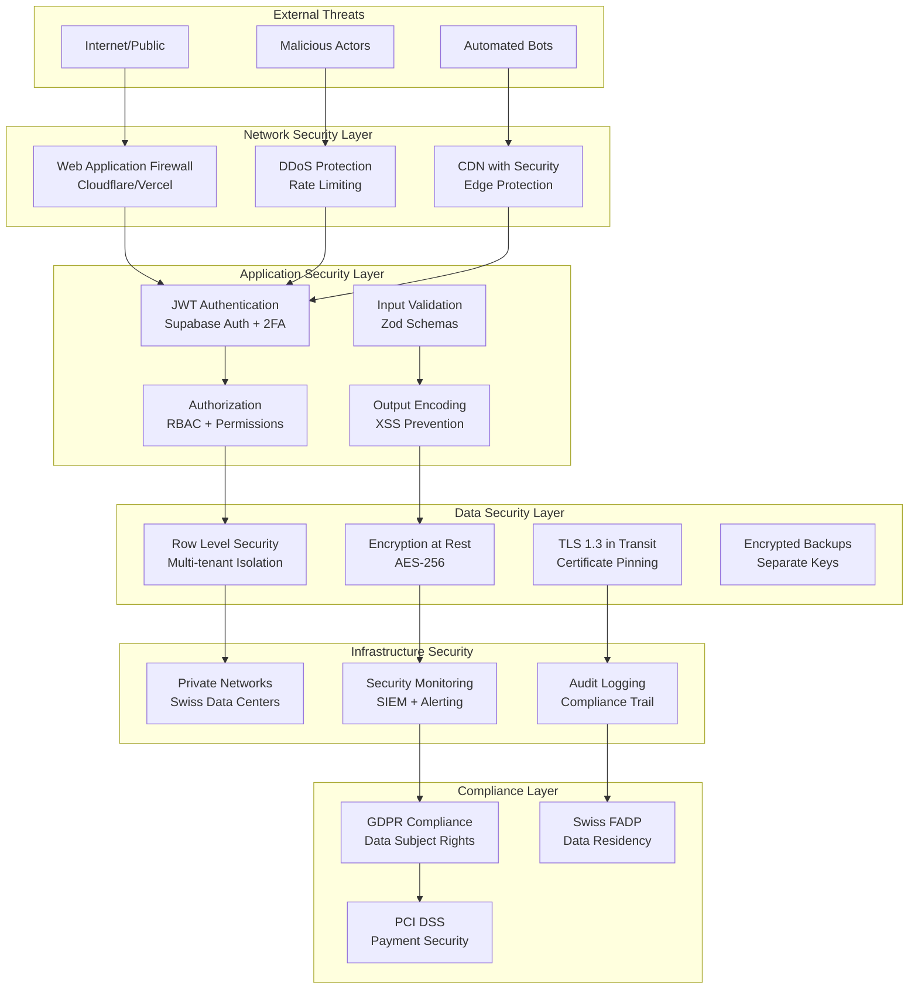

# Car Rental SaaS - Security Architecture

## Security Architecture Overview

The Car Rental SaaS implements defense-in-depth security with multiple layers of protection, Swiss compliance, and GDPR requirements. Security is built into every layer from the database to the user interface.

## Security Framework



## Authentication & Authorization

### Multi-Factor Authentication System
```typescript
interface AuthenticationFlow {
  primary: 'email_password' | 'magic_link' | 'sso'
  secondary?: 'totp' | 'sms' | 'backup_codes'
  session: {
    duration: number // 8 hours default
    refresh_duration: number // 30 days
    concurrent_sessions: number // 3 max
  }
  security: {
    password_policy: PasswordPolicy
    failed_attempts_lockout: number // 5 attempts
    lockout_duration: number // 30 minutes
  }
}

interface PasswordPolicy {
  min_length: 12
  require_uppercase: true
  require_lowercase: true
  require_numbers: true
  require_special: true
  prohibited_patterns: string[] // Common passwords, company name, etc.
  history_check: number // Last 5 passwords
  max_age_days: number // 90 days
}
```

### Role-Based Access Control (RBAC)
```typescript
enum UserRole {
  OWNER = 'owner',
  MANAGER = 'manager', 
  STAFF = 'staff',
  VIEWER = 'viewer',
  AUDITOR = 'auditor'
}

interface Permission {
  resource: string
  action: 'create' | 'read' | 'update' | 'delete' | 'approve' | 'export'
  conditions?: {
    own_records_only?: boolean
    department_only?: boolean
    date_range_limit?: number
  }
}

const RolePermissions: Record<UserRole, Permission[]> = {
  [UserRole.OWNER]: [
    // Full access to everything
    { resource: '*', action: 'create' },
    { resource: '*', action: 'read' },
    { resource: '*', action: 'update' },
    { resource: '*', action: 'delete' },
    { resource: '*', action: 'approve' },
    { resource: '*', action: 'export' },
  ],
  
  [UserRole.MANAGER]: [
    // Business operations with some restrictions
    { resource: 'contracts', action: 'create' },
    { resource: 'contracts', action: 'read' },
    { resource: 'contracts', action: 'update' },
    { resource: 'contracts', action: 'approve' },
    { resource: 'customers', action: 'create' },
    { resource: 'customers', action: 'read' },
    { resource: 'customers', action: 'update' },
    { resource: 'vehicles', action: 'read' },
    { resource: 'vehicles', action: 'update' },
    { resource: 'payments', action: 'read' },
    { resource: 'payments', action: 'update' },
    { resource: 'reports', action: 'read' },
    { resource: 'reports', action: 'export' },
    { resource: 'users', action: 'read', conditions: { department_only: true } },
  ],
  
  [UserRole.STAFF]: [
    // Day-to-day operations
    { resource: 'contracts', action: 'create' },
    { resource: 'contracts', action: 'read' },
    { resource: 'contracts', action: 'update', conditions: { own_records_only: true } },
    { resource: 'customers', action: 'create' },
    { resource: 'customers', action: 'read' },
    { resource: 'customers', action: 'update' },
    { resource: 'vehicles', action: 'read' },
    { resource: 'vehicles', action: 'update', conditions: { own_records_only: true } },
    { resource: 'payments', action: 'create' },
    { resource: 'payments', action: 'read', conditions: { own_records_only: true } },
  ],
  
  [UserRole.VIEWER]: [
    // Read-only access
    { resource: 'contracts', action: 'read' },
    { resource: 'customers', action: 'read' },
    { resource: 'vehicles', action: 'read' },
    { resource: 'reports', action: 'read' },
  ],
  
  [UserRole.AUDITOR]: [
    // Compliance and audit access
    { resource: 'audit_logs', action: 'read' },
    { resource: 'contracts', action: 'read' },
    { resource: 'payments', action: 'read' },
    { resource: 'reports', action: 'read' },
    { resource: 'reports', action: 'export' },
  ]
}
```

### JWT Token Security
```typescript
interface JWTConfiguration {
  algorithm: 'RS256' // RSA with SHA-256
  issuer: 'https://auth.crms.swiss'
  audience: ['https://api.crms.swiss', 'https://app.crms.swiss']
  
  access_token: {
    expiry: '15m' // Short-lived access tokens
    claims: {
      sub: string // User ID
      email: string
      role: UserRole
      company_id: string
      permissions: string[]
      iat: number
      exp: number
      jti: string // JWT ID for revocation
    }
  }
  
  refresh_token: {
    expiry: '30d' // Longer-lived refresh tokens
    rotation: true // Issue new refresh token on use
    revocation_check: true // Check if revoked before use
  }
  
  key_rotation: {
    frequency: '90d' // Rotate signing keys every 90 days
    grace_period: '7d' // Accept old keys for 7 days
  }
}
```

## Data Protection & Encryption

### Encryption at Rest
```typescript
interface EncryptionAtRest {
  database: {
    method: 'AES-256-GCM'
    key_management: 'AWS KMS' // Supabase uses AWS KMS
    transparent: true // Transparent to application
    column_level: {
      sensitive_fields: ['id_number', 'driver_license_number', 'phone', 'email']
      method: 'AES-256-CBC'
      key_derivation: 'PBKDF2'
    }
  }
  
  file_storage: {
    photos: {
      method: 'AES-256-GCM'
      key_per_file: true
      compression: 'before_encryption'
    }
    pdfs: {
      method: 'AES-256-GCM'
      password_protection: true // Additional PDF password
    }
    backups: {
      method: 'AES-256-GCM'
      key_rotation: '30d'
      separate_key_storage: true
    }
  }
}
```

### Encryption in Transit
```typescript
interface EncryptionInTransit {
  tls_version: 'TLS 1.3'
  cipher_suites: [
    'TLS_AES_256_GCM_SHA384',
    'TLS_CHACHA20_POLY1305_SHA256',
    'TLS_AES_128_GCM_SHA256'
  ]
  
  certificate: {
    type: 'EV SSL' // Extended Validation
    issuer: 'Let\'s Encrypt' // Via Vercel
    san: ['*.crms.swiss', 'crms.swiss', 'api.crms.swiss']
    rotation: 'automatic'
  }
  
  hsts: {
    max_age: 31536000 // 1 year
    include_subdomains: true
    preload: true
  }
  
  certificate_pinning: {
    enabled: true
    backup_pins: 2
    report_uri: 'https://crms.swiss/security/hpkp-report'
  }
}
```

### Key Management System
```typescript
interface KeyManagementSystem {
  primary_kms: 'AWS KMS' // Via Supabase
  backup_kms: 'HashiCorp Vault' // For additional keys
  
  key_types: {
    database_encryption: {
      algorithm: 'AES-256'
      rotation_period: '90d'
      backup_locations: ['primary_region', 'backup_region']
    }
    
    jwt_signing: {
      algorithm: 'RS256'
      key_size: 2048
      rotation_period: '90d'
      grace_period: '7d'
    }
    
    application_secrets: {
      algorithm: 'AES-256'
      rotation_period: '180d'
      environment_isolation: true
    }
  }
  
  access_control: {
    key_administrators: ['owner', 'security_officer']
    key_users: ['application_service_accounts']
    audit_logging: true
    approval_required: true // For key operations
  }
}
```

## Input Validation & Output Encoding

### Comprehensive Input Validation
```typescript
// lib/validation/schemas.ts
import { z } from 'zod'

// Swiss-specific validation patterns
const SwissPhoneSchema = z.string().regex(
  /^\+41[1-9][0-9]{8}$/,
  'Invalid Swiss phone number format'
)

const SwissPostalCodeSchema = z.string().regex(
  /^[1-9][0-9]{3}$/,
  'Invalid Swiss postal code'
)

const SwissCantonSchema = z.enum([
  'AG', 'AI', 'AR', 'BE', 'BL', 'BS', 'FR', 'GE', 'GL', 'GR',
  'JU', 'LU', 'NE', 'NW', 'OW', 'SG', 'SH', 'SO', 'SZ', 'TG',
  'TI', 'UR', 'VD', 'VS', 'ZG', 'ZH'
])

// Customer validation schema
export const CustomerSchema = z.object({
  first_name: z.string()
    .min(1, 'First name is required')
    .max(100, 'First name too long')
    .regex(/^[a-zA-ZàáâäçèéêëìíîïñòóôöùúûüÿßÀÁÂÄÇÈÉÊËÌÍÎÏÑÒÓÔÖÙÚÛÜŸ\s\-']+$/, 'Invalid characters in first name'),
  
  last_name: z.string()
    .min(1, 'Last name is required')
    .max(100, 'Last name too long')
    .regex(/^[a-zA-ZàáâäçèéêëìíîïñòóôöùúûüÿßÀÁÂÄÇÈÉÊËÌÍÎÏÑÒÓÔÖÙÚÛÜŸ\s\-']+$/, 'Invalid characters in last name'),
  
  email: z.string()
    .email('Invalid email format')
    .max(255, 'Email too long')
    .transform(email => email.toLowerCase())
    .optional(),
  
  phone: SwissPhoneSchema,
  
  date_of_birth: z.date()
    .refine(date => {
      const age = (Date.now() - date.getTime()) / (365.25 * 24 * 60 * 60 * 1000)
      return age >= 18 && age <= 120
    }, 'Age must be between 18 and 120 years'),
  
  address: z.string()
    .min(1, 'Address is required')
    .max(500, 'Address too long')
    .transform(addr => addr.trim()),
  
  postal_code: SwissPostalCodeSchema,
  canton: SwissCantonSchema,
  
  id_type: z.enum(['passport', 'swiss_id', 'residence_permit', 'driver_license']),
  id_number: z.string()
    .min(5, 'ID number too short')
    .max(50, 'ID number too long')
    .regex(/^[A-Z0-9\-]+$/, 'Invalid ID number format'),
  
  driver_license_number: z.string()
    .min(5, 'Driver license number too short')
    .max(50, 'Driver license number too long'),
  
  driver_license_expiry: z.date()
    .refine(date => date > new Date(), 'Driver license must be valid'),
  
  gdpr_consent: z.boolean()
    .refine(val => val === true, 'GDPR consent is required')
})

// Sanitization functions
export function sanitizeHtml(input: string): string {
  return input
    .replace(/[<>'"&]/g, (match) => {
      const entities: Record<string, string> = {
        '<': '&lt;',
        '>': '&gt;',
        "'": '&#x27;',
        '"': '&quot;',
        '&': '&amp;'
      }
      return entities[match] || match
    })
}

export function sanitizeSql(input: string): string {
  // Remove SQL injection patterns
  return input
    .replace(/[';\\x00\\n\\r\\x1a]/g, '') // Remove dangerous characters
    .replace(/(union|select|insert|update|delete|drop|create|alter|exec|execute)/gi, '') // Remove SQL keywords
    .trim()
}
```

### File Upload Security
```typescript
// lib/upload/security.ts
interface FileValidationConfig {
  allowed_types: string[]
  max_file_size: number
  max_files_per_upload: number
  virus_scanning: boolean
  content_inspection: boolean
}

const FILE_VALIDATION_CONFIG: FileValidationConfig = {
  allowed_types: [
    'image/jpeg',
    'image/png', 
    'image/webp',
    'image/heic', // iPhone photos
    'application/pdf'
  ],
  max_file_size: 10 * 1024 * 1024, // 10MB
  max_files_per_upload: 20,
  virus_scanning: true,
  content_inspection: true
}

export async function validateFileUpload(file: File): Promise<FileValidationResult> {
  // 1. Check file type
  if (!FILE_VALIDATION_CONFIG.allowed_types.includes(file.type)) {
    throw new SecurityError('INVALID_FILE_TYPE', `File type ${file.type} not allowed`)
  }
  
  // 2. Check file size
  if (file.size > FILE_VALIDATION_CONFIG.max_file_size) {
    throw new SecurityError('FILE_TOO_LARGE', `File size ${file.size} exceeds limit`)
  }
  
  // 3. Check file headers (magic numbers)
  const buffer = await file.arrayBuffer()
  const header = new Uint8Array(buffer.slice(0, 16))
  
  const isValidImage = validateImageHeader(header, file.type)
  const isValidPDF = file.type === 'application/pdf' && validatePDFHeader(header)
  
  if (!isValidImage && !isValidPDF) {
    throw new SecurityError('INVALID_FILE_FORMAT', 'File content does not match declared type')
  }
  
  // 4. Virus scanning (if enabled)
  if (FILE_VALIDATION_CONFIG.virus_scanning) {
    const scanResult = await scanFileForVirus(buffer)
    if (!scanResult.clean) {
      throw new SecurityError('VIRUS_DETECTED', `Virus detected: ${scanResult.threat}`)
    }
  }
  
  // 5. Content inspection for malicious payloads
  if (FILE_VALIDATION_CONFIG.content_inspection) {
    const contentResult = await inspectFileContent(buffer, file.type)
    if (contentResult.malicious) {
      throw new SecurityError('MALICIOUS_CONTENT', contentResult.reason)
    }
  }
  
  return {
    valid: true,
    file_type: file.type,
    file_size: file.size,
    scan_results: {
      virus_scan: 'clean',
      content_inspection: 'safe'
    }
  }
}

function validateImageHeader(header: Uint8Array, mimeType: string): boolean {
  const signatures: Record<string, number[][]> = {
    'image/jpeg': [[0xFF, 0xD8, 0xFF]],
    'image/png': [[0x89, 0x50, 0x4E, 0x47, 0x0D, 0x0A, 0x1A, 0x0A]],
    'image/webp': [[0x52, 0x49, 0x46, 0x46], [0x57, 0x45, 0x42, 0x50]], // RIFF...WEBP
  }
  
  const expectedSignatures = signatures[mimeType]
  if (!expectedSignatures) return false
  
  return expectedSignatures.some(signature =>
    signature.every((byte, index) => header[index] === byte)
  )
}
```

## Network Security

### Content Security Policy (CSP)
```typescript
// middleware.ts - Security headers
export function securityHeaders(): Record<string, string> {
  return {
    // Content Security Policy
    'Content-Security-Policy': [
      "default-src 'self'",
      "script-src 'self' 'unsafe-inline' 'unsafe-eval' https://js.stripe.com https://checkout.stripe.com",
      "style-src 'self' 'unsafe-inline' https://fonts.googleapis.com",
      "font-src 'self' https://fonts.gstatic.com",
      "img-src 'self' data: blob: https://*.supabase.co https://images.unsplash.com",
      "media-src 'self' blob:",
      "object-src 'none'",
      "base-uri 'self'",
      "form-action 'self'",
      "frame-ancestors 'none'",
      "connect-src 'self' https://*.supabase.co https://api.stripe.com wss://*.supabase.co",
      "worker-src 'self' blob:",
      "child-src 'self'",
      "manifest-src 'self'",
      "upgrade-insecure-requests"
    ].join('; '),
    
    // XSS Protection
    'X-XSS-Protection': '1; mode=block',
    
    // Content Type Options
    'X-Content-Type-Options': 'nosniff',
    
    // Frame Options
    'X-Frame-Options': 'DENY',
    
    // Referrer Policy
    'Referrer-Policy': 'strict-origin-when-cross-origin',
    
    // HSTS
    'Strict-Transport-Security': 'max-age=31536000; includeSubDomains; preload',
    
    // Permissions Policy
    'Permissions-Policy': [
      'camera=(self)',
      'microphone=()',
      'geolocation=()',
      'interest-cohort=()',
      'payment=(self)',
      'usb=()'
    ].join(', ')
  }
}
```

### Rate Limiting Strategy
```typescript
// lib/rate-limiting.ts
interface RateLimitConfig {
  window: number // seconds
  limit: number // requests
  identifier: 'ip' | 'user' | 'api_key'
  skip_condition?: (req: Request) => boolean
}

const RATE_LIMIT_CONFIGS: Record<string, RateLimitConfig> = {
  // Authentication endpoints - strict limits
  'POST:/auth/login': {
    window: 300, // 5 minutes
    limit: 5,
    identifier: 'ip'
  },
  
  'POST:/auth/register': {
    window: 3600, // 1 hour
    limit: 3,
    identifier: 'ip'
  },
  
  'POST:/auth/reset-password': {
    window: 3600,
    limit: 3,
    identifier: 'ip'
  },
  
  // File upload endpoints
  'POST:/photos/upload': {
    window: 60,
    limit: 20,
    identifier: 'user'
  },
  
  'POST:/contracts/*/pdf': {
    window: 60,
    limit: 10,
    identifier: 'user'
  },
  
  // API endpoints by user role
  'GET:/contracts': {
    window: 60,
    limit: 100,
    identifier: 'user'
  },
  
  'POST:/contracts': {
    window: 60,
    limit: 30,
    identifier: 'user'
  },
  
  // Payment endpoints - moderate limits
  'POST:/payments': {
    window: 60,
    limit: 20,
    identifier: 'user'
  },
  
  // Dashboard endpoints
  'GET:/dashboard/*': {
    window: 60,
    limit: 60,
    identifier: 'user'
  },
  
  // Global rate limit
  'GLOBAL': {
    window: 60,
    limit: 1000,
    identifier: 'user'
  }
}

export class RateLimiter {
  async checkLimit(
    endpoint: string,
    identifier: string,
    userRole?: string
  ): Promise<RateLimitResult> {
    const config = RATE_LIMIT_CONFIGS[endpoint] || RATE_LIMIT_CONFIGS['GLOBAL']
    
    // Adjust limits based on user role
    let limit = config.limit
    if (userRole === 'owner') limit *= 2
    if (userRole === 'viewer') limit *= 0.5
    
    const key = `rate_limit:${endpoint}:${identifier}`
    const current = await redis.incr(key)
    
    if (current === 1) {
      await redis.expire(key, config.window)
    }
    
    const remaining = Math.max(0, limit - current)
    const resetTime = await redis.ttl(key)
    
    return {
      allowed: current <= limit,
      limit,
      remaining,
      reset_time: Date.now() + (resetTime * 1000)
    }
  }
}
```

## Swiss Compliance & GDPR

### Data Subject Rights Implementation
```typescript
// lib/gdpr/data-subject-rights.ts
export class GDPRService {
  // Article 15 - Right of Access
  async exportPersonalData(customerId: string): Promise<PersonalDataExport> {
    const customer = await this.getCustomerData(customerId)
    const contracts = await this.getCustomerContracts(customerId)
    const payments = await this.getCustomerPayments(customerId)
    const photos = await this.getCustomerPhotos(customerId)
    
    // Anonymize sensitive internal data
    const exportData = {
      personal_information: {
        ...customer,
        // Remove internal fields
        internal_notes: undefined,
        risk_notes: undefined,
        created_by: undefined
      },
      rental_history: contracts.map(contract => ({
        ...contract,
        // Include only customer-relevant data
        internal_notes: undefined,
        staff_notes: undefined
      })),
      payment_history: payments,
      photos: photos.filter(photo => photo.gdpr_exportable),
      export_metadata: {
        requested_at: new Date().toISOString(),
        data_controller: 'Car Rental Management System',
        legal_basis: 'GDPR Article 15 - Right of Access',
        retention_period: '7 years (Swiss legal requirement)'
      }
    }
    
    // Create secure download link
    const exportId = await this.createSecureExport(exportData, customerId)
    
    return {
      export_id: exportId,
      download_url: `https://secure.crms.swiss/gdpr/export/${exportId}`,
      expires_at: new Date(Date.now() + 7 * 24 * 60 * 60 * 1000), // 7 days
      format: 'JSON with PDF attachments'
    }
  }
  
  // Article 16 - Right to Rectification
  async rectifyPersonalData(
    customerId: string, 
    corrections: Partial<Customer>,
    requestedBy: string
  ): Promise<RectificationResult> {
    // Validate corrections
    const validatedData = CustomerSchema.partial().parse(corrections)
    
    // Get current data for audit
    const currentData = await this.getCustomerData(customerId)
    
    // Apply corrections
    await supabase
      .from('customers')
      .update(validatedData)
      .eq('id', customerId)
    
    // Log rectification
    await this.logGDPRActivity(customerId, 'rectification', {
      requested_by: requestedBy,
      old_values: currentData,
      new_values: validatedData,
      legal_basis: 'GDPR Article 16'
    })
    
    return {
      success: true,
      changes_applied: Object.keys(validatedData),
      effective_date: new Date().toISOString()
    }
  }
  
  // Article 17 - Right to Erasure
  async erasePersonalData(
    customerId: string,
    requestedBy: string,
    reason: ErasureReason
  ): Promise<ErasureResult> {
    // Check for legal obligations preventing erasure
    const legalHolds = await this.checkLegalHolds(customerId)
    
    if (legalHolds.length > 0) {
      return {
        success: false,
        reason: 'Legal obligations prevent erasure',
        legal_holds: legalHolds,
        alternative: 'Data can be anonymized instead'
      }
    }
    
    // Perform anonymization instead of deletion (for audit trail)
    await this.anonymizeCustomerData(customerId)
    
    await this.logGDPRActivity(customerId, 'erasure', {
      requested_by: requestedBy,
      reason,
      method: 'anonymization',
      legal_basis: 'GDPR Article 17'
    })
    
    return {
      success: true,
      method: 'anonymization',
      completion_date: new Date().toISOString(),
      retention_note: 'Anonymized data retained for legal compliance'
    }
  }
  
  // Article 20 - Right to Data Portability  
  async exportPortableData(customerId: string): Promise<PortabilityExport> {
    const data = await this.exportPersonalData(customerId)
    
    // Convert to standardized format
    const portableData = {
      format: 'JSON-LD',
      schema_version: '1.0',
      data: this.convertToPortableFormat(data),
      metadata: {
        exported_at: new Date().toISOString(),
        source_system: 'CRMS v1.0',
        compatibility: 'Generic rental system format'
      }
    }
    
    return portableData
  }
  
  private async checkLegalHolds(customerId: string): Promise<LegalHold[]> {
    // Check for active contracts
    const activeContracts = await supabase
      .from('contracts')
      .select('id, status, end_date')
      .eq('customer_id', customerId)
      .in('status', ['active', 'confirmed'])
    
    // Check for pending payments
    const pendingPayments = await supabase
      .from('payments')
      .select('id, amount, status')
      .eq('customer_id', customerId)
      .eq('status', 'pending')
    
    // Check for recent disputes
    const recentDisputes = await supabase
      .from('audit_logs')
      .select('*')
      .eq('entity_type', 'customers')
      .eq('entity_id', customerId)
      .gte('created_at', new Date(Date.now() - 365 * 24 * 60 * 60 * 1000).toISOString()) // 1 year
      .like('action', '%dispute%')
    
    const holds: LegalHold[] = []
    
    if (activeContracts.data?.length > 0) {
      holds.push({
        type: 'active_contract',
        reason: 'Customer has active rental contracts',
        count: activeContracts.data.length
      })
    }
    
    if (pendingPayments.data?.length > 0) {
      holds.push({
        type: 'pending_payment',
        reason: 'Customer has pending payments',
        total_amount: pendingPayments.data.reduce((sum, p) => sum + parseFloat(p.amount), 0)
      })
    }
    
    if (recentDisputes.data?.length > 0) {
      holds.push({
        type: 'legal_dispute',
        reason: 'Recent disputes may require data retention',
        count: recentDisputes.data.length
      })
    }
    
    return holds
  }
}
```

### Data Retention & Cleanup
```sql
-- Automated data retention compliance
CREATE OR REPLACE FUNCTION gdpr_data_cleanup()
RETURNS void AS $$
DECLARE
    retention_cutoff DATE;
    anonymization_cutoff DATE;
BEGIN
    -- Swiss legal requirement: 7 years for financial records
    retention_cutoff := CURRENT_DATE - INTERVAL '7 years';
    
    -- Customer data anonymization after 10 years of inactivity
    anonymization_cutoff := CURRENT_DATE - INTERVAL '10 years';
    
    -- 1. Delete expired audit logs (keep 7 years)
    DELETE FROM audit_logs 
    WHERE created_at < retention_cutoff;
    
    -- 2. Anonymize inactive customers (no rentals in 10 years)
    UPDATE customers 
    SET 
        first_name = 'ANONYMIZED',
        last_name = 'ANONYMIZED',
        email = NULL,
        phone = 'ANONYMIZED',
        address = 'ANONYMIZED',
        id_number = 'ANONYMIZED',
        driver_license_number = 'ANONYMIZED',
        notes = NULL,
        gdpr_anonymized = true,
        gdpr_anonymized_at = NOW()
    WHERE 
        created_at < anonymization_cutoff
        AND NOT gdpr_anonymized
        AND id NOT IN (
            SELECT DISTINCT customer_id 
            FROM contracts 
            WHERE created_at > anonymization_cutoff
        );
    
    -- 3. Delete old contract photos (keep 3 years after contract completion)
    DELETE FROM contract_photos cp
    WHERE EXISTS (
        SELECT 1 FROM contracts c 
        WHERE c.id = cp.contract_id 
        AND c.status = 'completed'
        AND c.actual_return_date < CURRENT_DATE - INTERVAL '3 years'
    );
    
    -- 4. Clean up expired password reset tokens, sessions, etc.
    -- This would be handled by Supabase Auth automatically
    
    RAISE NOTICE 'GDPR data cleanup completed at %', NOW();
END;
$$ LANGUAGE plpgsql;

-- Schedule cleanup to run monthly
SELECT cron.schedule(
    'gdpr-cleanup',
    '0 2 1 * *', -- First day of month at 2 AM
    'SELECT gdpr_data_cleanup();'
);
```

## Security Monitoring & Incident Response

### Security Information and Event Management (SIEM)
```typescript
// lib/security/monitoring.ts
export class SecurityMonitoring {
  async detectSuspiciousActivity(event: SecurityEvent): Promise<ThreatAssessment> {
    const assessment: ThreatAssessment = {
      threat_level: 'low',
      confidence: 0,
      indicators: [],
      recommended_actions: []
    }
    
    // 1. Failed authentication attempts
    if (event.type === 'failed_login') {
      const recentFailures = await this.getRecentFailedLogins(event.ip_address, event.user_id)
      
      if (recentFailures >= 5) {
        assessment.threat_level = 'high'
        assessment.confidence = 0.9
        assessment.indicators.push('Multiple failed login attempts')
        assessment.recommended_actions.push('Block IP address', 'Alert security team')
      }
    }
    
    // 2. Unusual access patterns
    if (event.type === 'api_access') {
      const accessPattern = await this.analyzeAccessPattern(event.user_id, event.endpoint)
      
      if (accessPattern.unusual) {
        assessment.threat_level = 'medium'
        assessment.confidence = 0.7
        assessment.indicators.push('Unusual access pattern detected')
        assessment.recommended_actions.push('Require additional authentication')
      }
    }
    
    // 3. Data exfiltration attempts
    if (event.type === 'data_export' && event.data_volume > 1000000) { // 1MB threshold
      assessment.threat_level = 'high'
      assessment.confidence = 0.8
      assessment.indicators.push('Large data export detected')
      assessment.recommended_actions.push('Alert data protection officer', 'Review export request')
    }
    
    // 4. Privilege escalation attempts
    if (event.type === 'permission_denied' && event.attempted_action === 'admin_function') {
      const escalationAttempts = await this.getEscalationAttempts(event.user_id)
      
      if (escalationAttempts >= 3) {
        assessment.threat_level = 'high'
        assessment.confidence = 0.9
        assessment.indicators.push('Privilege escalation attempts')
        assessment.recommended_actions.push('Lock user account', 'Alert security team')
      }
    }
    
    // Execute recommended actions
    await this.executeSecurityActions(assessment)
    
    return assessment
  }
  
  private async executeSecurityActions(assessment: ThreatAssessment): Promise<void> {
    for (const action of assessment.recommended_actions) {
      switch (action) {
        case 'Block IP address':
          await this.blockIPAddress(assessment.source_ip, '1 hour')
          break
          
        case 'Lock user account':
          await this.lockUserAccount(assessment.user_id, 'security_incident')
          break
          
        case 'Alert security team':
          await this.alertSecurityTeam(assessment)
          break
          
        case 'Require additional authentication':
          await this.requireStepUpAuth(assessment.user_id)
          break
      }
    }
  }
}
```

### Incident Response Plan
```typescript
interface IncidentResponsePlan {
  severity_levels: {
    P1: { // Critical - Data breach, system compromise
      response_time: '15 minutes'
      escalation_path: ['CISO', 'CEO', 'Legal', 'External IR team']
      communication: 'All stakeholders immediately'
      actions: [
        'Isolate affected systems',
        'Preserve evidence',
        'Notify authorities within 72h (GDPR)',
        'Prepare customer notifications'
      ]
    }
    
    P2: { // High - Security vulnerability, insider threat
      response_time: '1 hour'
      escalation_path: ['Security team', 'IT management']
      communication: 'Internal security team + management'
      actions: [
        'Investigate thoroughly',
        'Apply security patches',
        'Review access logs',
        'Update security measures'
      ]
    }
    
    P3: { // Medium - Suspicious activity, minor security issues
      response_time: '4 hours'
      escalation_path: ['Security team']
      communication: 'Security team only'
      actions: [
        'Monitor and investigate',
        'Document findings',
        'Update monitoring rules'
      ]
    }
  }
  
  notification_requirements: {
    gdpr_breach: {
      authority: 'Swiss Federal Data Protection and Information Commissioner (FDPIC)'
      timeline: '72 hours'
      customer_notification: 'If high risk to rights and freedoms'
    }
    
    payment_breach: {
      authority: 'PCI DSS acquiring bank'
      timeline: 'Immediately'
      card_brands: 'Within 24 hours'
    }
  }
}
```

## Backup & Recovery Security

### Secure Backup Strategy
```typescript
interface BackupSecurityStrategy {
  encryption: {
    algorithm: 'AES-256-GCM'
    key_management: 'Separate from primary system'
    key_rotation: '90 days'
  }
  
  storage_locations: {
    primary: 'Swiss data center (same region as production)'
    secondary: 'Swiss data center (different region)'
    offline: 'Air-gapped storage for compliance'
  }
  
  access_control: {
    backup_operators: ['designated_backup_admin']
    restore_approval: ['CISO', 'CTO'] // Dual approval required
    audit_logging: 'All backup/restore operations logged'
  }
  
  testing: {
    restore_testing_frequency: 'Monthly'
    full_disaster_recovery_test: 'Quarterly'
    security_validation: 'Each restore test'
  }
  
  retention: {
    daily_backups: '30 days'
    weekly_backups: '12 weeks'
    monthly_backups: '12 months'
    yearly_backups: '7 years (Swiss compliance)'
  }
}
```

---

**Security Architecture Version:** 1.0  
**Last Updated:** 2025-08-07  
**Status:** Complete Analysis  
**Coverage:** Multi-layered Security with Swiss/GDPR Compliance