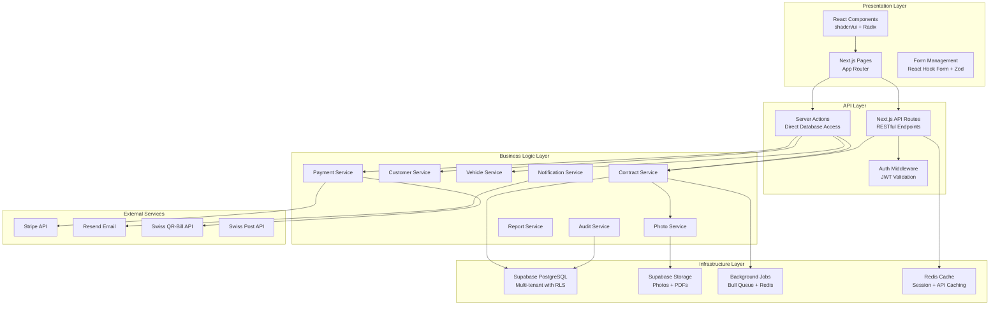

# Car Rental SaaS - Service Architecture

## Service Architecture Overview

The Car Rental Management System follows a modular service architecture built on Next.js with clear
separation of concerns. Each service handles specific business domains while maintaining loose
coupling through well-defined interfaces.

## Service Layer Architecture



## Core Services

### 1. Contract Service

**Purpose:** Manages the complete contract lifecycle from creation to completion.

**Responsibilities:**

- Contract creation and validation
- Digital signature processing
- Contract state management
- PDF generation with embedded photos
- Contract modifications and extensions
- Return processing and completion

**Key Methods:**

```typescript
class ContractService {
  async createContract(contractData: CreateContractRequest): Promise<Contract>;
  async generatePDF(contractId: string): Promise<string>;
  async addDigitalSignature(contractId: string, signatureData: SignatureData): Promise<void>;
  async processReturn(contractId: string, returnData: ReturnData): Promise<Contract>;
  async extendContract(contractId: string, newEndDate: Date): Promise<Contract>;
  async calculateFinalCharges(contractId: string): Promise<FinalCharges>;
}
```

**Database Tables:**

- `contracts` - Main contract data
- `contract_photos` - Associated photos
- `audit_logs` - Contract changes

### 2. Customer Service

**Purpose:** Complete customer lifecycle management with GDPR compliance.

**Responsibilities:**

- Customer registration and validation
- Identity verification
- GDPR compliance (data export, anonymization)
- Blacklist management
- Customer search and deduplication
- Communication preferences

**Key Methods:**

```typescript
class CustomerService {
  async createCustomer(customerData: CreateCustomerRequest): Promise<Customer>;
  async verifyIdentity(
    customerId: string,
    documents: IdentityDocuments,
  ): Promise<VerificationResult>;
  async exportCustomerData(customerId: string): Promise<GDPRExport>;
  async anonymizeCustomer(customerId: string): Promise<void>;
  async searchCustomers(query: string): Promise<Customer[]>;
  async addToBlacklist(customerId: string, reason: string): Promise<void>;
}
```

### 3. Vehicle Service

**Purpose:** Fleet management and availability tracking.

**Responsibilities:**

- Vehicle registration and management
- Real-time availability checking
- Maintenance scheduling
- Status workflow management
- Performance analytics
- Fleet optimization

**Key Methods:**

```typescript
class VehicleService {
  async checkAvailability(vehicleId: string, startDate: Date, endDate: Date): Promise<boolean>;
  async getAvailableVehicles(dateRange: DateRange, filters: VehicleFilters): Promise<Vehicle[]>;
  async updateStatus(vehicleId: string, status: VehicleStatus): Promise<void>;
  async scheduleMainenance(vehicleId: string, maintenanceData: MaintenanceSchedule): Promise<void>;
  async getFleetAnalytics(companyId: string, period: AnalyticsPeriod): Promise<FleetAnalytics>;
  async optimizeFleetUtilization(companyId: string): Promise<OptimizationSuggestions>;
}
```

### 4. Payment Service

**Purpose:** Multi-channel payment processing with Swiss compliance.

**Responsibilities:**

- Credit card processing via Stripe
- Swiss QR-bill generation and processing
- Cash transaction recording
- Deposit management
- Refund processing
- Payment failure handling
- Financial reconciliation

**Key Methods:**

```typescript
class PaymentService {
  async processCardPayment(amount: number, paymentMethod: string): Promise<PaymentResult>;
  async generateQRBill(paymentData: QRBillData): Promise<QRBillResult>;
  async recordCashPayment(amount: number, contractId: string): Promise<Payment>;
  async processRefund(paymentId: string, amount: number, reason: string): Promise<RefundResult>;
  async holdDeposit(amount: number, customerId: string): Promise<DepositResult>;
  async releaseDeposit(depositId: string): Promise<void>;
  async reconcilePayments(companyId: string, date: Date): Promise<ReconciliationReport>;
}
```

### 5. Photo Service

**Purpose:** Evidence management and photo processing.

**Responsibilities:**

- Photo capture and upload
- Image compression and optimization
- Damage annotation
- Before/after comparison
- Secure storage with access controls
- PDF embedding

**Key Methods:**

```typescript
class PhotoService {
  async uploadPhoto(file: File, contractId: string, photoType: PhotoType): Promise<Photo>;
  async compressImage(imageBuffer: Buffer): Promise<Buffer>;
  async annotatePhoto(photoId: string, annotations: Annotation[]): Promise<void>;
  async generateComparison(beforePhotoId: string, afterPhotoId: string): Promise<string>;
  async embedInPDF(photoIds: string[]): Promise<Buffer>;
  async deletePhoto(photoId: string): Promise<void>;
}
```

### 6. Notification Service

**Purpose:** Multi-channel communication management.

**Responsibilities:**

- Email notifications
- SMS alerts (future)
- In-app notifications
- Contract reminders
- Payment notifications
- Maintenance alerts

**Key Methods:**

```typescript
class NotificationService {
  async sendEmail(template: EmailTemplate, recipient: string, data: any): Promise<void>;
  async sendSMS(message: string, phoneNumber: string): Promise<void>;
  async scheduleReminder(contractId: string, reminderType: ReminderType, date: Date): Promise<void>;
  async notifyPaymentFailure(contractId: string): Promise<void>;
  async notifyMaintenanceDue(vehicleId: string): Promise<void>;
}
```

### 7. Report Service

**Purpose:** Analytics and reporting for business intelligence.

**Responsibilities:**

- Revenue analytics
- Fleet utilization reports
- Customer analytics
- Financial reconciliation
- Custom report generation
- Data export capabilities

**Key Methods:**

```typescript
class ReportService {
  async generateRevenueReport(companyId: string, period: ReportPeriod): Promise<RevenueReport>;
  async getFleetUtilization(companyId: string, period: ReportPeriod): Promise<UtilizationReport>;
  async getCustomerAnalytics(companyId: string): Promise<CustomerAnalytics>;
  async exportData(companyId: string, dataType: DataType, format: ExportFormat): Promise<string>;
  async scheduleRecurringReport(reportConfig: ReportConfig): Promise<void>;
}
```

### 8. Audit Service

**Purpose:** Comprehensive audit logging and compliance.

**Responsibilities:**

- Activity logging
- Change tracking
- Security monitoring
- Compliance reporting
- Data retention management
- GDPR audit trails

**Key Methods:**

```typescript
class AuditService {
  async logActivity(
    userId: string,
    action: string,
    entityType: string,
    entityId: string,
  ): Promise<void>;
  async trackChange(
    entityType: string,
    entityId: string,
    oldValues: any,
    newValues: any,
  ): Promise<void>;
  async generateAuditReport(companyId: string, period: ReportPeriod): Promise<AuditReport>;
  async monitorSecurity(userId: string, ipAddress: string): Promise<void>;
  async cleanupExpiredLogs(): Promise<void>;
}
```

## Service Communication Patterns

### 1. Direct Database Access (Server Actions)

```typescript
// app/actions/contract.ts
export async function createContract(contractData: CreateContractRequest) {
  'use server';

  const user = await getCurrentUser();
  if (!user) throw new Error('Unauthorized');

  const contract = await ContractService.createContract(contractData);
  await AuditService.logActivity(user.id, 'contract.created', 'contracts', contract.id);

  return contract;
}
```

### 2. API Route Pattern

```typescript
// app/api/vehicles/availability/route.ts
export async function GET(request: Request) {
  const { searchParams } = new URL(request.url);
  const startDate = new Date(searchParams.get('start_date')!);
  const endDate = new Date(searchParams.get('end_date')!);

  const availability = await VehicleService.checkAvailability(startDate, endDate);

  return Response.json({ success: true, data: availability });
}
```

### 3. Background Job Pattern

```typescript
// services/queue/jobs/pdf-generation.ts
export async function generateContractPDF(job: Job) {
  const { contractId } = job.data;

  try {
    const pdfUrl = await ContractService.generatePDF(contractId);
    await NotificationService.notifyContractReady(contractId, pdfUrl);
  } catch (error) {
    await AuditService.logError('pdf.generation.failed', contractId, error);
    throw error;
  }
}
```

## Cross-Cutting Concerns

### Authentication & Authorization

```typescript
// lib/auth.ts
export async function withAuth(handler: Function) {
  return async (request: Request) => {
    const token = await getToken(request);
    if (!token) {
      return new Response('Unauthorized', { status: 401 });
    }

    const user = await verifyToken(token);
    request.user = user;

    return handler(request);
  };
}
```

### Error Handling

```typescript
// lib/error-handler.ts
export class ServiceError extends Error {
  constructor(
    public code: string,
    public message: string,
    public details?: any,
  ) {
    super(message);
  }
}

export function handleServiceError(error: unknown) {
  if (error instanceof ServiceError) {
    return {
      success: false,
      error: {
        code: error.code,
        message: error.message,
        details: error.details,
      },
    };
  }

  // Log unexpected errors
  console.error('Unexpected error:', error);

  return {
    success: false,
    error: {
      code: 'INTERNAL_ERROR',
      message: 'An unexpected error occurred',
    },
  };
}
```

### Validation Layer

```typescript
// lib/validation.ts
export function validateInput<T>(schema: z.ZodSchema<T>, input: unknown): T {
  try {
    return schema.parse(input);
  } catch (error) {
    throw new ServiceError('VALIDATION_ERROR', 'Input validation failed', error.errors);
  }
}
```

### Caching Strategy

```typescript
// lib/cache.ts
export class CacheService {
  async get<T>(key: string): Promise<T | null> {
    const cached = await redis.get(key);
    return cached ? JSON.parse(cached) : null;
  }

  async set<T>(key: string, value: T, ttl: number = 300): Promise<void> {
    await redis.set(key, JSON.stringify(value), { ex: ttl });
  }

  async invalidate(pattern: string): Promise<void> {
    const keys = await redis.keys(pattern);
    if (keys.length > 0) {
      await redis.del(...keys);
    }
  }
}
```

## Service Configuration

### Environment-Based Configuration

```typescript
// config/services.ts
export const serviceConfig = {
  database: {
    url: process.env.DATABASE_URL!,
    maxConnections: parseInt(process.env.DB_MAX_CONNECTIONS || '10'),
  },
  stripe: {
    apiKey: process.env.STRIPE_SECRET_KEY!,
    webhookSecret: process.env.STRIPE_WEBHOOK_SECRET!,
  },
  storage: {
    bucket: process.env.SUPABASE_STORAGE_BUCKET!,
    maxFileSize: 10 * 1024 * 1024, // 10MB
  },
  queue: {
    redis: {
      host: process.env.REDIS_HOST!,
      port: parseInt(process.env.REDIS_PORT || '6379'),
    },
  },
};
```

### Service Registry

```typescript
// lib/service-registry.ts
export class ServiceRegistry {
  private static services = new Map<string, any>();

  static register<T>(name: string, service: T): void {
    this.services.set(name, service);
  }

  static get<T>(name: string): T {
    const service = this.services.get(name);
    if (!service) {
      throw new Error(`Service ${name} not found`);
    }
    return service as T;
  }
}

// Usage
ServiceRegistry.register('contract', new ContractService());
ServiceRegistry.register('payment', new PaymentService());
```

## Testing Strategy

### Unit Testing Services

```typescript
// tests/services/contract.service.test.ts
describe('ContractService', () => {
  let contractService: ContractService;
  let mockDatabase: MockDatabase;

  beforeEach(() => {
    mockDatabase = new MockDatabase();
    contractService = new ContractService(mockDatabase);
  });

  test('should create contract successfully', async () => {
    const contractData = createMockContractData();
    const result = await contractService.createContract(contractData);

    expect(result).toBeDefined();
    expect(result.status).toBe('draft');
  });
});
```

### Integration Testing

```typescript
// tests/integration/contract-flow.test.ts
describe('Contract Creation Flow', () => {
  test('complete contract creation with payment', async () => {
    // Create customer
    const customer = await CustomerService.createCustomer(mockCustomerData);

    // Create contract
    const contract = await ContractService.createContract({
      customerId: customer.id,
      vehicleId: mockVehicleId,
      ...mockContractData,
    });

    // Process payment
    const payment = await PaymentService.processCardPayment(
      contract.totalAmount,
      mockPaymentMethod,
    );

    expect(payment.status).toBe('completed');
    expect(contract.paymentStatus).toBe('paid');
  });
});
```

## Performance Optimization

### Database Optimization

- Connection pooling for high concurrency
- Query optimization with proper indexing
- Read replicas for analytics queries
- Materialized views for complex reports

### Caching Strategy

- API response caching (5-minute TTL)
- Database query result caching
- Session data caching
- Static asset CDN caching

### Background Processing

- PDF generation in background
- Email notifications queued
- Report generation scheduled
- Database maintenance automated

---

**Service Architecture Version:** 1.0  
**Last Updated:** 2025-08-07  
**Status:** Complete Analysis  
**Coverage:** All Core Business Services
