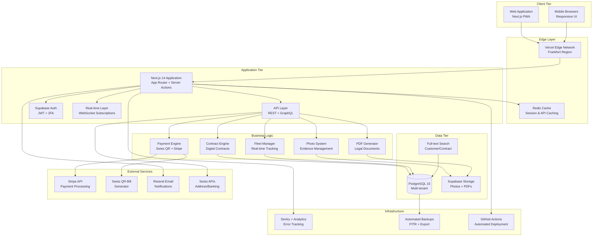
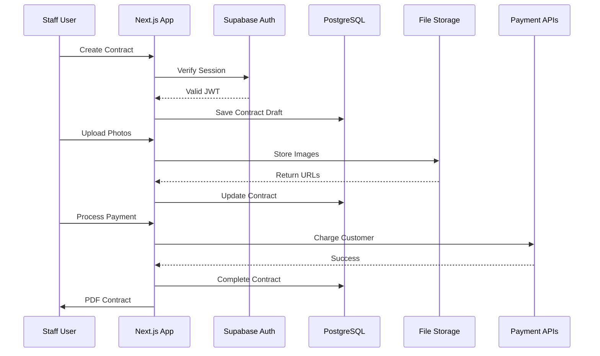

# Car Rental SaaS - Complete System Architecture

## Executive Summary

Based on comprehensive analysis of all documentation in the `docs/` folder, this document presents
the complete Car Rental Management System (CRMS) architecture. The system is designed as a
Swiss-compliant, multi-tenant SaaS platform for car rental SMEs, targeting 2-minute digital
contracts and 10-15% revenue improvement.

## System Vision

**Business Goal:** Modernize Swiss car rental operations with a streamlined, compliant, and
profitable SaaS solution.

**Key Metrics:**

- 2-minute digital contract creation (vs 15-30 minutes paper-based)
- 10-15% revenue capture improvement
- Swiss GDPR/FADP compliance
- Multi-tenant SaaS with CHF 99-299/month pricing

## High-Level Architecture

## Technology Stack Overview

### Core Platform

- **Frontend Framework:** Next.js 14 with App Router (React 18+)
- **Backend Platform:** Next.js API Routes + Supabase
- **Database:** PostgreSQL 15 (Supabase managed)
- **Authentication:** Supabase Auth with JWT + 2FA
- **Language:** TypeScript 5.0+ (strict mode)

### Swiss-Specific Stack

- **Hosting:** Vercel Pro (Frankfurt region)
- **Data Storage:** Supabase (Zurich/Frankfurt for Swiss residency)
- **Payments:** Stripe + Swiss QR-Bill generation
- **Compliance:** GDPR/FADP ready with audit logging

### Key Features

- **Multi-tenancy:** Company-isolated data with RLS
- **Real-time:** Fleet status and contract updates
- **Photo Management:** Evidence capture with compression
- **Digital Signatures:** Legal contract signing
- **PWA Capabilities:** Offline-first operations
- **Swiss Integration:** QR-Bills, address validation, banking APIs

## Core Business Domains

### 1. Contract Operations (Epic 1)

- Digital contract creation (<2 minutes)
- Customer management with GDPR compliance
- Contract modifications and completions
- Digital signature capture and validation
- Legal document generation with embedded photos

### 2. Fleet Management (Epic 2)

- Real-time vehicle availability tracking
- Maintenance scheduling and alerts
- Fleet calendar visualization
- Vehicle performance analytics
- Status workflow management

### 3. Financial Processing (Epic 3)

- Multi-channel payment processing (card, cash, TWINT, QR-bills)
- Swiss QR-bill generation and validation
- Automated deposit management
- Financial reconciliation and reporting
- Payment failure handling and recovery

### 4. Dashboard & Analytics (Epic 4)

- Staff operations dashboard with real-time metrics
- Owner business intelligence with ROI tracking
- Revenue analytics and forecasting
- Custom report builder
- Alert and notification system

### 5. Photo Documentation (Epic 7)

- Legal evidence capture system
- Before/after comparison tools
- Damage annotation and documentation
- PDF embedding for contracts
- Secure storage with access controls

### 6. System Security (Epic 6)

- Multi-tenant user management
- Authentication with 2FA
- Comprehensive audit logging
- GDPR compliance features
- Automated backup and recovery

## Architecture Principles

### 1. Swiss Compliance First

- Data residency in Switzerland/EU
- GDPR/FADP compliance built-in
- Audit logging for all operations
- Privacy by design
- Right to erasure implementation

### 2. Multi-Tenant SaaS

- Complete company data isolation
- Scalable pricing tiers (CHF 99-299/month)
- Self-service onboarding
- Usage-based billing
- White-label capabilities

### 3. Performance Optimized

- Edge-first delivery (Vercel CDN)
- Database query optimization
- Image compression and CDN
- Progressive loading
- Offline-first PWA

### 4. Security by Design

- JWT-based authentication
- Row-level security (RLS)
- API rate limiting
- Input validation and sanitization
- Comprehensive security headers

### 5. Scalability Ready

- Horizontal scaling architecture
- Database connection pooling
- CDN for static assets
- Background job processing
- Microservice-ready design

## User Experience Architecture

### Staff Operations Flow

1. **Dashboard Review** → Quick status overview
2. **Contract Creation** → 2-minute digital process
3. **Photo Capture** → Evidence documentation
4. **Payment Processing** → Multi-method support
5. **Vehicle Management** → Real-time status updates

### Owner Management Flow

1. **Business Dashboard** → ROI and revenue tracking
2. **Fleet Overview** → Utilization analytics
3. **Financial Reports** → Automated reconciliation
4. **Staff Management** → Role-based access

### Customer Experience Flow

1. **Quick Registration** → Streamlined onboarding
2. **Digital Contract** → Tablet-based signing
3. **Photo Verification** → Damage documentation
4. **Payment Options** → Swiss-preferred methods
5. **Digital Receipts** → PDF generation

## Integration Architecture

### External APIs

- **Stripe API** → Credit card processing
- **Swiss QR-Bill** → Local payment method
- **Swiss Post API** → Address validation
- **Banking APIs** → Payment verification
- **Email Service** → Automated notifications

### Internal Services

- **Auth Service** → User management
- **Contract Service** → Business logic
- **Payment Service** → Financial processing
- **Photo Service** → Image management
- **PDF Service** → Document generation
- **Notification Service** → Multi-channel alerts

## Data Flow Architecture

## Security Architecture Layers

### 1. Network Security

- TLS 1.3 encryption
- Web Application Firewall
- DDoS protection
- Geographic restrictions

### 2. Application Security

- JWT authentication
- RBAC permissions
- Input validation
- XSS/CSRF protection

### 3. Database Security

- Row-level security (RLS)
- Encrypted at rest
- Audit logging
- Connection pooling

### 4. File Security

- Virus scanning
- Type validation
- Access controls
- Secure URLs

## Deployment Architecture

### Production Environment

- **Primary:** Vercel Pro (Frankfurt)
- **Database:** Supabase Production (Zurich)
- **CDN:** Global edge network
- **Monitoring:** Sentry + custom metrics
- **Backups:** Automated daily with PITR

### Development Workflow

- **Local:** Docker development environment
- **Staging:** Vercel preview deployments
- **Testing:** Separate Supabase project
- **CI/CD:** GitHub Actions automation

## Scalability & Performance

### Performance Targets

- **Page Load:** <2 seconds on 4G
- **API Response:** <500ms average
- **Photo Upload:** <5 seconds per image
- **Contract Generation:** <10 seconds with photos
- **Concurrent Users:** 100+ per company

### Scalability Features

- **Database:** Connection pooling and read replicas
- **CDN:** Global asset distribution
- **Caching:** Redis for sessions and API responses
- **Background Jobs:** Queue processing for heavy tasks
- **Auto-scaling:** Vercel serverless functions

## Monitoring & Analytics

### System Monitoring

- **Error Tracking:** Sentry for bug reporting
- **Performance:** Web vitals and API metrics
- **Uptime:** 99.9% availability target
- **Security:** Failed login attempts and anomalies

### Business Analytics

- **Revenue Tracking:** Real-time financial metrics
- **Usage Analytics:** Feature adoption and user behavior
- **Fleet Utilization:** Vehicle usage optimization
- **Customer Insights:** Rental patterns and preferences

---

**Architecture Version:** 1.0  
**Last Updated:** 2025-08-07  
**Status:** Complete Analysis Based on Documentation Review  
**Coverage:** All 9 Epics, 60+ User Stories, Swiss Compliance Requirements
