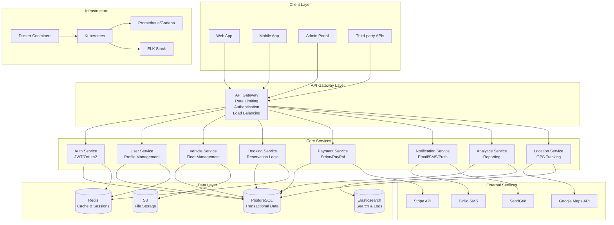

# Car Rental SaaS - System Architecture Overview

## Executive Summary
Scalable multi-tenant car rental platform with microservices architecture, supporting vehicle management, booking operations, payment processing, and analytics.

## System Architecture Diagram

## Service Responsibilities

### Authentication Service
- JWT token management
- OAuth2 integration (Google, Facebook)
- Role-based access control (RBAC)
- Session management
- Multi-tenant authentication

### User Management Service
- Customer profiles
- Driver profiles
- Admin user management
- Tenant isolation
- User verification

### Vehicle Management Service
- Fleet inventory
- Vehicle specifications
- Availability tracking
- Maintenance scheduling
- Vehicle categorization

### Booking Service
- Reservation creation/modification
- Availability calculation
- Booking lifecycle management
- Pricing engine integration
- Conflict resolution

### Payment Service
- Payment processing (Stripe/PayPal)
- Billing management
- Invoice generation
- Refund handling
- Subscription management

### Notification Service
- Email notifications
- SMS alerts
- Push notifications
- Template management
- Delivery tracking

### Analytics Service
- Business intelligence
- Usage metrics
- Revenue reporting
- Performance analytics
- Data aggregation

### Location Service
- GPS tracking
- Geofencing
- Route optimization
- Location history
- Maps integration

## Key Architectural Patterns

### Microservices Architecture
- Independent deployability
- Technology diversity
- Fault isolation
- Scalable development teams

### Event-Driven Architecture
- Asynchronous communication
- Event sourcing for audit trails
- CQRS for read/write optimization
- Message queuing (RabbitMQ/Kafka)

### Multi-Tenancy
- Tenant isolation at data layer
- Shared infrastructure
- Per-tenant configuration
- Resource quotas

### API-First Design
- OpenAPI specifications
- Versioning strategy
- Backward compatibility
- Developer experience

## Scalability Considerations

### Horizontal Scaling
- Stateless service design
- Load balancing
- Auto-scaling policies
- Database sharding

### Performance Optimization
- Redis caching layers
- CDN for static assets
- Database indexing strategy
- Query optimization

### Reliability
- Circuit breaker pattern
- Retry mechanisms
- Health checks
- Graceful degradation

## Security Architecture

### Authentication & Authorization
- Multi-factor authentication
- JWT with refresh tokens
- Role-based permissions
- API key management

### Data Protection
- Encryption at rest and transit
- PII data masking
- GDPR compliance
- Audit logging

### Infrastructure Security
- Network segmentation
- WAF protection
- SSL/TLS termination
- Security scanning

## Technology Stack

### Backend
- Node.js/TypeScript
- Express.js/Fastify
- PostgreSQL with read replicas
- Redis for caching
- Elasticsearch for search

### Frontend
- React/Next.js
- React Native (mobile)
- TypeScript
- State management (Redux/Zustand)

### Infrastructure
- Docker containers
- Kubernetes orchestration
- AWS/GCP cloud platform
- Terraform for IaC

### Monitoring & Observability
- Prometheus metrics
- Grafana dashboards
- ELK stack for logging
- Distributed tracing (Jaeger)

## Data Flow Architecture

## Integration Points

### External APIs
- Payment gateways (Stripe, PayPal)
- Maps and geocoding (Google Maps)
- Communication (Twilio, SendGrid)
- Identity providers (Auth0, Firebase)

### Third-party Services
- Fleet management systems
- Insurance providers
- Credit check services
- Background verification

### Mobile Integration
- GPS tracking
- Push notifications
- Offline capability
- Camera integration

## Deployment Architecture

### Environment Strategy
- Development
- Staging
- Production
- Disaster recovery

### CI/CD Pipeline
- GitHub Actions
- Automated testing
- Security scanning
- Blue-green deployments

### Monitoring Strategy
- Application metrics
- Infrastructure monitoring
- Log aggregation
- Alerting rules

This architecture provides a solid foundation for a scalable car rental SaaS platform with clear separation of concerns, robust security, and excellent scalability characteristics.