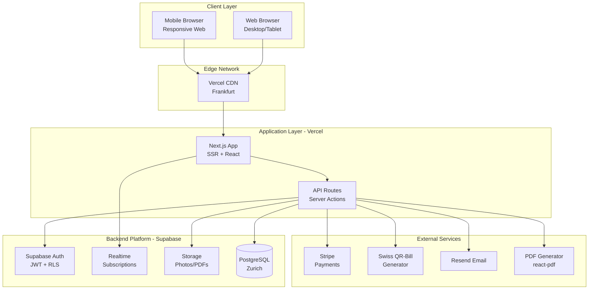

# Car Rental Management System (CRMS) - Architecture Overview

## Introduction

This document outlines the complete fullstack architecture for the Car Rental Management System
(CRMS), including backend systems, frontend implementation, and their integration. It serves as the
single source of truth for AI-driven development, ensuring consistency across the entire technology
stack.

This unified approach combines what would traditionally be separate backend and frontend
architecture documents, streamlining the development process for modern fullstack applications where
these concerns are increasingly intertwined.

### Starter Template or Existing Project

**N/A - Greenfield project**

This is a new greenfield project without any existing codebase or starter template constraints. The
architecture decisions will be made based on the PRD requirements and Swiss market needs.

### Change Log

| Date       | Version | Description                                   | Author              |
| ---------- | ------- | --------------------------------------------- | ------------------- |
| 2025-08-06 | 1.0     | Initial fullstack architecture document       | Winston (Architect) |
| 2025-08-06 | 1.1     | Simplified to Supabase-first approach for MVP | Winston (Architect) |

## High Level Architecture

### Technical Summary

CRMS employs a simplified Supabase-first architecture with Next.js as the frontend framework. The
system leverages Supabase's integrated platform features (database, auth, storage, realtime) to
achieve rapid MVP development within the 6-8 week timeline. Infrastructure is hosted on Vercel's
European regions with Supabase's Swiss data residency, ensuring GDPR compliance and low-latency
access. This architecture achieves the 2-minute contract goal through optimized workflows and
intelligent use of platform-native features.

### Platform and Infrastructure Choice

**Selected Platform:** Vercel + Supabase (Simplified MVP Approach) **Key Services:**

- Vercel (Frontend hosting, Edge Functions)
- Supabase (PostgreSQL, Auth, Storage, Real-time)
- Stripe (Payment processing)
- Resend (Email delivery)

**Deployment Host and Regions:**

- Vercel: Frankfurt (eu-central-1) - Primary
- Supabase: Zurich (AWS eu-central-2) - Swiss data residency

### Repository Structure

**Structure:** Monorepo **Monorepo Tool:** npm workspaces (simpler for MVP) **Package
Organization:**

- apps/web (Next.js frontend)
- packages/database (Supabase types & migrations)
- packages/shared (business logic, types, utils)
- packages/ui (shared React components)

### High Level Architecture Diagram

### Architectural Patterns

- **Simplified Backend:** Supabase handles all backend complexity - _Rationale:_ Focus on business
  logic, not infrastructure
- **Database-First Design:** Leverage Supabase RLS for authorization - _Rationale:_ Centralized
  security model reduces auth complexity
- **Optimistic UI Updates:** React Query with optimistic mutations - _Rationale:_ Critical for
  achieving sub-2-minute contract flow perception
- **Server Components:** Next.js App Router with RSC - _Rationale:_ Reduce client bundle size and
  improve initial load for tablet devices
- **Component-Driven UI:** Atomic design with Shadcn/ui - _Rationale:_ Rapid UI development with
  consistent Swiss-professional aesthetic
- **Real-time Updates:** Supabase Realtime for fleet status - _Rationale:_ Prevent double-bookings
  without polling overhead
- **Progressive Enhancement:** Start simple, add complexity based on metrics - _Rationale:_ Avoid
  over-engineering before product-market fit

## Tech Stack

### Technology Stack Table - Complete MVP Stack

| Category                  | Technology        | Version | Purpose                    | Rationale                                         |
| ------------------------- | ----------------- | ------- | -------------------------- | ------------------------------------------------- |
| **Core Framework**        |                   |         |                            |                                                   |
| Frontend Language         | TypeScript        | 5.3+    | Type-safe development      | Prevents runtime errors in financial calculations |
| Frontend Framework        | Next.js           | 14.2+   | Full-stack React framework | App Router for RSC, optimal for complex workflows |
| Backend Platform          | Supabase          | 2.39+   | Complete backend solution  | Auth, database, storage, realtime in one          |
| Database                  | PostgreSQL        | 15+     | Primary datastore          | Supabase-hosted in Zurich, ACID compliance        |
| **UI/UX Libraries**       |                   |         |                            |                                                   |
| UI Component Library      | Shadcn/ui + Radix | Latest  | Professional components    | Swiss-clean aesthetic, fully customizable         |
| CSS Framework             | Tailwind CSS      | 3.4+    | Utility-first CSS          | Rapid development, consistent styling             |
| **Financial & Utilities** |                   |         |                            |                                                   |
| Money Calculations        | Dinero.js         | 1.9+    | Currency handling          | Accurate CHF calculations with Rappen             |
| Date Handling             | date-fns          | 3.0+    | Date manipulation          | Tree-shakeable, timezone-aware                    |
| **Infrastructure**        |                   |         |                            |                                                   |
| Hosting                   | Vercel            | Latest  | Frontend hosting           | Free tier, automatic deploys                      |
| File Storage              | Supabase Storage  | 2.39+   | Photos/PDFs                | Integrated with auth, RLS                         |
| Authentication            | Supabase Auth     | 2.39+   | User management            | Built-in 2FA, magic links                         |
| **Payments**              |                   |         |                            |                                                   |
| Payment Processing        | Stripe            | Latest  | Credit card payments       | PCI compliant, Swiss market support               |
| QR Bill Generation        | swissqrbill       | 3.2+    | Swiss payments             | Generate only, manual reconciliation              |

---

**Document Version:** 3.0 - Architecture Overview **Last Updated:** 2025-08-06 **Status:** Ready for
Implementation
