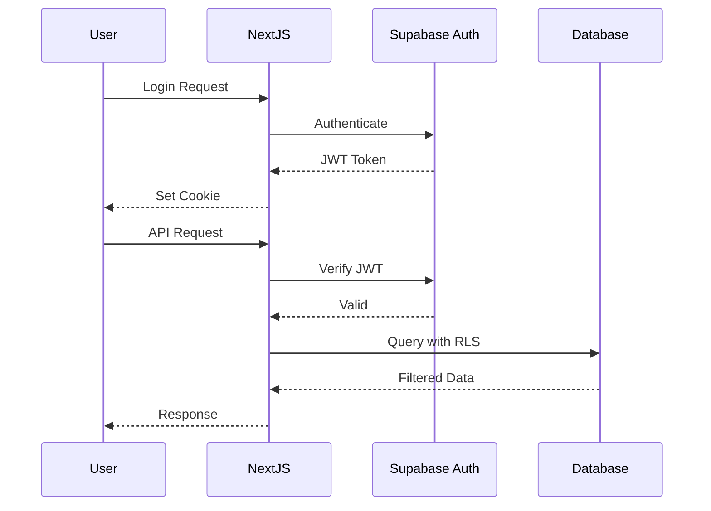

# CRMS Security Architecture

## Authentication & Authorization

### Multi-Layer Security Model
1. **Supabase Auth**: JWT-based authentication
2. **Row Level Security**: Database-level access control
3. **Application Middleware**: Route protection
4. **API Validation**: Request validation

### Authentication Flow


### Role-Based Access Control (RBAC)
```typescript
// lib/permissions.ts
export const permissions = {
  owner: {
    contracts: ['create', 'read', 'update', 'delete'],
    financials: ['read', 'export'],
    users: ['create', 'read', 'update', 'delete'],
    settings: ['read', 'update'],
  },
  manager: {
    contracts: ['create', 'read', 'update'],
    financials: ['read'],
    users: ['read'],
    settings: ['read'],
  },
  staff: {
    contracts: ['create', 'read', 'update'],
    financials: [],
    users: [],
    settings: [],
  },
  viewer: {
    contracts: ['read'],
    financials: [],
    users: [],
    settings: [],
  },
};
```

## Data Protection

### Encryption Strategy
- **At Rest**: Supabase handles with AES-256
- **In Transit**: TLS 1.3 minimum
- **Application Level**: Sensitive field encryption
- **Backups**: Encrypted with separate keys

### GDPR Compliance Implementation
```typescript
// lib/gdpr.ts
export async function anonymizeCustomer(customerId: string) {
  return await supabase
    .from('customers')
    .update({
      first_name: 'ANONYMIZED',
      last_name: 'ANONYMIZED',
      email: null,
      phone: 'ANONYMIZED',
      address: 'ANONYMIZED',
      id_number: 'ANONYMIZED',
      driver_license_number: 'ANONYMIZED',
      gdpr_anonymized: true,
      gdpr_anonymized_at: new Date().toISOString(),
    })
    .eq('id', customerId);
}
```

### Security Headers Configuration
```typescript
// middleware.ts
export function middleware(request: NextRequest) {
  const response = NextResponse.next();
  
  // Security headers
  response.headers.set('X-Frame-Options', 'DENY');
  response.headers.set('X-Content-Type-Options', 'nosniff');
  response.headers.set('X-XSS-Protection', '1; mode=block');
  response.headers.set('Referrer-Policy', 'strict-origin-when-cross-origin');
  response.headers.set(
    'Content-Security-Policy',
    "default-src 'self'; script-src 'self' 'unsafe-inline' 'unsafe-eval'; style-src 'self' 'unsafe-inline';"
  );
  response.headers.set(
    'Strict-Transport-Security',
    'max-age=31536000; includeSubDomains'
  );
  response.headers.set(
    'Permissions-Policy',
    'camera=(self), microphone=(), geolocation=(), interest-cohort=()'
  );
  
  return response;
}
```

## Input Validation & Sanitization

### Zod Schema Validation
```typescript
// schemas/customer.schema.ts
export const customerSchema = z.object({
  first_name: z.string().min(1).max(100).regex(/^[a-zA-ZäöüÄÖÜß\s-]+$/),
  last_name: z.string().min(1).max(100).regex(/^[a-zA-ZäöüÄÖÜß\s-]+$/),
  email: z.string().email().optional(),
  phone: z.string().regex(/^\+41[0-9\s]+$/),
  date_of_birth: z.date().refine(
    (date) => {
      const age = new Date().getFullYear() - date.getFullYear();
      return age >= 18 && age <= 100;
    },
    { message: "Age must be between 18 and 100" }
  ),
  id_number: z.string().min(5).max(50),
  driver_license_number: z.string().min(5).max(50),
  driver_license_expiry: z.date().refine(
    (date) => date > new Date(),
    { message: "Driver license must be valid" }
  ),
});
```

### SQL Injection Prevention
```typescript
// All database queries use parameterized queries via Supabase
// Example of safe query:
const { data } = await supabase
  .from('customers')
  .select('*')
  .eq('company_id', companyId)
  .ilike('last_name', `%${searchTerm}%`);

// Supabase automatically sanitizes all inputs
```

## File Upload Security

### Secure File Upload
```typescript
// lib/upload.ts
const ALLOWED_TYPES = ['image/jpeg', 'image/png', 'image/webp', 'application/pdf'];
const MAX_FILE_SIZE = 10 * 1024 * 1024; // 10MB

export async function validateFileUpload(file: File): Promise<boolean> {
  // Check file type
  if (!ALLOWED_TYPES.includes(file.type)) {
    throw new ValidationError('Invalid file type');
  }
  
  // Check file size
  if (file.size > MAX_FILE_SIZE) {
    throw new ValidationError('File too large');
  }
  
  // Check file headers (magic numbers)
  const buffer = await file.arrayBuffer();
  const header = new Uint8Array(buffer.slice(0, 4));
  
  const isValidImage = validateImageHeader(header);
  const isValidPDF = validatePDFHeader(header);
  
  if (!isValidImage && !isValidPDF) {
    throw new ValidationError('Invalid file format');
  }
  
  return true;
}
```

## Access Control

### Route Protection
```typescript
// middleware.ts - Protected routes
const protectedPaths = [
  '/dashboard',
  '/contracts',
  '/customers',
  '/vehicles',
  '/payments',
  '/reports'
];

export async function middleware(request: NextRequest) {
  const pathname = request.nextUrl.pathname;
  const isProtectedPath = protectedPaths.some(path => pathname.startsWith(path));
  
  if (isProtectedPath) {
    const token = request.cookies.get('sb-access-token');
    
    if (!token) {
      return NextResponse.redirect(new URL('/login', request.url));
    }
    
    // Verify token with Supabase
    const { data: { user }, error } = await supabase.auth.getUser(token.value);
    
    if (error || !user) {
      return NextResponse.redirect(new URL('/login', request.url));
    }
  }
  
  return NextResponse.next();
}
```

## Audit Logging

### Comprehensive Audit Trail
```typescript
// lib/audit.ts
export async function logAuditEvent(
  action: string,
  entityType: string,
  entityId: string,
  oldValues?: any,
  newValues?: any,
  userId?: string,
  ipAddress?: string
) {
  await supabase
    .from('audit_logs')
    .insert({
      company_id: getCurrentCompanyId(),
      user_id: userId,
      action,
      entity_type: entityType,
      entity_id: entityId,
      old_values: oldValues,
      new_values: newValues,
      ip_address: ipAddress,
      user_agent: getUserAgent(),
    });
}

// Usage example
await logAuditEvent(
  'contract.created',
  'contracts',
  contract.id,
  null,
  contract,
  user.id,
  getClientIP()
);
```

## Swiss Compliance & GDPR

### Data Residency
- **Primary Region**: AWS eu-central-2 (Zurich)
- **Backup Region**: AWS eu-central-1 (Frankfurt)
- **Data Processing**: Within Switzerland/EU only
- **Compliance**: Swiss Federal Data Protection Act (FADP)

### Data Retention Policies
```sql
-- Automated data retention policy
CREATE OR REPLACE FUNCTION cleanup_expired_data()
RETURNS void AS $$
BEGIN
  -- Delete audit logs older than 7 years (Swiss legal requirement)
  DELETE FROM audit_logs 
  WHERE created_at < NOW() - INTERVAL '7 years';
  
  -- Anonymize customer data older than 10 years if no active contracts
  UPDATE customers 
  SET 
    first_name = 'ANONYMIZED',
    last_name = 'ANONYMIZED',
    email = NULL,
    phone = 'ANONYMIZED',
    address = 'ANONYMIZED',
    gdpr_anonymized = true,
    gdpr_anonymized_at = NOW()
  WHERE 
    created_at < NOW() - INTERVAL '10 years'
    AND id NOT IN (
      SELECT DISTINCT customer_id 
      FROM contracts 
      WHERE status IN ('active', 'confirmed')
    );
END;
$$ LANGUAGE plpgsql;

-- Schedule cleanup monthly
SELECT cron.schedule(
  'data-cleanup',
  '0 2 1 * *', -- First day of month at 2 AM
  'SELECT cleanup_expired_data();'
);
```

### GDPR Rights Implementation
```typescript
// lib/gdpr-rights.ts
export class GDPRService {
  // Right to Access (Article 15)
  async exportCustomerData(customerId: string): Promise<CustomerDataExport> {
    const customer = await supabase
      .from('customers')
      .select('*')
      .eq('id', customerId)
      .single();
      
    const contracts = await supabase
      .from('contracts')
      .select('*')
      .eq('customer_id', customerId);
      
    const payments = await supabase
      .from('payments')
      .select('*')
      .eq('customer_id', customerId);
      
    return {
      personal_data: customer.data,
      rental_history: contracts.data,
      payment_history: payments.data,
      export_date: new Date().toISOString(),
    };
  }
  
  // Right to Erasure (Article 17)
  async deleteCustomerData(customerId: string): Promise<void> {
    // Check for legal holds
    const hasActiveContracts = await supabase
      .from('contracts')
      .select('id')
      .eq('customer_id', customerId)
      .eq('status', 'active');
      
    if (hasActiveContracts.data?.length > 0) {
      throw new Error('Cannot delete customer with active contracts');
    }
    
    // Anonymize instead of delete (for audit trail)
    await this.anonymizeCustomer(customerId);
  }
  
  // Right to Rectification (Article 16)
  async updateCustomerData(
    customerId: string, 
    updates: Partial<Customer>
  ): Promise<void> {
    await supabase
      .from('customers')
      .update(updates)
      .eq('id', customerId);
      
    await logAuditEvent(
      'customer.updated',
      'customers',
      customerId,
      null,
      updates
    );
  }
}
```

## Security Monitoring

### Intrusion Detection
```typescript
// lib/security-monitoring.ts
export class SecurityMonitor {
  async detectSuspiciousActivity(userId: string, ipAddress: string) {
    // Check for multiple failed login attempts
    const failedAttempts = await redis.get(`failed_logins:${ipAddress}`);
    if (parseInt(failedAttempts || '0') > 5) {
      await this.blockIP(ipAddress);
      await this.alertSecurityTeam('IP_BLOCKED', { ipAddress, userId });
    }
    
    // Check for unusual access patterns
    const recentSessions = await supabase
      .from('audit_logs')
      .select('*')
      .eq('user_id', userId)
      .gte('created_at', new Date(Date.now() - 24 * 60 * 60 * 1000))
      .order('created_at', { ascending: false });
      
    if (this.detectAnomalousPattern(recentSessions.data)) {
      await this.alertSecurityTeam('ANOMALOUS_ACTIVITY', { userId });
    }
  }
  
  async blockIP(ipAddress: string) {
    await redis.set(`blocked_ip:${ipAddress}`, '1', { ex: 3600 }); // Block for 1 hour
  }
}
```

---

**Document Version:** 3.0 - Security Architecture
**Last Updated:** 2025-08-06
**Status:** Ready for Implementation