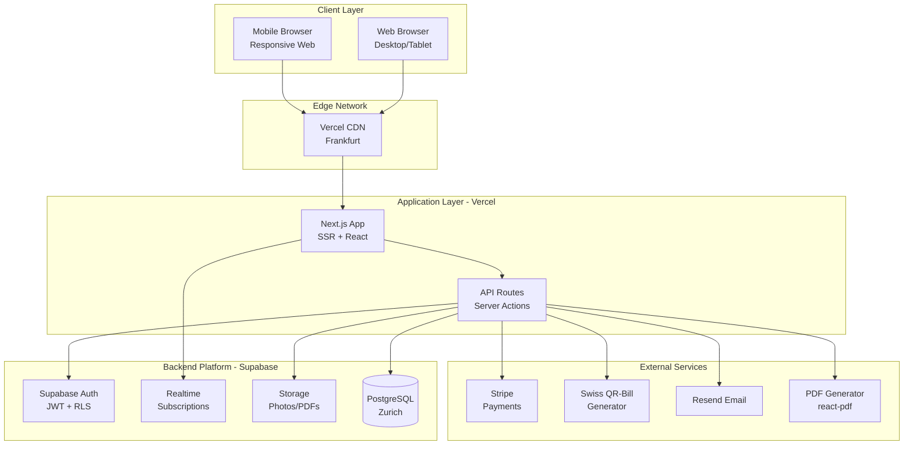
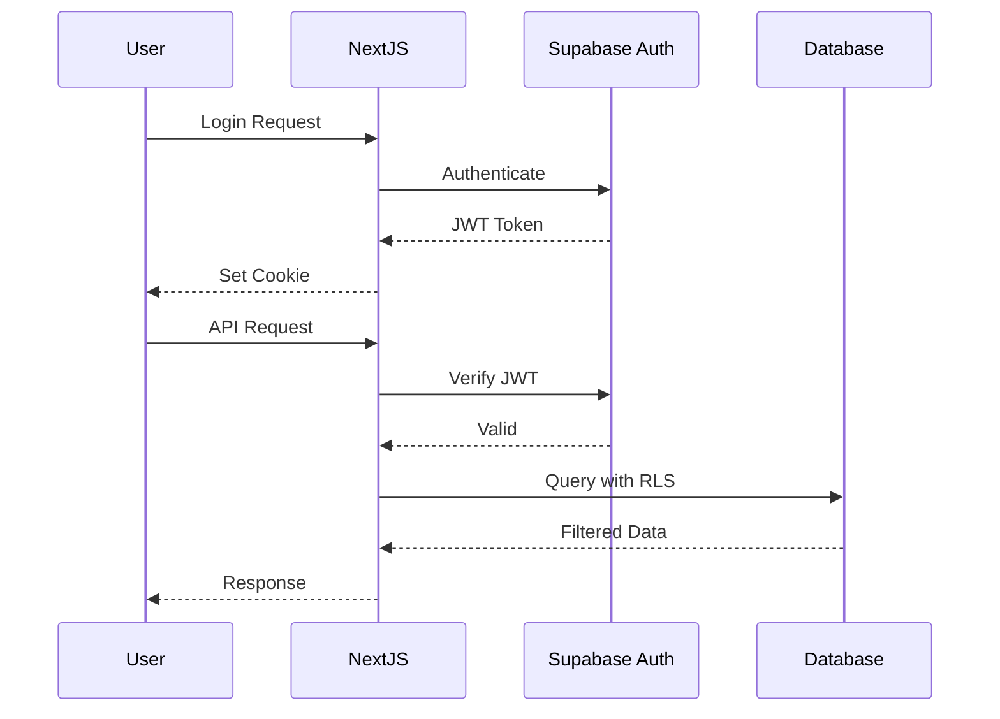

# Car Rental Management System (CRMS) - Fullstack Architecture Document

## Introduction

This document outlines the complete fullstack architecture for the Car Rental Management System (CRMS), including backend systems, frontend implementation, and their integration. It serves as the single source of truth for AI-driven development, ensuring consistency across the entire technology stack.

This unified approach combines what would traditionally be separate backend and frontend architecture documents, streamlining the development process for modern fullstack applications where these concerns are increasingly intertwined.

### Starter Template or Existing Project
**N/A - Greenfield project**

This is a new greenfield project without any existing codebase or starter template constraints. The architecture decisions will be made based on the PRD requirements and Swiss market needs.

### Change Log
| Date | Version | Description | Author |
|------|---------|-------------|--------|
| 2025-08-06 | 1.0 | Initial fullstack architecture document | Winston (Architect) |
| 2025-08-06 | 1.1 | Simplified to Supabase-first approach for MVP | Winston (Architect) |

## High Level Architecture

### Technical Summary
CRMS employs a simplified Supabase-first architecture with Next.js as the frontend framework. The system leverages Supabase's integrated platform features (database, auth, storage, realtime) to achieve rapid MVP development within the 6-8 week timeline. Infrastructure is hosted on Vercel's European regions with Supabase's Swiss data residency, ensuring GDPR compliance and low-latency access. This architecture achieves the 2-minute contract goal through optimized workflows and intelligent use of platform-native features.

### Platform and Infrastructure Choice

**Selected Platform:** Vercel + Supabase (Simplified MVP Approach)
**Key Services:** 
- Vercel (Frontend hosting, Edge Functions)
- Supabase (PostgreSQL, Auth, Storage, Real-time)
- Stripe (Payment processing)
- Resend (Email delivery)

**Deployment Host and Regions:** 
- Vercel: Frankfurt (eu-central-1) - Primary
- Supabase: Zurich (AWS eu-central-2) - Swiss data residency

### Repository Structure

**Structure:** Monorepo
**Monorepo Tool:** npm workspaces (simpler for MVP)
**Package Organization:** 
- apps/web (Next.js frontend)
- packages/database (Supabase types & migrations)
- packages/shared (business logic, types, utils)
- packages/ui (shared React components)

### High Level Architecture Diagram



### Architectural Patterns

- **Simplified Backend:** Supabase handles all backend complexity - _Rationale:_ Focus on business logic, not infrastructure
- **Database-First Design:** Leverage Supabase RLS for authorization - _Rationale:_ Centralized security model reduces auth complexity
- **Optimistic UI Updates:** React Query with optimistic mutations - _Rationale:_ Critical for achieving sub-2-minute contract flow perception
- **Server Components:** Next.js App Router with RSC - _Rationale:_ Reduce client bundle size and improve initial load for tablet devices
- **Component-Driven UI:** Atomic design with Shadcn/ui - _Rationale:_ Rapid UI development with consistent Swiss-professional aesthetic
- **Real-time Updates:** Supabase Realtime for fleet status - _Rationale:_ Prevent double-bookings without polling overhead
- **Progressive Enhancement:** Start simple, add complexity based on metrics - _Rationale:_ Avoid over-engineering before product-market fit

## Tech Stack

### Technology Stack Table - Complete MVP Stack

| Category | Technology | Version | Purpose | Rationale |
|----------|------------|---------|----------|-----------|
| **Core Framework** |||||
| Frontend Language | TypeScript | 5.3+ | Type-safe development | Prevents runtime errors in financial calculations |
| Frontend Framework | Next.js | 14.2+ | Full-stack React framework | App Router for RSC, optimal for complex workflows |
| Backend Platform | Supabase | 2.39+ | Complete backend solution | Auth, database, storage, realtime in one |
| Database | PostgreSQL | 15+ | Primary datastore | Supabase-hosted in Zurich, ACID compliance |
| **UI/UX Libraries** |||||
| UI Component Library | Shadcn/ui + Radix | Latest | Professional components | Swiss-clean aesthetic, fully customizable |
| CSS Framework | Tailwind CSS | 3.4+ | Utility-first CSS | Rapid development, consistent styling |
| Calendar Component | FullCalendar | 6.1+ | Fleet availability view | Interactive drag-drop calendar for reservations |
| Date Picker | react-day-picker | 8.0+ | Date selection | Lightweight, accessible date picking |
| Charts | Recharts | 2.10+ | Dashboard visualizations | ROI metrics and analytics display |
| **Document & Media** |||||
| PDF Generation | @react-pdf/renderer | 3.1+ | Contract generation | Server-side PDF with embedded images |
| Swiss QR Bills | swissqrbill | 3.2+ | Payment QR codes | ISO 20022 compliant Swiss payment slips |
| Digital Signatures | react-signature-canvas | 1.0+ | Touch signatures | Capture legally-binding signatures |
| Camera Access | react-webcam | 7.2+ | Photo capture | Tablet/desktop camera integration |
| Image Compression | browser-image-compression | 2.0+ | Photo optimization | Reduce size before upload (1MB max) |
| Image Annotation | Konva | 9.3+ | Damage marking | Draw on photos to mark damage |
| **State & Data** |||||
| State Management | Zustand | 4.5+ | Client state | Simple store for UI state |
| Server State | React Query (TanStack) | 5.0+ | Server cache | Data fetching, caching, synchronization |
| Form Handling | React Hook Form | 7.48+ | Form management | Performance-optimized forms |
| Validation | Zod | 3.22+ | Schema validation | Type-safe validation |
| **Financial & Utilities** |||||
| Money Calculations | Dinero.js | 1.9+ | Currency handling | Accurate CHF calculations with Rappen |
| Date Handling | date-fns | 3.0+ | Date manipulation | Tree-shakeable, timezone-aware |
| Phone Input | react-phone-number-input | 3.3+ | Swiss phone numbers | +41 format validation |
| Unique IDs | uuid | 9.0+ | ID generation | Database record identifiers |
| **Infrastructure** |||||
| Hosting | Vercel | Latest | Frontend hosting | Free tier, automatic deploys |
| File Storage | Supabase Storage | 2.39+ | Photos/PDFs | Integrated with auth, RLS |
| Authentication | Supabase Auth | 2.39+ | User management | Built-in 2FA, magic links |
| Realtime | Supabase Realtime | 2.39+ | Live updates | WebSocket for fleet status |
| **Payments** |||||
| Payment Processing | Stripe | Latest | Credit card payments | PCI compliant, Swiss market support |
| QR Bill Generation | swissqrbill | 3.2+ | Swiss payments | Generate only, manual reconciliation |
| **Development Tools** |||||
| Package Manager | pnpm | 8.14+ | Dependency management | Faster, efficient monorepo support |
| Build Tool | Vite | 5.0+ | Development server | Fast HMR for development |
| Bundler | Turbopack | Beta | Production builds | Faster Next.js builds |
| Linting | ESLint | 8.56+ | Code quality | Enforce coding standards |
| Formatting | Prettier | 3.2+ | Code formatting | Consistent code style |
| Git Hooks | Husky | 8.0+ | Pre-commit checks | Ensure quality before commits |
| **Testing** |||||
| Unit Testing | Vitest | 1.2+ | Unit/integration tests | Fast, ESM-native |
| Component Testing | Testing Library | 14+ | React component tests | User-centric testing |
| E2E Testing | Playwright | 1.41+ | End-to-end tests | Cross-browser testing |
| **Monitoring** |||||
| Error Tracking | Sentry | 7.99+ | Error monitoring | Real-time error alerts |
| Analytics | PostHog | 1.0+ | User analytics | Self-hosted option, privacy-first |
| **Email & Support** |||||
| Email Service | Resend | 2.1+ | Transactional email | Great DX, Swiss-friendly |
| Customer Support | Crisp.chat | Free | Live chat support | Optional for customer help |

## Data Models

### Core Data Models Overview

The system uses 8 core entities designed for multi-tenant SaaS with Swiss compliance requirements.

### 1. Companies (Multi-tenant isolation)
**Purpose:** Isolates data per rental company for SaaS multi-tenancy
**Key Attributes:**
- id: UUID - Unique identifier
- name: string - Company name
- subscription_tier: enum - Pricing tier (starter/professional/business)
- settings: JSON - Company-specific configuration

**TypeScript Interface:**
```typescript
interface Company {
  id: string;
  name: string;
  vat_number: string;
  address: string;
  city: string;
  postal_code: string;
  canton: string;
  phone: string;
  email: string;
  subscription_tier: 'starter' | 'professional' | 'business';
  subscription_status: 'active' | 'trial' | 'suspended';
  trial_ends_at: Date;
  created_at: Date;
  settings: {
    currency: 'CHF';
    vat_rate: number;
    default_fuel_price: number;
    km_price: number;
    contract_terms: string;
  };
}
```

**Relationships:**
- Owns vehicles, contracts, staff users

### 2. Users (Staff and Owners)
**Purpose:** Authentication and authorization for system access
**Key Attributes:**
- id: UUID - From Supabase Auth
- company_id: UUID - Links to company
- role: enum - Access level (owner/staff/admin)
- permissions: JSON - Granular permissions

**TypeScript Interface:**
```typescript
interface User {
  id: string;
  company_id: string;
  email: string;
  full_name: string;
  role: 'owner' | 'staff' | 'admin';
  phone?: string;
  is_active: boolean;
  created_at: Date;
  last_login?: Date;
  permissions: {
    can_create_contracts: boolean;
    can_modify_contracts: boolean;
    can_view_financials: boolean;
    can_manage_fleet: boolean;
  };
}
```

**Relationships:**
- Belongs to company, creates contracts/actions

### 3. Customers (Rental customers)
**Purpose:** Store customer information for quick contract creation
**Key Attributes:**
- id: UUID - Unique identifier
- Personal info: name, DOB, contact details
- Documents: ID type/number, driver license
- Status: blacklist flag, verification status

**TypeScript Interface:**
```typescript
interface Customer {
  id: string;
  company_id: string;
  first_name: string;
  last_name: string;
  date_of_birth: Date;
  email?: string;
  phone: string;
  address: string;
  city: string;
  postal_code: string;
  country: string;
  id_type: 'passport' | 'swiss_id' | 'residence_permit';
  id_number: string;
  id_expiry?: Date;
  driver_license_number: string;
  driver_license_expiry: Date;
  driver_license_category: string;
  is_blacklisted: boolean;
  blacklist_reason?: string;
  verified: boolean;
  notes?: string;
  created_at: Date;
  updated_at: Date;
  created_by: string;
}
```

**Relationships:**
- Has many contracts, rental history

### 4. Vehicles (Fleet inventory)
**Purpose:** Track fleet inventory and availability
**Key Attributes:**
- License plate, VIN, make/model
- Rental rates: daily/weekly/monthly
- Current status and state (km, fuel)
- Maintenance tracking

**TypeScript Interface:**
```typescript
interface Vehicle {
  id: string;
  company_id: string;
  license_plate: string;
  vin?: string;
  make: string;
  model: string;
  year: number;
  color: string;
  vehicle_type: 'sedan' | 'suv' | 'van' | 'luxury' | 'economy';
  daily_rate: number;
  weekly_rate: number;
  monthly_rate: number;
  deposit_amount: number;
  status: 'available' | 'rented' | 'maintenance' | 'cleaning' | 'retired';
  current_km: number;
  fuel_level: number;
  next_service_km?: number;
  next_service_date?: Date;
  created_at: Date;
  updated_at: Date;
  is_active: boolean;
  features: string[];
}
```

**Relationships:**
- Has many contracts, maintenance records

### 5. Contracts (Core rental agreements)
**Purpose:** Complete rental contract lifecycle management
**Key Attributes:**
- Contract parties and vehicle
- Rental period and pricing
- Vehicle state at pickup/return
- Payment tracking and status

**TypeScript Interface:**
```typescript
interface Contract {
  id: string;
  company_id: string;
  contract_number: string;
  customer_id: string;
  vehicle_id: string;
  created_by: string;
  start_date: Date;
  end_date: Date;
  actual_return_date?: Date;
  pickup_km: number;
  pickup_fuel: number;
  return_km?: number;
  return_fuel?: number;
  base_rate: number;
  rate_type: 'daily' | 'weekly' | 'monthly';
  total_days: number;
  subtotal: number;
  vat_rate: number;
  vat_amount: number;
  total_amount: number;
  deposit_amount: number;
  deposit_status: 'pending' | 'held' | 'released' | 'forfeited';
  payment_status: 'pending' | 'partial' | 'paid' | 'refunded';
  status: 'draft' | 'confirmed' | 'active' | 'completed' | 'cancelled';
  contract_pdf_url?: string;
  signed_at?: Date;
  created_at: Date;
  updated_at: Date;
  version: number;
}
```

**Relationships:**
- Belongs to customer/vehicle, has photos/payments

### 6. Contract Photos (Evidence documentation)
**Purpose:** Visual evidence for contract disputes
**Key Attributes:**
- Photo type and category
- Storage path and URLs
- Damage annotations
- Upload metadata

**TypeScript Interface:**
```typescript
interface ContractPhoto {
  id: string;
  contract_id: string;
  company_id: string;
  photo_type: 'pickup' | 'return' | 'damage' | 'id' | 'license';
  photo_category: 'exterior' | 'interior' | 'damage' | 'document';
  storage_path: string;
  public_url: string;
  thumbnail_url?: string;
  caption?: string;
  damage_description?: string;
  position?: 'front' | 'rear' | 'left' | 'right' | 'top' | 'interior';
  uploaded_at: Date;
  uploaded_by: string;
  sort_order: number;
  annotations?: {
    x: number;
    y: number;
    width: number;
    height: number;
    description: string;
  }[];
}
```

**Relationships:**
- Belongs to contract

### 7. Payments (Financial transactions)
**Purpose:** Track all financial transactions
**Key Attributes:**
- Amount and currency
- Payment type and method
- Status and references
- QR bill generation

**TypeScript Interface:**
```typescript
interface Payment {
  id: string;
  company_id: string;
  contract_id: string;
  amount: number;
  currency: 'CHF';
  payment_type: 'deposit' | 'rental' | 'damage' | 'fine' | 'refund';
  payment_method: 'cash' | 'card' | 'transfer' | 'twint';
  status: 'pending' | 'completed' | 'failed' | 'refunded';
  reference_number?: string;
  transaction_id?: string;
  processed_at?: Date;
  processed_by?: string;
  created_at: Date;
  qr_bill_generated?: boolean;
  qr_bill_url?: string;
  notes?: string;
}
```

**Relationships:**
- Belongs to contract

### 8. Reservations (Future bookings)
**Purpose:** Manage future vehicle bookings
**Key Attributes:**
- Customer and vehicle
- Reservation dates
- Status tracking
- Conversion to contract

**TypeScript Interface:**
```typescript
interface Reservation {
  id: string;
  company_id: string;
  customer_id: string;
  vehicle_id: string;
  start_date: Date;
  end_date: Date;
  status: 'pending' | 'confirmed' | 'cancelled' | 'no_show' | 'converted';
  contract_id?: string;
  converted_at?: Date;
  cancelled_at?: Date;
  cancellation_reason?: string;
  created_at: Date;
  created_by: string;
  notes?: string;
}
```

**Relationships:**
- Can convert to contract

## Storage Architecture

### Simplified Supabase-First Approach

For MVP, we use Supabase Storage for everything with a clear migration path for future optimization.

**Current Storage Strategy:**
- **Photos:** Supabase Storage with public bucket
- **PDFs:** Supabase Storage with RLS protection
- **Temp files:** Supabase Storage with auto-cleanup policies
- **Backups:** Supabase automatic daily backups

**Future Migration Path (Month 3+):**
- Add CDN when photo loading exceeds 2 seconds
- Move to R2/B2 when storage costs exceed CHF 50/month
- Implement Redis caching when search slows down

## API Specification

### Overview

The CRMS API follows RESTful principles and combines:
1. **Supabase Auto-generated APIs** - Direct CRUD operations with Row Level Security (RLS)
2. **Custom Next.js API Routes** - Complex business logic and integrations
3. **Real-time Subscriptions** - WebSocket connections for live updates

**Base URLs:**
- Production: `https://crms.swiss/api/v1`
- Staging: `https://staging.crms.swiss/api/v1`
- Supabase: `https://[project-id].supabase.co/rest/v1`

**Authentication:** JWT Bearer tokens from Supabase Auth
**Rate Limiting:** 100 requests per minute per authenticated user
**Swiss Compliance:** All endpoints support Swiss data residency and GDPR

### Global Response Format

All API responses follow a consistent structure:

```typescript
interface APIResponse<T> {
  success: boolean;
  data?: T;
  error?: {
    code: string;
    message: string;
    details?: any;
  };
  meta?: {
    total?: number;
    page?: number;
    limit?: number;
    has_more?: boolean;
  };
}
```

### Error Codes

| Code | HTTP Status | Description |
|------|-------------|-------------|
| `UNAUTHORIZED` | 401 | Invalid or missing JWT token |
| `FORBIDDEN` | 403 | Insufficient permissions |
| `NOT_FOUND` | 404 | Resource not found |
| `VALIDATION_ERROR` | 422 | Request validation failed |
| `RATE_LIMIT_EXCEEDED` | 429 | Too many requests |
| `INTERNAL_ERROR` | 500 | Server error |
| `MAINTENANCE_MODE` | 503 | System maintenance |

## Authentication Endpoints

### POST /auth/login
**Purpose:** Authenticate user with email/password

**Request:**
```json
{
  "email": "user@example.ch",
  "password": "securePassword123",
  "remember_me": true
}
```

**Response:**
```json
{
  "success": true,
  "data": {
    "access_token": "eyJhbGciOiJIUzI1NiIsInR5cCI6IkpXVCJ9...",
    "refresh_token": "eyJhbGciOiJIUzI1NiIsInR5cCI6IkpXVCJ9...",
    "expires_at": 1699123200,
    "user": {
      "id": "123e4567-e89b-12d3-a456-426614174000",
      "email": "user@example.ch",
      "full_name": "John Doe",
      "role": "staff",
      "company_id": "123e4567-e89b-12d3-a456-426614174001",
      "permissions": {
        "can_create_contracts": true,
        "can_modify_contracts": false,
        "can_view_financials": false,
        "can_manage_fleet": false
      }
    }
  }
}
```

### POST /auth/magic-link
**Purpose:** Send magic link for passwordless login

**Request:**
```json
{
  "email": "user@example.ch",
  "redirect_url": "https://crms.swiss/dashboard"
}
```

**Response:**
```json
{
  "success": true,
  "data": {
    "message": "Magic link sent to your email"
  }
}
```

### POST /auth/refresh
**Purpose:** Refresh access token

**Headers:**
```
Authorization: Bearer [refresh_token]
```

**Response:**
```json
{
  "success": true,
  "data": {
    "access_token": "eyJhbGciOiJIUzI1NiIsInR5cCI6IkpXVCJ9...",
    "expires_at": 1699126800
  }
}
```

### POST /auth/logout
**Purpose:** Invalidate user session

**Headers:**
```
Authorization: Bearer [access_token]
```

**Response:**
```json
{
  "success": true,
  "data": {
    "message": "Successfully logged out"
  }
}
```

### POST /auth/password-reset
**Purpose:** Send password reset email

**Request:**
```json
{
  "email": "user@example.ch"
}
```

**Response:**
```json
{
  "success": true,
  "data": {
    "message": "Password reset instructions sent"
  }
}
```

### POST /auth/password-update
**Purpose:** Update user password

**Headers:**
```
Authorization: Bearer [access_token]
```

**Request:**
```json
{
  "current_password": "oldPassword123",
  "new_password": "newSecurePassword456"
}
```

**Response:**
```json
{
  "success": true,
  "data": {
    "message": "Password updated successfully"
  }
}
```

## Company Management

### GET /companies/current
**Purpose:** Get current user's company details

**Headers:**
```
Authorization: Bearer [access_token]
```

**Response:**
```json
{
  "success": true,
  "data": {
    "id": "123e4567-e89b-12d3-a456-426614174001",
    "name": "Swiss Rental AG",
    "vat_number": "CHE-123.456.789",
    "address": "Bahnhofstrasse 1",
    "city": "Zurich",
    "postal_code": "8001",
    "canton": "ZH",
    "phone": "+41 44 123 45 67",
    "email": "info@swissrental.ch",
    "subscription_tier": "professional",
    "subscription_status": "active",
    "trial_ends_at": null,
    "created_at": "2025-01-01T00:00:00Z",
    "settings": {
      "currency": "CHF",
      "vat_rate": 7.7,
      "default_fuel_price": 1.65,
      "km_price": 0.25,
      "contract_terms": "Standard rental terms..."
    }
  }
}
```

### PUT /companies/current
**Purpose:** Update company information

**Headers:**
```
Authorization: Bearer [access_token]
```

**Request:**
```json
{
  "name": "Swiss Rental AG",
  "phone": "+41 44 123 45 67",
  "email": "info@swissrental.ch",
  "settings": {
    "vat_rate": 7.7,
    "default_fuel_price": 1.70,
    "km_price": 0.30
  }
}
```

**Response:**
```json
{
  "success": true,
  "data": {
    "message": "Company updated successfully"
  }
}
```

## User Management

### GET /users
**Purpose:** List company users with pagination

**Headers:**
```
Authorization: Bearer [access_token]
```

**Query Parameters:**
- `page` (number): Page number (default: 1)
- `limit` (number): Items per page (max: 100, default: 25)
- `role` (string): Filter by role
- `active` (boolean): Filter by active status
- `search` (string): Search by name or email

**Response:**
```json
{
  "success": true,
  "data": [
    {
      "id": "123e4567-e89b-12d3-a456-426614174002",
      "company_id": "123e4567-e89b-12d3-a456-426614174001",
      "email": "staff@swissrental.ch",
      "full_name": "Jane Smith",
      "role": "staff",
      "phone": "+41 79 123 45 67",
      "is_active": true,
      "created_at": "2025-01-15T10:30:00Z",
      "last_login": "2025-08-06T08:15:00Z",
      "permissions": {
        "can_create_contracts": true,
        "can_modify_contracts": false,
        "can_view_financials": false,
        "can_manage_fleet": true
      }
    }
  ],
  "meta": {
    "total": 5,
    "page": 1,
    "limit": 25,
    "has_more": false
  }
}
```

### POST /users
**Purpose:** Create new user

**Headers:**
```
Authorization: Bearer [access_token]
```

**Request:**
```json
{
  "email": "newuser@swissrental.ch",
  "full_name": "New User",
  "role": "staff",
  "phone": "+41 79 987 65 43",
  "permissions": {
    "can_create_contracts": true,
    "can_modify_contracts": false,
    "can_view_financials": false,
    "can_manage_fleet": false
  }
}
```

**Response:**
```json
{
  "success": true,
  "data": {
    "id": "123e4567-e89b-12d3-a456-426614174003",
    "message": "User created successfully. Invitation email sent."
  }
}
```

### PUT /users/{user_id}
**Purpose:** Update user information

**Headers:**
```
Authorization: Bearer [access_token]
```

**Path Parameters:**
- `user_id` (string): User UUID

**Request:**
```json
{
  "full_name": "Updated Name",
  "role": "admin",
  "is_active": true,
  "permissions": {
    "can_create_contracts": true,
    "can_modify_contracts": true,
    "can_view_financials": true,
    "can_manage_fleet": true
  }
}
```

**Response:**
```json
{
  "success": true,
  "data": {
    "message": "User updated successfully"
  }
}
```

### DELETE /users/{user_id}
**Purpose:** Deactivate user (soft delete)

**Headers:**
```
Authorization: Bearer [access_token]
```

**Response:**
```json
{
  "success": true,
  "data": {
    "message": "User deactivated successfully"
  }
}
```

## Customer Management

### GET /customers
**Purpose:** List customers with advanced filtering

**Headers:**
```
Authorization: Bearer [access_token]
```

**Query Parameters:**
- `page` (number): Page number
- `limit` (number): Items per page
- `search` (string): Search name, email, phone, or ID number
- `blacklisted` (boolean): Filter blacklisted customers
- `verified` (boolean): Filter verified customers
- `sort` (string): Sort field (name, created_at, last_rental)
- `order` (string): Sort order (asc, desc)

**Response:**
```json
{
  "success": true,
  "data": [
    {
      "id": "123e4567-e89b-12d3-a456-426614174004",
      "company_id": "123e4567-e89b-12d3-a456-426614174001",
      "first_name": "Hans",
      "last_name": "Mueller",
      "date_of_birth": "1985-06-15",
      "email": "hans.mueller@example.ch",
      "phone": "+41 79 123 45 67",
      "address": "Musterstrasse 12",
      "city": "Basel",
      "postal_code": "4001",
      "country": "Switzerland",
      "id_type": "swiss_id",
      "id_number": "CH1234567890",
      "driver_license_number": "CH98765432",
      "driver_license_expiry": "2028-06-15",
      "driver_license_category": "B",
      "is_blacklisted": false,
      "verified": true,
      "created_at": "2025-02-01T14:20:00Z",
      "total_rentals": 5,
      "last_rental_date": "2025-07-15T00:00:00Z"
    }
  ],
  "meta": {
    "total": 150,
    "page": 1,
    "limit": 25,
    "has_more": true
  }
}
```

### GET /customers/{customer_id}
**Purpose:** Get customer details with rental history

**Headers:**
```
Authorization: Bearer [access_token]
```

**Response:**
```json
{
  "success": true,
  "data": {
    "id": "123e4567-e89b-12d3-a456-426614174004",
    "first_name": "Hans",
    "last_name": "Mueller",
    "date_of_birth": "1985-06-15",
    "email": "hans.mueller@example.ch",
    "phone": "+41 79 123 45 67",
    "address": "Musterstrasse 12",
    "city": "Basel",
    "postal_code": "4001",
    "country": "Switzerland",
    "id_type": "swiss_id",
    "id_number": "CH1234567890",
    "driver_license_number": "CH98765432",
    "driver_license_expiry": "2028-06-15",
    "driver_license_category": "B",
    "is_blacklisted": false,
    "verified": true,
    "notes": "Reliable customer, always on time",
    "created_at": "2025-02-01T14:20:00Z",
    "rental_history": [
      {
        "contract_id": "123e4567-e89b-12d3-a456-426614174010",
        "contract_number": "CR-2025-001",
        "vehicle": "VW Golf - ZH-123456",
        "start_date": "2025-07-15",
        "end_date": "2025-07-18",
        "status": "completed",
        "total_amount": 450.00
      }
    ]
  }
}
```

### POST /customers
**Purpose:** Create new customer

**Headers:**
```
Authorization: Bearer [access_token]
```

**Request:**
```json
{
  "first_name": "Anna",
  "last_name": "Zimmermann",
  "date_of_birth": "1990-03-22",
  "email": "anna.zimmermann@example.ch",
  "phone": "+41 76 987 65 43",
  "address": "Seestrasse 25",
  "city": "Lucerne",
  "postal_code": "6002",
  "country": "Switzerland",
  "id_type": "swiss_id",
  "id_number": "CH9876543210",
  "driver_license_number": "CH12345678",
  "driver_license_expiry": "2029-03-22",
  "driver_license_category": "B",
  "notes": "New customer from referral"
}
```

**Response:**
```json
{
  "success": true,
  "data": {
    "id": "123e4567-e89b-12d3-a456-426614174005",
    "message": "Customer created successfully"
  }
}
```

### PUT /customers/{customer_id}
**Purpose:** Update customer information

**Headers:**
```
Authorization: Bearer [access_token]
```

**Request:**
```json
{
  "phone": "+41 76 987 65 44",
  "address": "New Address 30",
  "driver_license_expiry": "2030-03-22",
  "notes": "Updated contact information"
}
```

**Response:**
```json
{
  "success": true,
  "data": {
    "message": "Customer updated successfully"
  }
}
```

### POST /customers/{customer_id}/blacklist
**Purpose:** Add customer to blacklist

**Headers:**
```
Authorization: Bearer [access_token]
```

**Request:**
```json
{
  "reason": "Damaged vehicle and refused to pay"
}
```

**Response:**
```json
{
  "success": true,
  "data": {
    "message": "Customer blacklisted successfully"
  }
}
```

### DELETE /customers/{customer_id}/blacklist
**Purpose:** Remove customer from blacklist

**Headers:**
```
Authorization: Bearer [access_token]
```

**Response:**
```json
{
  "success": true,
  "data": {
    "message": "Customer removed from blacklist"
  }
}
```

## Vehicle Management

### GET /vehicles
**Purpose:** List vehicles with availability status

**Headers:**
```
Authorization: Bearer [access_token]
```

**Query Parameters:**
- `page` (number): Page number
- `limit` (number): Items per page
- `status` (string): Filter by status
- `type` (string): Filter by vehicle type
- `available_from` (date): Check availability from date
- `available_to` (date): Check availability until date
- `search` (string): Search license plate, make, model
- `sort` (string): Sort field
- `order` (string): Sort order

**Response:**
```json
{
  "success": true,
  "data": [
    {
      "id": "123e4567-e89b-12d3-a456-426614174006",
      "company_id": "123e4567-e89b-12d3-a456-426614174001",
      "license_plate": "ZH-123456",
      "vin": "WVWZZZ1JZ3W386752",
      "make": "Volkswagen",
      "model": "Golf",
      "year": 2023,
      "color": "Silver",
      "vehicle_type": "economy",
      "daily_rate": 89.00,
      "weekly_rate": 500.00,
      "monthly_rate": 1800.00,
      "deposit_amount": 500.00,
      "status": "available",
      "current_km": 15432,
      "fuel_level": 85,
      "next_service_km": 20000,
      "next_service_date": "2025-12-01",
      "features": ["GPS", "Bluetooth", "Air Conditioning"],
      "is_active": true,
      "availability": {
        "is_available": true,
        "next_rental": null,
        "available_until": "2025-08-20"
      }
    }
  ],
  "meta": {
    "total": 25,
    "page": 1,
    "limit": 25,
    "has_more": false
  }
}
```

### GET /vehicles/{vehicle_id}
**Purpose:** Get vehicle details with rental history

**Headers:**
```
Authorization: Bearer [access_token]
```

**Response:**
```json
{
  "success": true,
  "data": {
    "id": "123e4567-e89b-12d3-a456-426614174006",
    "license_plate": "ZH-123456",
    "make": "Volkswagen",
    "model": "Golf",
    "year": 2023,
    "color": "Silver",
    "vehicle_type": "economy",
    "daily_rate": 89.00,
    "weekly_rate": 500.00,
    "monthly_rate": 1800.00,
    "deposit_amount": 500.00,
    "status": "available",
    "current_km": 15432,
    "fuel_level": 85,
    "features": ["GPS", "Bluetooth", "Air Conditioning"],
    "rental_history": [
      {
        "contract_id": "123e4567-e89b-12d3-a456-426614174010",
        "customer_name": "Hans Mueller",
        "start_date": "2025-07-15",
        "end_date": "2025-07-18",
        "total_km": 245,
        "status": "completed"
      }
    ],
    "maintenance_records": [
      {
        "date": "2025-06-01",
        "type": "Service",
        "description": "Regular service at 10,000 km",
        "cost": 350.00
      }
    ]
  }
}
```

### POST /vehicles
**Purpose:** Add new vehicle to fleet

**Headers:**
```
Authorization: Bearer [access_token]
```

**Request:**
```json
{
  "license_plate": "ZH-789012",
  "vin": "WVWZZZ1JZ3W386753",
  "make": "Volkswagen",
  "model": "Passat",
  "year": 2024,
  "color": "Blue",
  "vehicle_type": "sedan",
  "daily_rate": 120.00,
  "weekly_rate": 750.00,
  "monthly_rate": 2500.00,
  "deposit_amount": 800.00,
  "current_km": 0,
  "fuel_level": 100,
  "features": ["GPS", "Bluetooth", "Air Conditioning", "Leather Seats"]
}
```

**Response:**
```json
{
  "success": true,
  "data": {
    "id": "123e4567-e89b-12d3-a456-426614174007",
    "message": "Vehicle added successfully"
  }
}
```

### PUT /vehicles/{vehicle_id}
**Purpose:** Update vehicle information

**Headers:**
```
Authorization: Bearer [access_token]
```

**Request:**
```json
{
  "daily_rate": 95.00,
  "status": "maintenance",
  "current_km": 15650,
  "fuel_level": 45,
  "features": ["GPS", "Bluetooth", "Air Conditioning", "Heated Seats"]
}
```

**Response:**
```json
{
  "success": true,
  "data": {
    "message": "Vehicle updated successfully"
  }
}
```

### GET /vehicles/availability
**Purpose:** Check vehicle availability for date range

**Headers:**
```
Authorization: Bearer [access_token]
```

**Query Parameters:**
- `start_date` (date): Required start date
- `end_date` (date): Required end date
- `vehicle_type` (string): Filter by type
- `exclude_contract` (string): Exclude specific contract from check

**Response:**
```json
{
  "success": true,
  "data": {
    "available_vehicles": [
      {
        "id": "123e4567-e89b-12d3-a456-426614174006",
        "license_plate": "ZH-123456",
        "make": "Volkswagen",
        "model": "Golf",
        "vehicle_type": "economy",
        "daily_rate": 89.00,
        "is_available": true
      }
    ],
    "unavailable_vehicles": [
      {
        "id": "123e4567-e89b-12d3-a456-426614174008",
        "license_plate": "ZH-456789",
        "make": "BMW",
        "model": "320i",
        "vehicle_type": "luxury",
        "reason": "Already rented",
        "available_from": "2025-08-10"
      }
    ]
  }
}
```

## Contract Management

### GET /contracts
**Purpose:** List contracts with advanced filtering

**Headers:**
```
Authorization: Bearer [access_token]
```

**Query Parameters:**
- `page` (number): Page number
- `limit` (number): Items per page
- `status` (string): Filter by status
- `customer_id` (string): Filter by customer
- `vehicle_id` (string): Filter by vehicle
- `start_date` (date): Filter contracts starting from date
- `end_date` (date): Filter contracts ending before date
- `payment_status` (string): Filter by payment status
- `search` (string): Search contract number or customer name
- `sort` (string): Sort field
- `order` (string): Sort order

**Response:**
```json
{
  "success": true,
  "data": [
    {
      "id": "123e4567-e89b-12d3-a456-426614174010",
      "contract_number": "CR-2025-001",
      "customer": {
        "id": "123e4567-e89b-12d3-a456-426614174004",
        "name": "Hans Mueller",
        "phone": "+41 79 123 45 67"
      },
      "vehicle": {
        "id": "123e4567-e89b-12d3-a456-426614174006",
        "license_plate": "ZH-123456",
        "make": "Volkswagen",
        "model": "Golf"
      },
      "start_date": "2025-08-10T10:00:00Z",
      "end_date": "2025-08-15T10:00:00Z",
      "total_days": 5,
      "total_amount": 525.00,
      "deposit_amount": 500.00,
      "status": "confirmed",
      "payment_status": "paid",
      "created_at": "2025-08-05T14:30:00Z",
      "created_by": "Jane Smith"
    }
  ],
  "meta": {
    "total": 45,
    "page": 1,
    "limit": 25,
    "has_more": true
  }
}
```

### GET /contracts/{contract_id}
**Purpose:** Get complete contract details

**Headers:**
```
Authorization: Bearer [access_token]
```

**Response:**
```json
{
  "success": true,
  "data": {
    "id": "123e4567-e89b-12d3-a456-426614174010",
    "contract_number": "CR-2025-001",
    "customer": {
      "id": "123e4567-e89b-12d3-a456-426614174004",
      "first_name": "Hans",
      "last_name": "Mueller",
      "email": "hans.mueller@example.ch",
      "phone": "+41 79 123 45 67",
      "driver_license_number": "CH98765432"
    },
    "vehicle": {
      "id": "123e4567-e89b-12d3-a456-426614174006",
      "license_plate": "ZH-123456",
      "make": "Volkswagen",
      "model": "Golf",
      "year": 2023
    },
    "start_date": "2025-08-10T10:00:00Z",
    "end_date": "2025-08-15T10:00:00Z",
    "actual_return_date": null,
    "pickup_km": 15432,
    "pickup_fuel": 85,
    "return_km": null,
    "return_fuel": null,
    "base_rate": 89.00,
    "rate_type": "daily",
    "total_days": 5,
    "subtotal": 445.00,
    "vat_rate": 7.7,
    "vat_amount": 34.27,
    "total_amount": 479.27,
    "deposit_amount": 500.00,
    "deposit_status": "held",
    "payment_status": "paid",
    "status": "confirmed",
    "contract_pdf_url": "https://storage.supabase.co/contracts/CR-2025-001.pdf",
    "signed_at": "2025-08-05T15:00:00Z",
    "created_at": "2025-08-05T14:30:00Z",
    "photos": [
      {
        "id": "123e4567-e89b-12d3-a456-426614174020",
        "photo_type": "pickup",
        "photo_category": "exterior",
        "public_url": "https://storage.supabase.co/photos/pickup_exterior_1.jpg",
        "caption": "Front view at pickup",
        "uploaded_at": "2025-08-10T09:45:00Z"
      }
    ],
    "payments": [
      {
        "id": "123e4567-e89b-12d3-a456-426614174030",
        "amount": 479.27,
        "payment_type": "rental",
        "payment_method": "card",
        "status": "completed",
        "processed_at": "2025-08-05T15:30:00Z"
      }
    ]
  }
}
```

### POST /contracts
**Purpose:** Create new rental contract

**Headers:**
```
Authorization: Bearer [access_token]
```

**Request:**
```json
{
  "customer_id": "123e4567-e89b-12d3-a456-426614174004",
  "vehicle_id": "123e4567-e89b-12d3-a456-426614174006",
  "start_date": "2025-08-10T10:00:00Z",
  "end_date": "2025-08-15T10:00:00Z",
  "pickup_km": 15432,
  "pickup_fuel": 85,
  "rate_type": "daily",
  "base_rate": 89.00,
  "deposit_amount": 500.00
}
```

**Response:**
```json
{
  "success": true,
  "data": {
    "id": "123e4567-e89b-12d3-a456-426614174011",
    "contract_number": "CR-2025-002",
    "status": "draft",
    "total_amount": 479.27,
    "contract_pdf_url": "https://storage.supabase.co/contracts/CR-2025-002.pdf"
  }
}
```

### PUT /contracts/{contract_id}
**Purpose:** Update contract details

**Headers:**
```
Authorization: Bearer [access_token]
```

**Request:**
```json
{
  "end_date": "2025-08-16T10:00:00Z",
  "pickup_km": 15435,
  "pickup_fuel": 90
}
```

**Response:**
```json
{
  "success": true,
  "data": {
    "message": "Contract updated successfully",
    "total_amount": 568.27,
    "contract_pdf_url": "https://storage.supabase.co/contracts/CR-2025-002.pdf"
  }
}
```

### POST /contracts/{contract_id}/confirm
**Purpose:** Confirm contract and make it active

**Headers:**
```
Authorization: Bearer [access_token]
```

**Request:**
```json
{
  "signature_url": "https://storage.supabase.co/signatures/CR-2025-002.png"
}
```

**Response:**
```json
{
  "success": true,
  "data": {
    "status": "confirmed",
    "message": "Contract confirmed successfully"
  }
}
```

### POST /contracts/{contract_id}/return
**Purpose:** Process vehicle return

**Headers:**
```
Authorization: Bearer [access_token]
```

**Request:**
```json
{
  "return_km": 15987,
  "return_fuel": 25,
  "damage_notes": "Small scratch on rear bumper",
  "extra_charges": [
    {
      "description": "Fuel refill",
      "amount": 45.00
    },
    {
      "description": "Cleaning fee",
      "amount": 50.00
    }
  ]
}
```

**Response:**
```json
{
  "success": true,
  "data": {
    "status": "completed",
    "total_km": 555,
    "extra_charges_total": 95.00,
    "final_amount": 574.27,
    "deposit_returned": 405.00,
    "message": "Vehicle returned successfully"
  }
}
```

### POST /contracts/{contract_id}/cancel
**Purpose:** Cancel contract

**Headers:**
```
Authorization: Bearer [access_token]
```

**Request:**
```json
{
  "reason": "Customer requested cancellation",
  "refund_amount": 400.00
}
```

**Response:**
```json
{
  "success": true,
  "data": {
    "status": "cancelled",
    "refund_amount": 400.00,
    "message": "Contract cancelled successfully"
  }
}
```

## Photo Management

### POST /contracts/{contract_id}/photos
**Purpose:** Upload contract photos

**Headers:**
```
Authorization: Bearer [access_token]
Content-Type: multipart/form-data
```

**Request:**
```
file: [image file]
photo_type: pickup|return|damage|id|license
photo_category: exterior|interior|damage|document
caption: "Front view at pickup"
position: front|rear|left|right|top|interior (optional)
damage_description: "Small scratch visible" (for damage photos)
```

**Response:**
```json
{
  "success": true,
  "data": {
    "id": "123e4567-e89b-12d3-a456-426614174020",
    "public_url": "https://storage.supabase.co/photos/pickup_exterior_1.jpg",
    "thumbnail_url": "https://storage.supabase.co/photos/thumbnails/pickup_exterior_1.jpg"
  }
}
```

### PUT /photos/{photo_id}
**Purpose:** Update photo metadata

**Headers:**
```
Authorization: Bearer [access_token]
```

**Request:**
```json
{
  "caption": "Updated caption",
  "damage_description": "Detailed damage description",
  "annotations": [
    {
      "x": 100,
      "y": 150,
      "width": 50,
      "height": 30,
      "description": "Scratch here"
    }
  ]
}
```

**Response:**
```json
{
  "success": true,
  "data": {
    "message": "Photo updated successfully"
  }
}
```

### DELETE /photos/{photo_id}
**Purpose:** Delete photo

**Headers:**
```
Authorization: Bearer [access_token]
```

**Response:**
```json
{
  "success": true,
  "data": {
    "message": "Photo deleted successfully"
  }
}
```

## Payment Management

### GET /payments
**Purpose:** List payments with filtering

**Headers:**
```
Authorization: Bearer [access_token]
```

**Query Parameters:**
- `page` (number): Page number
- `limit` (number): Items per page
- `contract_id` (string): Filter by contract
- `payment_type` (string): Filter by type
- `payment_method` (string): Filter by method
- `status` (string): Filter by status
- `date_from` (date): Filter payments from date
- `date_to` (date): Filter payments until date
- `sort` (string): Sort field
- `order` (string): Sort order

**Response:**
```json
{
  "success": true,
  "data": [
    {
      "id": "123e4567-e89b-12d3-a456-426614174030",
      "contract_id": "123e4567-e89b-12d3-a456-426614174010",
      "contract_number": "CR-2025-001",
      "customer_name": "Hans Mueller",
      "amount": 479.27,
      "currency": "CHF",
      "payment_type": "rental",
      "payment_method": "card",
      "status": "completed",
      "reference_number": "REF-2025-001",
      "processed_at": "2025-08-05T15:30:00Z",
      "processed_by": "Jane Smith"
    }
  ],
  "meta": {
    "total": 120,
    "page": 1,
    "limit": 25,
    "has_more": true
  }
}
```

### POST /payments
**Purpose:** Process payment

**Headers:**
```
Authorization: Bearer [access_token]
```

**Request:**
```json
{
  "contract_id": "123e4567-e89b-12d3-a456-426614174010",
  "amount": 479.27,
  "payment_type": "rental",
  "payment_method": "card",
  "reference_number": "REF-2025-001"
}
```

**Response:**
```json
{
  "success": true,
  "data": {
    "id": "123e4567-e89b-12d3-a456-426614174031",
    "status": "completed",
    "transaction_id": "txn_1234567890",
    "message": "Payment processed successfully"
  }
}
```

### POST /payments/{payment_id}/refund
**Purpose:** Process refund

**Headers:**
```
Authorization: Bearer [access_token]
```

**Request:**
```json
{
  "amount": 100.00,
  "reason": "Partial cancellation refund"
}
```

**Response:**
```json
{
  "success": true,
  "data": {
    "refund_id": "123e4567-e89b-12d3-a456-426614174032",
    "status": "completed",
    "message": "Refund processed successfully"
  }
}
```

### GET /payments/{payment_id}/qr-bill
**Purpose:** Generate Swiss QR bill

**Headers:**
```
Authorization: Bearer [access_token]
```

**Response:**
```json
{
  "success": true,
  "data": {
    "qr_bill_url": "https://storage.supabase.co/qr-bills/payment-123.pdf",
    "reference_number": "210000000003139471430009017"
  }
}
```

## Reservation Management

### GET /reservations
**Purpose:** List reservations

**Headers:**
```
Authorization: Bearer [access_token]
```

**Query Parameters:**
- `page` (number): Page number
- `limit` (number): Items per page
- `status` (string): Filter by status
- `customer_id` (string): Filter by customer
- `vehicle_id` (string): Filter by vehicle
- `date_from` (date): Filter from date
- `date_to` (date): Filter until date

**Response:**
```json
{
  "success": true,
  "data": [
    {
      "id": "123e4567-e89b-12d3-a456-426614174040",
      "customer": {
        "id": "123e4567-e89b-12d3-a456-426614174004",
        "name": "Hans Mueller",
        "phone": "+41 79 123 45 67"
      },
      "vehicle": {
        "id": "123e4567-e89b-12d3-a456-426614174006",
        "license_plate": "ZH-123456",
        "make": "Volkswagen",
        "model": "Golf"
      },
      "start_date": "2025-08-20T10:00:00Z",
      "end_date": "2025-08-25T10:00:00Z",
      "status": "confirmed",
      "created_at": "2025-08-15T14:30:00Z",
      "notes": "Customer prefers morning pickup"
    }
  ],
  "meta": {
    "total": 15,
    "page": 1,
    "limit": 25,
    "has_more": false
  }
}
```

### POST /reservations
**Purpose:** Create new reservation

**Headers:**
```
Authorization: Bearer [access_token]
```

**Request:**
```json
{
  "customer_id": "123e4567-e89b-12d3-a456-426614174004",
  "vehicle_id": "123e4567-e89b-12d3-a456-426614174006",
  "start_date": "2025-08-20T10:00:00Z",
  "end_date": "2025-08-25T10:00:00Z",
  "notes": "Customer prefers morning pickup"
}
```

**Response:**
```json
{
  "success": true,
  "data": {
    "id": "123e4567-e89b-12d3-a456-426614174041",
    "status": "pending",
    "message": "Reservation created successfully"
  }
}
```

### POST /reservations/{reservation_id}/convert
**Purpose:** Convert reservation to contract

**Headers:**
```
Authorization: Bearer [access_token]
```

**Request:**
```json
{
  "pickup_km": 15432,
  "pickup_fuel": 85,
  "base_rate": 89.00,
  "deposit_amount": 500.00
}
```

**Response:**
```json
{
  "success": true,
  "data": {
    "contract_id": "123e4567-e89b-12d3-a456-426614174012",
    "contract_number": "CR-2025-003",
    "message": "Reservation converted to contract successfully"
  }
}
```

## Business Logic Endpoints

### POST /contracts/quick-create
**Purpose:** Streamlined contract creation for 2-minute goal

**Headers:**
```
Authorization: Bearer [access_token]
```

**Request:**
```json
{
  "customer": {
    "first_name": "Maria",
    "last_name": "Garcia",
    "phone": "+41 78 123 45 67",
    "id_type": "passport",
    "id_number": "ESP123456789",
    "driver_license_number": "ESP987654321",
    "driver_license_expiry": "2028-12-31"
  },
  "vehicle_id": "123e4567-e89b-12d3-a456-426614174006",
  "rental_days": 3,
  "start_date": "2025-08-10T10:00:00Z",
  "pickup_km": 15432,
  "pickup_fuel": 85,
  "payment_method": "card"
}
```

**Response:**
```json
{
  "success": true,
  "data": {
    "customer_id": "123e4567-e89b-12d3-a456-426614174042",
    "contract_id": "123e4567-e89b-12d3-a456-426614174013",
    "contract_number": "CR-2025-004",
    "total_amount": 357.27,
    "contract_pdf_url": "https://storage.supabase.co/contracts/CR-2025-004.pdf",
    "message": "Contract created successfully"
  }
}
```

### GET /dashboard/overview
**Purpose:** Dashboard overview data

**Headers:**
```
Authorization: Bearer [access_token]
```

**Query Parameters:**
- `period` (string): today|week|month|year

**Response:**
```json
{
  "success": true,
  "data": {
    "period": "month",
    "revenue": {
      "total": 45780.50,
      "previous_period": 38940.25,
      "growth_percentage": 17.6
    },
    "contracts": {
      "total": 89,
      "active": 12,
      "completed": 65,
      "cancelled": 12,
      "previous_period": 73,
      "growth_percentage": 21.9
    },
    "vehicles": {
      "total": 25,
      "available": 18,
      "rented": 5,
      "maintenance": 2,
      "utilization_rate": 20.0
    },
    "customers": {
      "total": 156,
      "new_this_period": 23,
      "returning": 34,
      "blacklisted": 3
    },
    "recent_activity": [
      {
        "type": "contract_created",
        "message": "New contract CR-2025-005 created by Jane Smith",
        "timestamp": "2025-08-06T14:30:00Z"
      }
    ]
  }
}
```

### GET /analytics/revenue
**Purpose:** Revenue analytics

**Headers:**
```
Authorization: Bearer [access_token]
```

**Query Parameters:**
- `period` (string): daily|weekly|monthly|yearly
- `start_date` (date): Analysis start date
- `end_date` (date): Analysis end date
- `vehicle_type` (string): Filter by vehicle type

**Response:**
```json
{
  "success": true,
  "data": {
    "period": "monthly",
    "total_revenue": 125340.75,
    "breakdown": {
      "rental_revenue": 98450.25,
      "deposit_revenue": 12340.50,
      "extra_charges": 14550.00
    },
    "by_vehicle_type": [
      {
        "type": "economy",
        "revenue": 45678.90,
        "contracts": 45,
        "average_value": 1015.09
      }
    ],
    "trends": [
      {
        "date": "2025-07-01",
        "revenue": 12450.75
      }
    ],
    "top_performing": {
      "vehicles": [
        {
          "vehicle_id": "123e4567-e89b-12d3-a456-426614174006",
          "license_plate": "ZH-123456",
          "revenue": 5670.50,
          "rentals": 8
        }
      ]
    }
  }
}
```

### GET /analytics/fleet-utilization
**Purpose:** Fleet utilization analytics

**Headers:**
```
Authorization: Bearer [access_token]
```

**Query Parameters:**
- `start_date` (date): Analysis start date
- `end_date` (date): Analysis end date

**Response:**
```json
{
  "success": true,
  "data": {
    "overall_utilization": 68.5,
    "by_vehicle": [
      {
        "vehicle_id": "123e4567-e89b-12d3-a456-426614174006",
        "license_plate": "ZH-123456",
        "utilization_rate": 85.2,
        "total_days": 31,
        "rented_days": 26,
        "revenue": 2340.50
      }
    ],
    "by_type": [
      {
        "vehicle_type": "economy",
        "utilization_rate": 72.3,
        "vehicle_count": 8,
        "average_revenue_per_day": 89.50
      }
    ],
    "trends": [
      {
        "date": "2025-08-01",
        "utilization_rate": 65.0
      }
    ]
  }
}
```

## File Upload Endpoints

### POST /upload/photos
**Purpose:** Upload contract photos with compression

**Headers:**
```
Authorization: Bearer [access_token]
Content-Type: multipart/form-data
```

**Request:**
```
files[]: [image files]
contract_id: "123e4567-e89b-12d3-a456-426614174010"
photo_type: "pickup"
compress: true
```

**Response:**
```json
{
  "success": true,
  "data": {
    "uploaded_files": [
      {
        "original_name": "pickup_front.jpg",
        "file_id": "123e4567-e89b-12d3-a456-426614174020",
        "public_url": "https://storage.supabase.co/photos/pickup_front.jpg",
        "thumbnail_url": "https://storage.supabase.co/photos/thumbnails/pickup_front.jpg",
        "size": 245760,
        "compressed_size": 89340
      }
    ]
  }
}
```

### POST /upload/documents
**Purpose:** Upload contract documents and IDs

**Headers:**
```
Authorization: Bearer [access_token]
Content-Type: multipart/form-data
```

**Request:**
```
file: [PDF/image file]
document_type: "id_document|license|contract|other"
customer_id: "123e4567-e89b-12d3-a456-426614174004" (optional)
contract_id: "123e4567-e89b-12d3-a456-426614174010" (optional)
```

**Response:**
```json
{
  "success": true,
  "data": {
    "document_id": "123e4567-e89b-12d3-a456-426614174050",
    "secure_url": "https://storage.supabase.co/documents/secure/id_document_123.pdf",
    "file_size": 1240567,
    "document_type": "id_document"
  }
}
```

## Webhook Endpoints

### POST /webhooks/stripe
**Purpose:** Handle Stripe webhook events

**Headers:**
```
Stripe-Signature: [webhook signature]
```

**Request:** Stripe event payload

**Response:**
```json
{
  "success": true,
  "data": {
    "event_id": "evt_1234567890",
    "processed": true
  }
}
```

### POST /webhooks/supabase-auth
**Purpose:** Handle Supabase auth webhook events

**Headers:**
```
X-Supabase-Signature: [webhook signature]
```

**Request:** Supabase auth event payload

**Response:**
```json
{
  "success": true,
  "data": {
    "event_type": "user.created",
    "processed": true
  }
}
```

## Real-time Subscription Endpoints

### WebSocket: /realtime/fleet-status
**Purpose:** Real-time fleet status updates

**Authentication:** JWT token via query parameter or header

**Subscription Message:**
```json
{
  "action": "subscribe",
  "channel": "fleet_status",
  "company_id": "123e4567-e89b-12d3-a456-426614174001"
}
```

**Server Messages:**
```json
{
  "event": "vehicle_status_changed",
  "data": {
    "vehicle_id": "123e4567-e89b-12d3-a456-426614174006",
    "old_status": "available",
    "new_status": "rented",
    "contract_id": "123e4567-e89b-12d3-a456-426614174010",
    "timestamp": "2025-08-06T14:30:00Z"
  }
}
```

### WebSocket: /realtime/contract-updates
**Purpose:** Real-time contract status updates

**Subscription Message:**
```json
{
  "action": "subscribe",
  "channel": "contracts",
  "company_id": "123e4567-e89b-12d3-a456-426614174001"
}
```

**Server Messages:**
```json
{
  "event": "contract_created",
  "data": {
    "contract_id": "123e4567-e89b-12d3-a456-426614174010",
    "contract_number": "CR-2025-001",
    "customer_name": "Hans Mueller",
    "vehicle_plate": "ZH-123456",
    "status": "draft",
    "created_by": "Jane Smith",
    "timestamp": "2025-08-06T14:30:00Z"
  }
}
```

## Rate Limiting and Security

### Rate Limits
- **Authentication endpoints:** 5 requests per minute per IP
- **File upload endpoints:** 20 files per minute per user
- **General API endpoints:** 100 requests per minute per user
- **Real-time subscriptions:** 10 connections per user

### Security Headers
All API responses include security headers:
```
X-Frame-Options: DENY
X-Content-Type-Options: nosniff
X-XSS-Protection: 1; mode=block
Strict-Transport-Security: max-age=31536000; includeSubDomains
```

### Swiss Data Compliance
- All data stored in Swiss AWS regions
- GDPR-compliant data processing
- Customer data anonymization on request
- Audit logging for all data access
- Encrypted data at rest and in transit

### Error Response Examples

**401 Unauthorized:**
```json
{
  "success": false,
  "error": {
    "code": "UNAUTHORIZED",
    "message": "Invalid or expired JWT token",
    "details": "Token expired at 2025-08-06T12:00:00Z"
  }
}
```

**422 Validation Error:**
```json
{
  "success": false,
  "error": {
    "code": "VALIDATION_ERROR",
    "message": "Request validation failed",
    "details": {
      "field_errors": {
        "email": ["Email is required"],
        "phone": ["Invalid Swiss phone number format"]
      }
    }
  }
}
```

**429 Rate Limit:**
```json
{
  "success": false,
  "error": {
    "code": "RATE_LIMIT_EXCEEDED",
    "message": "Too many requests",
    "details": {
      "limit": 100,
      "reset_at": "2025-08-06T15:00:00Z"
    }
  }
}
```

This comprehensive API specification covers all major endpoints for the Car Rental Management System, following OpenAPI 3.0 standards and Swiss market requirements. The specification includes proper authentication, error handling, pagination, filtering, sorting, and real-time capabilities needed for the Swiss car rental market.

## Database Schema Design

### Schema Architecture Principles

1. **Multi-tenant Isolation**: Every table includes `company_id` for data segregation
2. **UUID Primary Keys**: Globally unique identifiers prevent collisions
3. **Soft Deletes**: `is_active` flags maintain data history
4. **Audit Trail**: Automatic tracking of all changes
5. **Optimistic Locking**: Version fields prevent concurrent update conflicts
6. **Swiss Compliance**: GDPR-ready fields and data retention policies

### Complete PostgreSQL Schema

```sql
-- Enable necessary extensions
CREATE EXTENSION IF NOT EXISTS "uuid-ossp";
CREATE EXTENSION IF NOT EXISTS "pg_trgm"; -- For text search
CREATE EXTENSION IF NOT EXISTS "btree_gin"; -- For compound indexes

-- Companies table (multi-tenant root)
CREATE TABLE companies (
    id UUID PRIMARY KEY DEFAULT gen_random_uuid(),
    name VARCHAR(255) NOT NULL,
    vat_number VARCHAR(50) UNIQUE,
    address TEXT NOT NULL,
    city VARCHAR(100) NOT NULL,
    postal_code VARCHAR(10) NOT NULL,
    canton VARCHAR(2) NOT NULL CHECK (canton IN ('AG','AI','AR','BE','BL','BS','FR','GE','GL','GR','JU','LU','NE','NW','OW','SG','SH','SO','SZ','TG','TI','UR','VD','VS','ZG','ZH')),
    phone VARCHAR(20) NOT NULL,
    email VARCHAR(255) NOT NULL,
    subscription_tier VARCHAR(20) DEFAULT 'starter' CHECK (subscription_tier IN ('starter', 'professional', 'business', 'enterprise')),
    subscription_status VARCHAR(20) DEFAULT 'trial' CHECK (subscription_status IN ('trial', 'active', 'suspended', 'cancelled')),
    trial_ends_at TIMESTAMP,
    settings JSONB DEFAULT '{"currency": "CHF", "vat_rate": 7.7, "default_fuel_price": 1.65, "km_price": 0.25}'::jsonb,
    created_at TIMESTAMP DEFAULT NOW(),
    updated_at TIMESTAMP DEFAULT NOW(),
    CONSTRAINT valid_email CHECK (email ~* '^[A-Za-z0-9._%+-]+@[A-Za-z0-9.-]+\.[A-Za-z]{2,}$'),
    CONSTRAINT valid_phone CHECK (phone ~ '^\+41[0-9\s]+$')
);

-- Users table (staff/owners)
CREATE TABLE users (
    id UUID PRIMARY KEY DEFAULT gen_random_uuid(),
    company_id UUID NOT NULL REFERENCES companies(id) ON DELETE CASCADE,
    email VARCHAR(255) UNIQUE NOT NULL,
    full_name VARCHAR(255) NOT NULL,
    role VARCHAR(20) NOT NULL CHECK (role IN ('owner', 'manager', 'staff', 'viewer')),
    phone VARCHAR(20),
    permissions JSONB DEFAULT '{}'::jsonb,
    is_active BOOLEAN DEFAULT true,
    last_login TIMESTAMP,
    created_at TIMESTAMP DEFAULT NOW(),
    updated_at TIMESTAMP DEFAULT NOW(),
    created_by UUID REFERENCES users(id),
    CONSTRAINT valid_user_email CHECK (email ~* '^[A-Za-z0-9._%+-]+@[A-Za-z0-9.-]+\.[A-Za-z]{2,}$')
);

-- Customers table
CREATE TABLE customers (
    id UUID PRIMARY KEY DEFAULT gen_random_uuid(),
    company_id UUID NOT NULL REFERENCES companies(id) ON DELETE CASCADE,
    first_name VARCHAR(100) NOT NULL,
    last_name VARCHAR(100) NOT NULL,
    date_of_birth DATE NOT NULL,
    email VARCHAR(255),
    phone VARCHAR(20) NOT NULL,
    address TEXT NOT NULL,
    city VARCHAR(100) NOT NULL,
    postal_code VARCHAR(10) NOT NULL,
    country VARCHAR(2) DEFAULT 'CH',
    id_type VARCHAR(20) NOT NULL CHECK (id_type IN ('passport', 'swiss_id', 'residence_permit', 'driver_license')),
    id_number VARCHAR(50) NOT NULL,
    id_expiry DATE,
    driver_license_number VARCHAR(50) NOT NULL,
    driver_license_expiry DATE NOT NULL,
    driver_license_category VARCHAR(10) NOT NULL,
    is_blacklisted BOOLEAN DEFAULT false,
    blacklist_reason TEXT,
    verified BOOLEAN DEFAULT false,
    notes TEXT,
    gdpr_consent BOOLEAN DEFAULT false,
    gdpr_consent_date TIMESTAMP,
    created_by UUID REFERENCES users(id),
    created_at TIMESTAMP DEFAULT NOW(),
    updated_at TIMESTAMP DEFAULT NOW(),
    version INT DEFAULT 1,
    CONSTRAINT valid_age CHECK (date_of_birth < CURRENT_DATE - INTERVAL '18 years'),
    CONSTRAINT valid_license_expiry CHECK (driver_license_expiry > CURRENT_DATE)
);

-- Vehicles table
CREATE TABLE vehicles (
    id UUID PRIMARY KEY DEFAULT gen_random_uuid(),
    company_id UUID NOT NULL REFERENCES companies(id) ON DELETE CASCADE,
    license_plate VARCHAR(20) UNIQUE NOT NULL,
    vin VARCHAR(17) UNIQUE,
    make VARCHAR(50) NOT NULL,
    model VARCHAR(50) NOT NULL,
    year INT NOT NULL CHECK (year >= 1900 AND year <= EXTRACT(YEAR FROM CURRENT_DATE) + 1),
    color VARCHAR(30),
    vehicle_type VARCHAR(20) NOT NULL CHECK (vehicle_type IN ('economy', 'compact', 'sedan', 'suv', 'van', 'luxury', 'sports')),
    transmission VARCHAR(20) DEFAULT 'manual' CHECK (transmission IN ('manual', 'automatic')),
    fuel_type VARCHAR(20) DEFAULT 'petrol' CHECK (fuel_type IN ('petrol', 'diesel', 'hybrid', 'electric')),
    seats INT NOT NULL CHECK (seats > 0 AND seats <= 20),
    daily_rate DECIMAL(10,2) NOT NULL CHECK (daily_rate > 0),
    weekly_rate DECIMAL(10,2) NOT NULL CHECK (weekly_rate > 0),
    monthly_rate DECIMAL(10,2) NOT NULL CHECK (monthly_rate > 0),
    deposit_amount DECIMAL(10,2) NOT NULL CHECK (deposit_amount >= 0),
    status VARCHAR(20) DEFAULT 'available' CHECK (status IN ('available', 'rented', 'maintenance', 'cleaning', 'retired')),
    current_km INT NOT NULL CHECK (current_km >= 0),
    fuel_level INT NOT NULL CHECK (fuel_level >= 0 AND fuel_level <= 100),
    fuel_capacity INT CHECK (fuel_capacity > 0),
    next_service_km INT,
    next_service_date DATE,
    insurance_policy_number VARCHAR(50),
    insurance_expiry DATE,
    features TEXT[],
    is_active BOOLEAN DEFAULT true,
    created_at TIMESTAMP DEFAULT NOW(),
    updated_at TIMESTAMP DEFAULT NOW(),
    CONSTRAINT valid_rates CHECK (weekly_rate < daily_rate * 7 AND monthly_rate < daily_rate * 30)
);

-- Contracts table (core business entity)
CREATE TABLE contracts (
    id UUID PRIMARY KEY DEFAULT gen_random_uuid(),
    company_id UUID NOT NULL REFERENCES companies(id) ON DELETE CASCADE,
    contract_number VARCHAR(20) UNIQUE NOT NULL,
    customer_id UUID NOT NULL REFERENCES customers(id),
    vehicle_id UUID NOT NULL REFERENCES vehicles(id),
    created_by UUID NOT NULL REFERENCES users(id),
    start_date TIMESTAMP NOT NULL,
    end_date TIMESTAMP NOT NULL,
    actual_return_date TIMESTAMP,
    pickup_km INT NOT NULL CHECK (pickup_km >= 0),
    pickup_fuel INT NOT NULL CHECK (pickup_fuel >= 0 AND pickup_fuel <= 100),
    pickup_location TEXT,
    return_km INT CHECK (return_km >= pickup_km),
    return_fuel INT CHECK (return_fuel >= 0 AND return_fuel <= 100),
    return_location TEXT,
    base_rate DECIMAL(10,2) NOT NULL CHECK (base_rate > 0),
    rate_type VARCHAR(20) NOT NULL CHECK (rate_type IN ('daily', 'weekly', 'monthly')),
    total_days INT NOT NULL CHECK (total_days > 0),
    km_included INT DEFAULT 0,
    extra_km_rate DECIMAL(10,2) DEFAULT 0.25,
    subtotal DECIMAL(10,2) NOT NULL CHECK (subtotal >= 0),
    vat_rate DECIMAL(5,2) DEFAULT 7.7 CHECK (vat_rate >= 0),
    vat_amount DECIMAL(10,2) NOT NULL CHECK (vat_amount >= 0),
    total_amount DECIMAL(10,2) NOT NULL CHECK (total_amount >= 0),
    deposit_amount DECIMAL(10,2) NOT NULL CHECK (deposit_amount >= 0),
    deposit_status VARCHAR(20) DEFAULT 'pending' CHECK (deposit_status IN ('pending', 'held', 'released', 'forfeited')),
    payment_status VARCHAR(20) DEFAULT 'pending' CHECK (payment_status IN ('pending', 'partial', 'paid', 'refunded')),
    status VARCHAR(20) DEFAULT 'draft' CHECK (status IN ('draft', 'confirmed', 'active', 'completed', 'cancelled', 'void')),
    contract_pdf_url TEXT,
    signature_customer_url TEXT,
    signature_staff_url TEXT,
    signed_at TIMESTAMP,
    cancellation_reason TEXT,
    cancelled_at TIMESTAMP,
    cancelled_by UUID REFERENCES users(id),
    notes TEXT,
    created_at TIMESTAMP DEFAULT NOW(),
    updated_at TIMESTAMP DEFAULT NOW(),
    version INT DEFAULT 1,
    CONSTRAINT valid_dates CHECK (end_date > start_date),
    CONSTRAINT valid_return CHECK (actual_return_date IS NULL OR actual_return_date >= start_date)
);

-- Contract Photos table
CREATE TABLE contract_photos (
    id UUID PRIMARY KEY DEFAULT gen_random_uuid(),
    contract_id UUID NOT NULL REFERENCES contracts(id) ON DELETE CASCADE,
    company_id UUID NOT NULL REFERENCES companies(id) ON DELETE CASCADE,
    photo_type VARCHAR(20) NOT NULL CHECK (photo_type IN ('pickup', 'return', 'damage', 'id', 'license', 'signature')),
    photo_category VARCHAR(20) NOT NULL CHECK (photo_category IN ('exterior', 'interior', 'damage', 'document')),
    storage_path TEXT NOT NULL,
    public_url TEXT,
    thumbnail_url TEXT,
    file_size INT,
    mime_type VARCHAR(50),
    caption TEXT,
    damage_description TEXT,
    position VARCHAR(20) CHECK (position IN ('front', 'rear', 'left', 'right', 'top', 'interior')),
    annotations JSONB,
    uploaded_at TIMESTAMP DEFAULT NOW(),
    uploaded_by UUID NOT NULL REFERENCES users(id),
    sort_order INT DEFAULT 0,
    is_deleted BOOLEAN DEFAULT false
);

-- Payments table
CREATE TABLE payments (
    id UUID PRIMARY KEY DEFAULT gen_random_uuid(),
    company_id UUID NOT NULL REFERENCES companies(id) ON DELETE CASCADE,
    contract_id UUID REFERENCES contracts(id),
    customer_id UUID REFERENCES customers(id),
    amount DECIMAL(10,2) NOT NULL CHECK (amount != 0),
    currency VARCHAR(3) DEFAULT 'CHF',
    payment_type VARCHAR(20) NOT NULL CHECK (payment_type IN ('deposit', 'rental', 'damage', 'fine', 'refund', 'partial')),
    payment_method VARCHAR(20) NOT NULL CHECK (payment_method IN ('cash', 'card', 'transfer', 'twint', 'qr_bill')),
    status VARCHAR(20) DEFAULT 'pending' CHECK (status IN ('pending', 'processing', 'completed', 'failed', 'refunded', 'cancelled')),
    reference_number VARCHAR(50),
    transaction_id VARCHAR(100),
    stripe_payment_intent_id VARCHAR(100),
    qr_bill_reference VARCHAR(27),
    qr_bill_url TEXT,
    processed_at TIMESTAMP,
    processed_by UUID REFERENCES users(id),
    failure_reason TEXT,
    refund_reason TEXT,
    notes TEXT,
    created_at TIMESTAMP DEFAULT NOW(),
    updated_at TIMESTAMP DEFAULT NOW()
);

-- Reservations table
CREATE TABLE reservations (
    id UUID PRIMARY KEY DEFAULT gen_random_uuid(),
    company_id UUID NOT NULL REFERENCES companies(id) ON DELETE CASCADE,
    customer_id UUID NOT NULL REFERENCES customers(id),
    vehicle_id UUID NOT NULL REFERENCES vehicles(id),
    start_date TIMESTAMP NOT NULL,
    end_date TIMESTAMP NOT NULL,
    pickup_location TEXT,
    return_location TEXT,
    estimated_rate DECIMAL(10,2),
    status VARCHAR(20) DEFAULT 'pending' CHECK (status IN ('pending', 'confirmed', 'cancelled', 'no_show', 'converted')),
    contract_id UUID REFERENCES contracts(id),
    converted_at TIMESTAMP,
    cancelled_at TIMESTAMP,
    cancellation_reason TEXT,
    no_show_at TIMESTAMP,
    confirmation_sent BOOLEAN DEFAULT false,
    reminder_sent BOOLEAN DEFAULT false,
    notes TEXT,
    created_at TIMESTAMP DEFAULT NOW(),
    created_by UUID NOT NULL REFERENCES users(id),
    updated_at TIMESTAMP DEFAULT NOW(),
    CONSTRAINT valid_reservation_dates CHECK (end_date > start_date),
    CONSTRAINT future_reservation CHECK (start_date > CURRENT_TIMESTAMP)
);

-- Audit Log table (for compliance)
CREATE TABLE audit_logs (
    id UUID PRIMARY KEY DEFAULT gen_random_uuid(),
    company_id UUID REFERENCES companies(id) ON DELETE CASCADE,
    user_id UUID REFERENCES users(id),
    action VARCHAR(50) NOT NULL,
    entity_type VARCHAR(50) NOT NULL,
    entity_id UUID,
    old_values JSONB,
    new_values JSONB,
    ip_address INET,
    user_agent TEXT,
    created_at TIMESTAMP DEFAULT NOW()
);

-- Create indexes for performance
CREATE INDEX idx_companies_subscription ON companies(subscription_status, subscription_tier);
CREATE INDEX idx_users_company ON users(company_id) WHERE is_active = true;
CREATE INDEX idx_users_email ON users(email);
CREATE INDEX idx_customers_company ON customers(company_id);
CREATE INDEX idx_customers_search ON customers USING gin(company_id, last_name gin_trgm_ops, first_name gin_trgm_ops);
CREATE INDEX idx_customers_phone ON customers(company_id, phone);
CREATE INDEX idx_customers_blacklist ON customers(company_id) WHERE is_blacklisted = true;
CREATE INDEX idx_vehicles_availability ON vehicles(company_id, status) WHERE is_active = true;
CREATE INDEX idx_vehicles_maintenance ON vehicles(next_service_date, next_service_km) WHERE is_active = true;
CREATE INDEX idx_contracts_active ON contracts(company_id, status) WHERE status IN ('active', 'draft', 'confirmed');
CREATE INDEX idx_contracts_dates ON contracts(company_id, start_date, end_date);
CREATE INDEX idx_contracts_customer ON contracts(customer_id);
CREATE INDEX idx_contracts_vehicle ON contracts(vehicle_id);
CREATE INDEX idx_payments_contract ON payments(contract_id);
CREATE INDEX idx_payments_status ON payments(company_id, status) WHERE status = 'pending';
CREATE INDEX idx_reservations_dates ON reservations(company_id, start_date, end_date) WHERE status = 'confirmed';
CREATE INDEX idx_audit_logs_entity ON audit_logs(entity_type, entity_id);
CREATE INDEX idx_audit_logs_user ON audit_logs(user_id, created_at);

-- Row Level Security (RLS) Policies
ALTER TABLE companies ENABLE ROW LEVEL SECURITY;
ALTER TABLE users ENABLE ROW LEVEL SECURITY;
ALTER TABLE customers ENABLE ROW LEVEL SECURITY;
ALTER TABLE vehicles ENABLE ROW LEVEL SECURITY;
ALTER TABLE contracts ENABLE ROW LEVEL SECURITY;
ALTER TABLE contract_photos ENABLE ROW LEVEL SECURITY;
ALTER TABLE payments ENABLE ROW LEVEL SECURITY;
ALTER TABLE reservations ENABLE ROW LEVEL SECURITY;
ALTER TABLE audit_logs ENABLE ROW LEVEL SECURITY;

-- Company isolation policy (all tables)
CREATE POLICY company_isolation_companies ON companies
    FOR ALL USING (id = (auth.jwt() ->> 'company_id')::uuid);

CREATE POLICY company_isolation_users ON users
    FOR ALL USING (company_id = (auth.jwt() ->> 'company_id')::uuid);

CREATE POLICY company_isolation_customers ON customers
    FOR ALL USING (company_id = (auth.jwt() ->> 'company_id')::uuid);

CREATE POLICY company_isolation_vehicles ON vehicles
    FOR ALL USING (company_id = (auth.jwt() ->> 'company_id')::uuid);

CREATE POLICY company_isolation_contracts ON contracts
    FOR ALL USING (company_id = (auth.jwt() ->> 'company_id')::uuid);

-- Triggers for automated timestamps
CREATE OR REPLACE FUNCTION update_updated_at()
RETURNS TRIGGER AS $$
BEGIN
    NEW.updated_at = NOW();
    RETURN NEW;
END;
$$ LANGUAGE plpgsql;

CREATE TRIGGER update_companies_updated_at BEFORE UPDATE ON companies
    FOR EACH ROW EXECUTE FUNCTION update_updated_at();

CREATE TRIGGER update_users_updated_at BEFORE UPDATE ON users
    FOR EACH ROW EXECUTE FUNCTION update_updated_at();

CREATE TRIGGER update_customers_updated_at BEFORE UPDATE ON customers
    FOR EACH ROW EXECUTE FUNCTION update_updated_at();

CREATE TRIGGER update_vehicles_updated_at BEFORE UPDATE ON vehicles
    FOR EACH ROW EXECUTE FUNCTION update_updated_at();

CREATE TRIGGER update_contracts_updated_at BEFORE UPDATE ON contracts
    FOR EACH ROW EXECUTE FUNCTION update_updated_at();

-- Function for contract number generation
CREATE OR REPLACE FUNCTION generate_contract_number(company_id UUID)
RETURNS VARCHAR AS $$
DECLARE
    company_prefix VARCHAR(3);
    year_prefix VARCHAR(4);
    sequential_number INT;
    contract_number VARCHAR(20);
BEGIN
    -- Get company prefix (first 3 letters of company name)
    SELECT UPPER(LEFT(REGEXP_REPLACE(name, '[^a-zA-Z]', '', 'g'), 3))
    INTO company_prefix
    FROM companies
    WHERE id = company_id;
    
    year_prefix := TO_CHAR(CURRENT_DATE, 'YYYY');
    
    -- Get next sequential number for this company and year
    SELECT COALESCE(MAX(CAST(REGEXP_REPLACE(c.contract_number, '^[A-Z]+-\d{4}-', '') AS INT)), 0) + 1
    INTO sequential_number
    FROM contracts c
    WHERE c.company_id = generate_contract_number.company_id
    AND c.contract_number LIKE company_prefix || '-' || year_prefix || '-%';
    
    contract_number := company_prefix || '-' || year_prefix || '-' || LPAD(sequential_number::TEXT, 5, '0');
    
    RETURN contract_number;
END;
$$ LANGUAGE plpgsql;
```

## Component Architecture

### Frontend Architecture (Next.js 14 App Router)

```
apps/web/
├── app/                              # Next.js 14 App Directory
│   ├── (auth)/                       # Authentication routes group
│   │   ├── login/
│   │   │   ├── page.tsx             # Login page
│   │   │   └── layout.tsx           # Auth layout
│   │   ├── register/
│   │   ├── forgot-password/
│   │   └── reset-password/
│   │
│   ├── (dashboard)/                  # Protected dashboard routes
│   │   ├── layout.tsx                # Dashboard layout with sidebar
│   │   ├── page.tsx                  # Dashboard home
│   │   │
│   │   ├── contracts/
│   │   │   ├── page.tsx              # Contracts list
│   │   │   ├── new/
│   │   │   │   ├── page.tsx          # New contract wizard
│   │   │   │   └── components/       # Contract creation components
│   │   │   ├── [id]/
│   │   │   │   ├── page.tsx          # Contract details
│   │   │   │   ├── edit/page.tsx     # Edit contract
│   │   │   │   └── return/page.tsx   # Process return
│   │   │   └── quick-create/         # 2-minute flow
│   │   │
│   │   ├── customers/
│   │   │   ├── page.tsx              # Customers list
│   │   │   ├── new/page.tsx          # Add customer
│   │   │   └── [id]/                 # Customer details
│   │   │
│   │   ├── vehicles/
│   │   │   ├── page.tsx              # Fleet overview
│   │   │   ├── calendar/page.tsx     # Availability calendar
│   │   │   ├── new/page.tsx          # Add vehicle
│   │   │   └── [id]/                 # Vehicle details
│   │   │
│   │   ├── payments/
│   │   │   ├── page.tsx              # Payments list
│   │   │   ├── pending/page.tsx      # Pending payments
│   │   │   └── reconciliation/       # Swiss QR reconciliation
│   │   │
│   │   ├── reservations/
│   │   ├── reports/
│   │   └── settings/
│   │
│   ├── api/                          # API Routes
│   │   ├── auth/[...supabase]/      # Supabase auth handler
│   │   ├── contracts/
│   │   │   ├── quick-create/route.ts # Quick contract endpoint
│   │   │   └── [id]/
│   │   │       └── pdf/route.ts      # PDF generation
│   │   ├── upload/
│   │   │   └── route.ts              # File upload handler
│   │   ├── webhooks/
│   │   │   ├── stripe/route.ts       # Stripe webhooks
│   │   │   └── supabase/route.ts     # Supabase webhooks
│   │   └── reports/
│   │       └── generate/route.ts     # Report generation
│   │
│   ├── layout.tsx                    # Root layout
│   ├── loading.tsx                   # Global loading state
│   ├── error.tsx                     # Error boundary
│   ├── not-found.tsx                 # 404 page
│   └── global-error.tsx              # Global error boundary
│
├── components/                        # React Components
│   ├── ui/                           # Shadcn/ui components
│   │   ├── button.tsx
│   │   ├── card.tsx
│   │   ├── dialog.tsx
│   │   ├── form.tsx
│   │   ├── input.tsx
│   │   ├── select.tsx
│   │   ├── table.tsx
│   │   └── ...
│   │
│   ├── forms/                        # Form components
│   │   ├── ContractForm.tsx
│   │   ├── CustomerForm.tsx
│   │   ├── VehicleForm.tsx
│   │   ├── PaymentForm.tsx
│   │   └── fields/
│   │       ├── DateRangePicker.tsx
│   │       ├── SwissPhoneInput.tsx
│   │       └── MoneyInput.tsx
│   │
│   ├── contracts/                    # Contract-specific
│   │   ├── ContractList.tsx
│   │   ├── ContractCard.tsx
│   │   ├── ContractTimeline.tsx
│   │   ├── QuickCreateWizard.tsx
│   │   └── SignaturePad.tsx
│   │
│   ├── vehicles/                     # Vehicle components
│   │   ├── VehicleCard.tsx
│   │   ├── AvailabilityCalendar.tsx
│   │   ├── FleetStatus.tsx
│   │   └── MaintenanceAlert.tsx
│   │
│   ├── dashboard/                    # Dashboard widgets
│   │   ├── RevenueChart.tsx
│   │   ├── FleetUtilization.tsx
│   │   ├── RecentActivity.tsx
│   │   ├── QuickActions.tsx
│   │   └── ROIMetrics.tsx
│   │
│   ├── photos/                       # Photo management
│   │   ├── PhotoUploader.tsx
│   │   ├── PhotoAnnotator.tsx
│   │   ├── PhotoGallery.tsx
│   │   └── DamageMarker.tsx
│   │
│   └── shared/                       # Shared components
│       ├── Layout/
│       │   ├── Sidebar.tsx
│       │   ├── Header.tsx
│       │   └── Footer.tsx
│       ├── DataTable.tsx
│       ├── SearchBar.tsx
│       ├── StatusBadge.tsx
│       └── LoadingSpinner.tsx
│
├── lib/                              # Utilities & Helpers
│   ├── supabase/
│   │   ├── client.ts                # Browser client
│   │   ├── server.ts                # Server client
│   │   ├── middleware.ts            # Auth middleware
│   │   └── types.ts                 # Generated types
│   │
│   ├── api/
│   │   ├── contracts.ts             # Contract API calls
│   │   ├── customers.ts             # Customer API calls
│   │   ├── vehicles.ts              # Vehicle API calls
│   │   └── payments.ts              # Payment API calls
│   │
│   ├── hooks/                       # Custom React hooks
│   │   ├── useAuth.ts
│   │   ├── useCompany.ts
│   │   ├── useRealtime.ts
│   │   ├── useDebounce.ts
│   │   └── useLocalStorage.ts
│   │
│   ├── utils/
│   │   ├── date.ts                  # Date utilities
│   │   ├── money.ts                 # Money formatting
│   │   ├── validation.ts            # Validation helpers
│   │   ├── swiss.ts                 # Swiss-specific utils
│   │   └── pdf.ts                   # PDF generation
│   │
│   └── constants/
│       ├── routes.ts                # Route constants
│       ├── permissions.ts           # Permission definitions
│       └── config.ts                # App configuration
│
├── stores/                          # Zustand state stores
│   ├── auth.store.ts                # Authentication state
│   ├── ui.store.ts                  # UI state (sidebar, modals)
│   ├── contract.store.ts            # Contract creation state
│   └── notification.store.ts        # Toast notifications
│
├── styles/                          # Global styles
│   ├── globals.css                  # Global CSS
│   └── components.css               # Component styles
│
├── types/                           # TypeScript types
│   ├── database.types.ts            # Supabase generated types
│   ├── api.types.ts                 # API types
│   └── app.types.ts                 # Application types
│
└── public/                          # Static assets
    ├── images/
    ├── fonts/
    └── locales/                     # i18n files (future)
```

### Component Design Patterns

#### 1. Server Components (Default)
```tsx
// app/(dashboard)/contracts/page.tsx
import { createServerClient } from '@/lib/supabase/server';

export default async function ContractsPage() {
  const supabase = createServerClient();
  const { data: contracts } = await supabase
    .from('contracts')
    .select('*, customer:customers(*), vehicle:vehicles(*)')
    .order('created_at', { ascending: false });

  return <ContractsList contracts={contracts} />;
}
```

#### 2. Client Components (Interactive)
```tsx
// components/contracts/QuickCreateWizard.tsx
'use client';

import { useState } from 'react';
import { useForm } from 'react-hook-form';
import { zodResolver } from '@hookform/resolvers/zod';

export function QuickCreateWizard() {
  const [step, setStep] = useState(1);
  const form = useForm({
    resolver: zodResolver(contractSchema),
  });
  
  // Interactive multi-step form
}
```

#### 3. Hybrid Patterns (Streaming)
```tsx
// app/(dashboard)/page.tsx
import { Suspense } from 'react';

export default function DashboardPage() {
  return (
    <>
      <QuickActions />
      <Suspense fallback={<LoadingSkeleton />}>
        <RevenueMetrics />
      </Suspense>
      <Suspense fallback={<LoadingSkeleton />}>
        <RecentActivity />
      </Suspense>
    </>
  );
}
```

### State Management Architecture

#### 1. Server State (React Query/TanStack Query)
```tsx
// hooks/useContracts.ts
export function useContracts(filters: ContractFilters) {
  return useQuery({
    queryKey: ['contracts', filters],
    queryFn: () => fetchContracts(filters),
    staleTime: 5 * 60 * 1000, // 5 minutes
    cacheTime: 10 * 60 * 1000, // 10 minutes
  });
}
```

#### 2. Client State (Zustand)
```tsx
// stores/ui.store.ts
interface UIStore {
  sidebarOpen: boolean;
  toggleSidebar: () => void;
  activeModal: string | null;
  openModal: (modal: string) => void;
  closeModal: () => void;
}

export const useUIStore = create<UIStore>((set) => ({
  sidebarOpen: true,
  toggleSidebar: () => set((state) => ({ 
    sidebarOpen: !state.sidebarOpen 
  })),
  activeModal: null,
  openModal: (modal) => set({ activeModal: modal }),
  closeModal: () => set({ activeModal: null }),
}));
```

#### 3. Form State (React Hook Form + Zod)
```tsx
// schemas/contract.schema.ts
export const contractSchema = z.object({
  customer_id: z.string().uuid(),
  vehicle_id: z.string().uuid(),
  start_date: z.date(),
  end_date: z.date(),
  pickup_km: z.number().min(0),
  pickup_fuel: z.number().min(0).max(100),
});

// Usage in component
const form = useForm<ContractFormData>({
  resolver: zodResolver(contractSchema),
  defaultValues: {
    pickup_fuel: 100,
  },
});
```

## Security Architecture

### Authentication & Authorization

#### Multi-Layer Security Model
1. **Supabase Auth**: JWT-based authentication
2. **Row Level Security**: Database-level access control
3. **Application Middleware**: Route protection
4. **API Validation**: Request validation

#### Authentication Flow


#### Role-Based Access Control (RBAC)
```typescript
// lib/permissions.ts
export const permissions = {
  owner: {
    contracts: ['create', 'read', 'update', 'delete'],
    financials: ['read', 'export'],
    users: ['create', 'read', 'update', 'delete'],
    settings: ['read', 'update'],
  },
  manager: {
    contracts: ['create', 'read', 'update'],
    financials: ['read'],
    users: ['read'],
    settings: ['read'],
  },
  staff: {
    contracts: ['create', 'read', 'update'],
    financials: [],
    users: [],
    settings: [],
  },
  viewer: {
    contracts: ['read'],
    financials: [],
    users: [],
    settings: [],
  },
};
```

### Data Protection

#### Encryption Strategy
- **At Rest**: Supabase handles with AES-256
- **In Transit**: TLS 1.3 minimum
- **Application Level**: Sensitive field encryption
- **Backups**: Encrypted with separate keys

#### GDPR Compliance Implementation
```typescript
// lib/gdpr.ts
export async function anonymizeCustomer(customerId: string) {
  return await supabase
    .from('customers')
    .update({
      first_name: 'ANONYMIZED',
      last_name: 'ANONYMIZED',
      email: null,
      phone: 'ANONYMIZED',
      address: 'ANONYMIZED',
      id_number: 'ANONYMIZED',
      driver_license_number: 'ANONYMIZED',
      gdpr_anonymized: true,
      gdpr_anonymized_at: new Date().toISOString(),
    })
    .eq('id', customerId);
}
```

### Security Headers Configuration
```typescript
// middleware.ts
export function middleware(request: NextRequest) {
  const response = NextResponse.next();
  
  // Security headers
  response.headers.set('X-Frame-Options', 'DENY');
  response.headers.set('X-Content-Type-Options', 'nosniff');
  response.headers.set('X-XSS-Protection', '1; mode=block');
  response.headers.set('Referrer-Policy', 'strict-origin-when-cross-origin');
  response.headers.set(
    'Content-Security-Policy',
    "default-src 'self'; script-src 'self' 'unsafe-inline' 'unsafe-eval'; style-src 'self' 'unsafe-inline';"
  );
  response.headers.set(
    'Strict-Transport-Security',
    'max-age=31536000; includeSubDomains'
  );
  response.headers.set(
    'Permissions-Policy',
    'camera=(self), microphone=(), geolocation=(), interest-cohort=()'
  );
  
  return response;
}
```

## Error Handling & Logging

### Error Handling Strategy

#### Error Classes
```typescript
// lib/errors.ts
export class AppError extends Error {
  constructor(
    public code: string,
    public message: string,
    public statusCode: number,
    public details?: any,
    public isOperational = true
  ) {
    super(message);
    Error.captureStackTrace(this, this.constructor);
  }
}

export class ValidationError extends AppError {
  constructor(message: string, details: any) {
    super('VALIDATION_ERROR', message, 422, details);
  }
}

export class AuthenticationError extends AppError {
  constructor(message = 'Authentication required') {
    super('AUTHENTICATION_ERROR', message, 401);
  }
}

export class AuthorizationError extends AppError {
  constructor(message = 'Insufficient permissions') {
    super('AUTHORIZATION_ERROR', message, 403);
  }
}

export class NotFoundError extends AppError {
  constructor(resource: string) {
    super('NOT_FOUND', `${resource} not found`, 404);
  }
}
```

#### Global Error Handler
```typescript
// app/api/middleware/errorHandler.ts
export async function errorHandler(
  error: Error,
  request: Request
): Promise<Response> {
  // Log error
  logger.error({
    error: error.message,
    stack: error.stack,
    url: request.url,
    method: request.method,
  });

  // Send to Sentry
  Sentry.captureException(error, {
    tags: {
      url: request.url,
    },
  });

  // Return appropriate response
  if (error instanceof AppError) {
    return NextResponse.json(
      {
        success: false,
        error: {
          code: error.code,
          message: error.message,
          details: error.details,
        },
      },
      { status: error.statusCode }
    );
  }

  // Generic error
  return NextResponse.json(
    {
      success: false,
      error: {
        code: 'INTERNAL_ERROR',
        message: 'An unexpected error occurred',
      },
    },
    { status: 500 }
  );
}
```

### Logging Architecture

#### Structured Logging
```typescript
// lib/logger.ts
import pino from 'pino';

export const logger = pino({
  level: process.env.LOG_LEVEL || 'info',
  formatters: {
    level: (label) => ({ level: label }),
  },
  timestamp: pino.stdTimeFunctions.isoTime,
  redact: ['password', 'token', 'api_key'],
  serializers: {
    error: pino.stdSerializers.err,
    request: (req) => ({
      method: req.method,
      url: req.url,
      headers: req.headers,
    }),
    response: (res) => ({
      statusCode: res.statusCode,
    }),
  },
});

// Usage
logger.info({
  event: 'contract.created',
  contractId: contract.id,
  customerId: customer.id,
  amount: contract.total_amount,
  userId: user.id,
});
```

## Performance Specifications

### Performance Targets

#### Response Time SLAs
| Operation | Target | Maximum |
|-----------|--------|---------|
| Page Load (Initial) | < 1s | 3s |
| Page Load (Cached) | < 500ms | 1s |
| API Response | < 200ms | 500ms |
| Search | < 300ms | 1s |
| Contract Creation | < 2s | 5s |
| PDF Generation | < 3s | 10s |
| Photo Upload (5MB) | < 3s | 10s |
| Dashboard Load | < 1s | 3s |
| Report Generation | < 5s | 30s |

#### Capacity Planning
- **Concurrent Users**: 100 per company
- **Total Users**: 10,000 system-wide
- **API Requests/Second**: 1,000 peak
- **Database Connections**: 100 concurrent
- **Storage**: 10GB per company
- **Photo Storage**: 1GB per 100 contracts

### Optimization Strategies

#### Frontend Optimization
```typescript
// next.config.js
module.exports = {
  images: {
    domains: ['storage.supabase.co'],
    formats: ['image/avif', 'image/webp'],
  },
  experimental: {
    optimizeCss: true,
  },
  compiler: {
    removeConsole: process.env.NODE_ENV === 'production',
  },
};
```

#### Database Optimization
```sql
-- Materialized view for dashboard metrics
CREATE MATERIALIZED VIEW dashboard_metrics AS
SELECT 
  company_id,
  DATE(created_at) as date,
  COUNT(*) as total_contracts,
  SUM(total_amount) as revenue,
  AVG(total_days) as avg_rental_duration
FROM contracts
WHERE status IN ('completed', 'active')
GROUP BY company_id, DATE(created_at);

-- Refresh daily
CREATE INDEX idx_dashboard_metrics ON dashboard_metrics(company_id, date);
```

#### Caching Strategy
```typescript
// lib/cache.ts
import { Redis } from '@upstash/redis';

const redis = new Redis({
  url: process.env.UPSTASH_REDIS_URL!,
  token: process.env.UPSTASH_REDIS_TOKEN!,
});

export async function getCachedData<T>(
  key: string,
  fetcher: () => Promise<T>,
  ttl = 300 // 5 minutes default
): Promise<T> {
  const cached = await redis.get(key);
  if (cached) return cached as T;
  
  const fresh = await fetcher();
  await redis.set(key, fresh, { ex: ttl });
  return fresh;
}
```

## Testing Architecture

### Testing Strategy

#### Test Pyramid
```
            /\
           /E2E\         5%  - Critical user journeys
          /------\
         /Integr. \     20%  - API & component integration  
        /----------\
       /  Unit      \   75%  - Business logic & utilities
      /--------------\
```

#### Testing Stack
```json
{
  "devDependencies": {
    "@testing-library/react": "^14.0.0",
    "@testing-library/jest-dom": "^6.0.0",
    "@playwright/test": "^1.40.0",
    "vitest": "^1.0.0",
    "msw": "^2.0.0",
    "@faker-js/faker": "^8.0.0"
  }
}
```

### Test Examples

#### Unit Test
```typescript
// lib/utils/money.test.ts
import { describe, it, expect } from 'vitest';
import { calculateTotal, formatCHF } from './money';

describe('Money Utilities', () => {
  describe('calculateTotal', () => {
    it('calculates total with VAT correctly', () => {
      const result = calculateTotal(100, 7.7);
      expect(result.subtotal).toBe(100);
      expect(result.vat).toBe(7.7);
      expect(result.total).toBe(107.7);
    });
  });
  
  describe('formatCHF', () => {
    it('formats Swiss Francs correctly', () => {
      expect(formatCHF(1234.56)).toBe('CHF 1,234.56');
    });
  });
});
```

#### Integration Test
```typescript
// app/api/contracts/route.test.ts
import { describe, it, expect, beforeAll } from 'vitest';
import { createMockSupabase } from '@/tests/mocks';

describe('POST /api/contracts', () => {
  it('creates contract successfully', async () => {
    const response = await fetch('/api/contracts', {
      method: 'POST',
      body: JSON.stringify({
        customer_id: 'test-customer',
        vehicle_id: 'test-vehicle',
        start_date: '2025-08-10',
        end_date: '2025-08-15',
      }),
    });
    
    expect(response.status).toBe(201);
    const data = await response.json();
    expect(data.success).toBe(true);
    expect(data.data.contract_number).toMatch(/^[A-Z]{3}-\d{4}-\d{5}$/);
  });
});
```

#### E2E Test
```typescript
// tests/e2e/contract-creation.spec.ts
import { test, expect } from '@playwright/test';

test('2-minute contract creation flow', async ({ page }) => {
  await page.goto('/contracts/quick-create');
  
  // Step 1: Customer
  await page.fill('[name="customer.phone"]', '+41 79 123 45 67');
  await page.click('text=Search Customer');
  
  // Step 2: Vehicle
  await page.click('[data-vehicle="ZH-123456"]');
  
  // Step 3: Details
  await page.fill('[name="start_date"]', '2025-08-10');
  await page.fill('[name="end_date"]', '2025-08-15');
  
  // Step 4: Signature
  await page.locator('#signature-pad').click();
  
  // Submit
  await page.click('text=Create Contract');
  
  // Verify
  await expect(page).toHaveURL(/\/contracts\/[a-z0-9-]+/);
  await expect(page.locator('text=Contract created')).toBeVisible();
});
```

## Deployment & DevOps

### CI/CD Pipeline

#### GitHub Actions Workflow
```yaml
# .github/workflows/main.yml
name: CI/CD Pipeline

on:
  push:
    branches: [main, develop]
  pull_request:
    branches: [main]

jobs:
  test:
    runs-on: ubuntu-latest
    steps:
      - uses: actions/checkout@v3
      - uses: pnpm/action-setup@v2
        with:
          version: 8
      - uses: actions/setup-node@v3
        with:
          node-version: '20'
          cache: 'pnpm'
      
      - run: pnpm install
      - run: pnpm lint
      - run: pnpm type-check
      - run: pnpm test:unit
      - run: pnpm test:integration
      
  e2e:
    runs-on: ubuntu-latest
    steps:
      - uses: actions/checkout@v3
      - uses: actions/setup-node@v3
      - run: pnpm install
      - run: pnpm exec playwright install
      - run: pnpm test:e2e
      
  deploy-preview:
    if: github.event_name == 'pull_request'
    needs: [test]
    runs-on: ubuntu-latest
    steps:
      - uses: actions/checkout@v3
      - uses: amondnet/vercel-action@v25
        with:
          vercel-token: ${{ secrets.VERCEL_TOKEN }}
          vercel-args: '--prod'
          vercel-org-id: ${{ secrets.VERCEL_ORG_ID }}
          vercel-project-id: ${{ secrets.VERCEL_PROJECT_ID }}
          
  deploy-production:
    if: github.ref == 'refs/heads/main'
    needs: [test, e2e]
    runs-on: ubuntu-latest
    steps:
      - uses: actions/checkout@v3
      - uses: amondnet/vercel-action@v25
        with:
          vercel-token: ${{ secrets.VERCEL_TOKEN }}
          vercel-args: '--prod'
          vercel-org-id: ${{ secrets.VERCEL_ORG_ID }}
          vercel-project-id: ${{ secrets.VERCEL_PROJECT_ID }}
```

### Environment Configuration

#### Environment Variables
```bash
# .env.local
NEXT_PUBLIC_SUPABASE_URL=https://[project].supabase.co
NEXT_PUBLIC_SUPABASE_ANON_KEY=eyJ...
SUPABASE_SERVICE_KEY=eyJ...
STRIPE_SECRET_KEY=sk_live_...
STRIPE_WEBHOOK_SECRET=whsec_...
RESEND_API_KEY=re_...
SENTRY_DSN=https://...@sentry.io/...
UPSTASH_REDIS_URL=https://...upstash.io
UPSTASH_REDIS_TOKEN=...
```

### Infrastructure as Code

#### Terraform Configuration
```hcl
# infrastructure/main.tf
terraform {
  required_providers {
    vercel = {
      source = "vercel/vercel"
    }
    supabase = {
      source = "supabase/supabase"
    }
  }
}

resource "vercel_project" "crms" {
  name      = "crms-production"
  framework = "nextjs"
  
  environment = [
    {
      key    = "NEXT_PUBLIC_SUPABASE_URL"
      value  = supabase_project.crms.url
      target = ["production", "preview"]
    }
  ]
}

resource "supabase_project" "crms" {
  name              = "crms-production"
  organization_id   = var.supabase_org_id
  database_password = var.db_password
  region           = "eu-central-2" # Zurich
}
```

## Monitoring & Observability

### Monitoring Stack

#### Application Monitoring
```typescript
// lib/monitoring.ts
import * as Sentry from '@sentry/nextjs';

Sentry.init({
  dsn: process.env.SENTRY_DSN,
  environment: process.env.NODE_ENV,
  tracesSampleRate: 0.1,
  profilesSampleRate: 0.1,
  integrations: [
    new Sentry.BrowserTracing(),
    new Sentry.Replay({
      maskAllText: true,
      blockAllMedia: true,
    }),
  ],
  beforeSend(event, hint) {
    // Filter sensitive data
    if (event.request?.cookies) {
      delete event.request.cookies;
    }
    return event;
  },
});
```

#### Custom Metrics
```typescript
// lib/metrics.ts
export function trackMetric(
  name: string,
  value: number,
  tags?: Record<string, string>
) {
  // Send to monitoring service
  fetch('/api/metrics', {
    method: 'POST',
    body: JSON.stringify({
      name,
      value,
      tags,
      timestamp: Date.now(),
    }),
  });
}

// Usage
trackMetric('contract.creation.duration', 1850, {
  company_id: company.id,
  payment_method: 'card',
});
```

### Alerting Rules

```yaml
# monitoring/alerts.yml
alerts:
  - name: high_error_rate
    condition: error_rate > 1%
    duration: 5m
    severity: critical
    notify: ['oncall@crms.ch']
    
  - name: slow_contract_creation
    condition: p95_contract_creation > 5s
    duration: 10m
    severity: warning
    notify: ['dev-team@crms.ch']
    
  - name: low_disk_space
    condition: disk_usage > 80%
    duration: 15m
    severity: warning
    notify: ['ops@crms.ch']
    
  - name: payment_failures
    condition: payment_failure_rate > 5%
    duration: 5m
    severity: critical
    notify: ['finance@crms.ch', 'oncall@crms.ch']
```

## Integration Specifications

### Stripe Integration
```typescript
// lib/stripe.ts
import Stripe from 'stripe';

const stripe = new Stripe(process.env.STRIPE_SECRET_KEY!, {
  apiVersion: '2023-10-16',
});

export async function createPaymentIntent(
  amount: number,
  contractId: string
): Promise<Stripe.PaymentIntent> {
  return await stripe.paymentIntents.create({
    amount: Math.round(amount * 100), // Convert to cents
    currency: 'chf',
    metadata: {
      contract_id: contractId,
      company_id: getCurrentCompanyId(),
    },
    automatic_payment_methods: {
      enabled: true,
    },
  });
}

export async function handleWebhook(
  payload: string,
  signature: string
): Promise<void> {
  const event = stripe.webhooks.constructEvent(
    payload,
    signature,
    process.env.STRIPE_WEBHOOK_SECRET!
  );
  
  switch (event.type) {
    case 'payment_intent.succeeded':
      await markPaymentComplete(event.data.object);
      break;
    case 'payment_intent.payment_failed':
      await handlePaymentFailure(event.data.object);
      break;
  }
}
```

### Swiss QR Bill Integration
```typescript
// lib/qr-bill.ts
import { SwissQRBill } from 'swissqrbill';

export function generateQRBill(payment: Payment): Buffer {
  const data = {
    currency: 'CHF',
    amount: payment.amount,
    reference: generateReference(payment.id),
    creditor: {
      name: company.name,
      address: company.address,
      city: company.city,
      postalCode: company.postal_code,
      country: 'CH',
      account: 'CH93 0076 2011 6238 5295 7',
    },
    debtor: {
      name: `${customer.first_name} ${customer.last_name}`,
      address: customer.address,
      city: customer.city,
      postalCode: customer.postal_code,
      country: 'CH',
    },
  };
  
  return SwissQRBill.PDF(data);
}
```

### Email Integration (Resend)
```typescript
// lib/email.ts
import { Resend } from 'resend';
import ContractConfirmationEmail from '@/emails/contract-confirmation';

const resend = new Resend(process.env.RESEND_API_KEY);

export async function sendContractEmail(
  contract: Contract,
  customer: Customer
): Promise<void> {
  await resend.emails.send({
    from: 'CRMS <noreply@crms.ch>',
    to: customer.email,
    subject: `Rental Contract ${contract.contract_number}`,
    react: ContractConfirmationEmail({ contract, customer }),
    attachments: [
      {
        filename: `contract-${contract.contract_number}.pdf`,
        content: await generateContractPDF(contract),
      },
    ],
  });
}
```

## Disaster Recovery

### Backup Strategy
- **Database**: Point-in-time recovery (Supabase managed)
- **Files**: Cross-region replication
- **Configuration**: Git version control

### Recovery Procedures
1. **Database Recovery**: Restore from Supabase dashboard
2. **Application Recovery**: Redeploy from Git
3. **Data Verification**: Run integrity checks

### RTO/RPO Targets
- **RPO (Recovery Point Objective)**: 1 hour
- **RTO (Recovery Time Objective)**: 4 hours
- **Backup Retention**: 30 days
- **Test Frequency**: Monthly

## Compliance & Certifications

### Swiss Data Protection
- **Data Residency**: Zurich AWS region (eu-central-2)
- **Encryption**: AES-256 at rest, TLS 1.3 in transit
- **Access Logs**: 90-day retention
- **Data Portability**: Export in JSON/CSV

### GDPR Compliance
- **Consent Management**: Explicit consent tracking
- **Right to Erasure**: Soft delete with anonymization
- **Data Minimization**: Only required fields
- **Privacy by Design**: RLS and encryption

### Industry Standards
- **PCI DSS**: Level 4 via Stripe
- **ISO 27001**: Security best practices
- **OWASP Top 10**: Security vulnerability prevention
- **Swiss Federal Data Protection Act**: Full compliance

## Future Roadmap

### Phase 1 (Months 1-3): MVP Launch
- Core contract management
- Basic reporting
- Swiss QR bills
- Multi-tenant isolation

### Phase 2 (Months 4-6): Enhancement
- Advanced analytics
- Mobile optimization
- API marketplace
- White-label options

### Phase 3 (Months 7-12): Scale
- Multi-language support
- Advanced automation
- AI-powered insights
- International expansion

### Phase 4 (Year 2): Enterprise
- Enterprise features
- Custom integrations
- Advanced security
- Global deployment

---

**Document Version:** 3.0 - Complete Fullstack Architecture
**Last Updated:** 2025-08-06
**Status:** Ready for Implementation
**Next Review:** Sprint 1 Completion