# Remove Vehicle from Fleet

**Actor:** Owner/Admin  
**Trigger:** Vehicle being sold, lease ended, or permanently retired

## Journey Steps

### 1. Verify Vehicle Status (15 seconds)
- Access fleet management
- Search and select vehicle
- Confirm no active rentals
- Check for future reservations

### 2. Handle Existing Bookings (30 seconds if needed)
- System shows all future bookings
- For each booking:
  - Reassign to alternative vehicle
  - Or notify customer for rebooking
  - Document changes made

### 3. Final Documentation (20 seconds)
- Record removal reason:
  - Sold
  - Lease ended
  - Written off (accident)
  - Excessive maintenance costs
- Enter final odometer reading
- Note sale price or disposal value
- Add any final notes

### 4. Archive Records (15 seconds)
- Export vehicle history
- Save all contracts involving vehicle
- Archive maintenance records
- Store photos and documentation
- Generate final vehicle report

### 5. Remove from System (10 seconds)
- Confirm removal action
- Remove from active fleet
- Update fleet calendar
- Archive in historical records
- Update fleet statistics

## Time Estimate
Total time: ~60-90 seconds depending on bookings

## Key Features Required
- Booking conflict detection
- Alternative vehicle assignment
- Removal reason tracking
- Historical data archiving
- Export functionality
- Final report generation
- Audit trail maintenance
- Fleet statistics update

## Visual Flow Chart

```mermaid
flowchart TD
    Start([Vehicle to be<br/>Removed]) --> Access[Access Fleet<br/>Management<br/>5 sec]
    Access --> Search[Search Vehicle<br/>by Plate<br/>5 sec]
    Search --> Select[Select Vehicle<br/>to Remove<br/>5 sec]
    Select --> CheckActive{Active<br/>Rental?}
    
    CheckActive -->|Yes| WaitReturn[Cannot Remove:<br/>Wait for Return]
    CheckActive -->|No| CheckFuture[Check Future<br/>Reservations]
    
    CheckFuture --> HasBookings{Future<br/>Bookings?}
    HasBookings -->|Yes| ShowBookings[Show All Future<br/>Bookings<br/>5 sec]
    HasBookings -->|No| Reason
    
    ShowBookings --> ForEach[For Each Booking:<br/>15 sec]
    ForEach --> Alternative{Alternative<br/>Available?}
    Alternative -->|Yes| Reassign[Reassign to<br/>Alternative Vehicle]
    Alternative -->|No| NotifyCustomer[Notify Customer<br/>for Rebooking]
    
    Reassign --> DocChange[Document Change]
    NotifyCustomer --> DocChange
    DocChange --> MoreBookings{More<br/>Bookings?}
    MoreBookings -->|Yes| ForEach
    MoreBookings -->|No| Reason
    
    Reason[Record Removal<br/>Reason<br/>5 sec] --> ReasonType{Reason?}
    ReasonType -->|Sold| Sold[Vehicle Sold]
    ReasonType -->|Lease End| LeaseEnd[Lease Ended]
    ReasonType -->|Accident| WrittenOff[Written Off]
    ReasonType -->|Maintenance| ExcessCost[Excessive Costs]
    
    Sold --> FinalOdo
    LeaseEnd --> FinalOdo
    WrittenOff --> FinalOdo
    ExcessCost --> FinalOdo[Enter Final<br/>Odometer<br/>5 sec]
    
    FinalOdo --> Value[Note Sale/<br/>Disposal Value<br/>5 sec]
    Value --> FinalNotes[Add Final Notes<br/>5 sec]
    
    FinalNotes --> Archive[Archive Records<br/>10 sec]
    Archive --> ExportHistory[Export Vehicle<br/>History]
    ExportHistory --> SaveContracts[Save All Related<br/>Contracts]
    SaveContracts --> ArchiveMaint[Archive Maintenance<br/>Records]
    ArchiveMaint --> StorePhotos[Store Photos &<br/>Documentation]
    StorePhotos --> GenReport[Generate Final<br/>Vehicle Report<br/>5 sec]
    
    GenReport --> ConfirmRemove{Confirm<br/>Removal?}
    ConfirmRemove -->|No| Cancel[Cancel Process]
    ConfirmRemove -->|Yes| Remove[Remove from<br/>Active Fleet<br/>5 sec]
    
    Remove --> UpdateCal[Update Fleet<br/>Calendar]
    UpdateCal --> ArchiveRecord[Move to Historical<br/>Records]
    ArchiveRecord --> UpdateStats[Update Fleet<br/>Statistics<br/>5 sec]
    UpdateStats --> NotifyStaff[Notify Staff of<br/>Removal]
    NotifyStaff --> End([Vehicle Removed<br/>~60-90 seconds])
    
    WaitReturn --> EndWait([Process Blocked])
    Cancel --> EndCancel([Removal Cancelled])
    
    style Start fill:#ffe6e6
    style End fill:#e1f5e1
    style Remove fill:#fff4e6
    style CheckActive fill:#ff5252
    style ConfirmRemove fill:#ffe6e6
```

