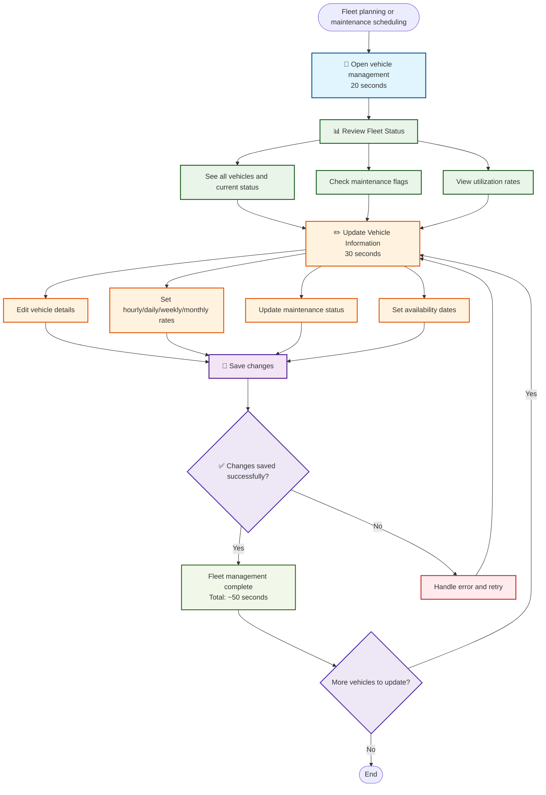

# Fleet Overview Management

**Actor:** Owner  
**Trigger:** Fleet planning or maintenance scheduling

## Journey Steps

### 1. Review Fleet Status (20 seconds)

- Open vehicle management
- See all vehicles and current status
- Check maintenance flags
- View utilization rates

### 2. Update Vehicle Information (30 seconds)

- Edit vehicle details
- Set hourly/daily/weekly/monthly rates
- Update maintenance status
- Set availability dates
- Save changes

## Time Estimate

Total time: ~50 seconds for fleet management tasks

## Key Features Required

- Comprehensive vehicle management interface
- Fleet status overview
- Maintenance tracking system
- Utilization rate calculations
- Vehicle detail editing
- Flexible rate configuration
- Availability calendar management
- Bulk update capabilities

## Visual Flow Chart

