# Financial Reconciliation

**Actor:** Owner  
**Trigger:** End of month accounting

## Journey Steps

### 1. Generate Reports (15 seconds)
- Access financial dashboard
- Select date range
- View total revenue breakdown by payment method

### 2. Export for Accounting (15 seconds)
- See payment summary (Card/Twint/Cash totals)
- Track all transactions
- Export report for bookkeeping

## Time Estimate
Total time: ~30 seconds for financial reconciliation

## Key Features Required
- Financial dashboard with date filtering
- Revenue breakdown by payment method
- Transaction listing
- Export functionality (CSV/Excel/PDF)
- Payment method totals
- VAT calculations
- Bookkeeping-ready reports

## Visual Flow Chart

```mermaid
flowchart TD
    Start([End of month accounting]) --> Access[💰 Access financial dashboard<br/>15 seconds]
    Access --> SelectDate[📅 Select date range]
    SelectDate --> ViewRevenue[View total revenue breakdown<br/>by payment method]
    
    ViewRevenue --> CardTotal[💳 Card payments total]
    ViewRevenue --> TwintTotal[📱 Twint payments total]
    ViewRevenue --> CashTotal[💵 Cash payments total]
    
    CardTotal --> Export[📊 Export for Accounting<br/>15 seconds]
    TwintTotal --> Export
    CashTotal --> Export
    
    Export --> PaymentSummary[See payment summary totals]
    Export --> TrackTransactions[Track all transactions]
    Export --> ExportReport[Export report for bookkeeping]
    
    PaymentSummary --> FormatCheck{Choose export format}
    TrackTransactions --> FormatCheck
    ExportReport --> FormatCheck
    
    FormatCheck -->|CSV| ExportCSV[📋 Export as CSV]
    FormatCheck -->|Excel| ExportExcel[📊 Export as Excel]
    FormatCheck -->|PDF| ExportPDF[📄 Export as PDF]
    
    ExportCSV --> Complete[Financial reconciliation complete<br/>Total: ~30 seconds]
    ExportExcel --> Complete
    ExportPDF --> Complete
    
    Complete --> End([End])
    
    classDef accessStyle fill:#e1f5fe,stroke:#01579b,stroke-width:2px
    classDef dataStyle fill:#e8f5e8,stroke:#1b5e20,stroke-width:2px
    classDef paymentStyle fill:#fff3e0,stroke:#e65100,stroke-width:2px
    classDef exportStyle fill:#f3e5f5,stroke:#4a148c,stroke-width:2px
    classDef decisionStyle fill:#ede7f6,stroke:#512da8,stroke-width:2px
    classDef formatStyle fill:#e0f2f1,stroke:#00695c,stroke-width:2px
    classDef completeStyle fill:#f1f8e9,stroke:#33691e,stroke-width:2px
    
    class Access,SelectDate accessStyle
    class ViewRevenue,PaymentSummary,TrackTransactions dataStyle
    class CardTotal,TwintTotal,CashTotal paymentStyle
    class Export,ExportReport exportStyle
    class FormatCheck decisionStyle
    class ExportCSV,ExportExcel,ExportPDF formatStyle
    class Complete completeStyle
```

