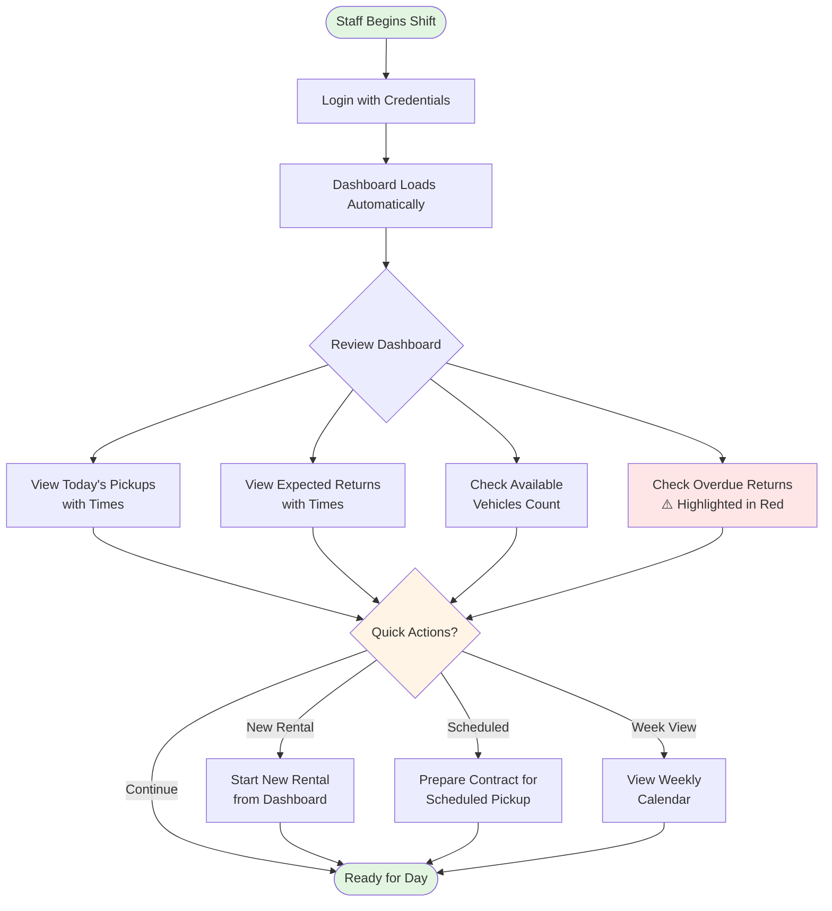

# Staff Dashboard Review (Daily Start)

**Actor:** Staff Member  
**Trigger:** Beginning of shift/workday

## Journey Steps

### 1. Dashboard Access (5 seconds)
- Login with staff credentials
- Dashboard loads automatically

### 2. Review Today's Overview (20 seconds)
- See today's scheduled pickups (list with times)
- See today's expected returns (list with times)
- View currently available vehicles count
- Check any overdue returns (highlighted in red)

### 3. Quick Actions (as needed)
- Click to start new rental from dashboard
- Click on scheduled pickup to prepare contract
- View calendar for week overview

## Time Estimate
Total time: ~30 seconds for complete dashboard review

## Key Features Required
- Staff authentication system
- Real-time dashboard with today's activities
- Visual indicators for overdue items
- Quick action buttons for common tasks
- Calendar integration for scheduling overview

## Visual Flow Chart

