# End of Day Reconciliation

**Actor:** Staff Member  
**Trigger:** End of shift

## Journey Steps

### 1. Review Day's Transactions (30 seconds)

- Open staff dashboard
- View today's completed rentals
- View today's returns
- Check cash payments received

### 2. Prepare Handover (15 seconds)

- Note any pending issues
- Check tomorrow's early pickups
- Log out of system

## Time Estimate

Total time: ~45 seconds for end of day process

## Key Features Required

- Daily transaction summary
- Rental and return counts
- Payment method breakdown
- Cash reconciliation display
- Pending issues tracker
- Next day preview
- Secure logout functionality

## Visual Flow Chart

```mermaid
flowchart TD
    A[🕐 End of Shift Triggered] --> B[Open Staff Dashboard<br/>~5s]
    B --> C[View Today's Completed Rentals<br/>~5s]
    C --> D[View Today's Returns<br/>~5s]
    D --> E[Check Cash Payments Received<br/>~5s]

    E --> F[Review Payment Breakdown<br/>~10s]
    F --> G{Any Discrepancies?}
    G -->|Yes| H[⚠️ Note Issues for Review<br/>~10s]
    G -->|No| I[Continue Reconciliation]

    H --> I
    I --> J[Check Pending Issues<br/>~5s]
    J --> K{Issues Require Handover?}
    K -->|Yes| L[Add Notes for Next Shift<br/>~5s]
    K -->|No| M[Continue Process]

    L --> M
    M --> N[Preview Tomorrow's Early Pickups<br/>~5s]
    N --> O[Prepare Vehicle Keys/Notes<br/>~5s]
    O --> P[Secure System Logout<br/>~5s]
    P --> Q[Shift Complete ✅]

    style A fill:#e1f5fe
    style G fill:#fff3e0
    style K fill:#fff3e0
    style H fill:#fff8e1
    style L fill:#fff8e1
    style Q fill:#e8f5e8
```

