# Shift Handover

**Actor:** Staff Member  
**Trigger:** End of shift requiring handover to next staff

## Journey Steps

### 1. Review Current Status (30 seconds)

- Check active rentals count
- Review overdue returns
- Note vehicles in maintenance
- Check pending reservations for next shift

### 2. Cash Reconciliation (45 seconds)

- Count cash in drawer
- Match against system records
- Document any discrepancies
- Prepare cash for handover or safe

### 3. Document Pending Items (30 seconds)

- List upcoming pickups with special notes
- Flag problem customers or situations
- Note any vehicle issues discovered
- Document unresolved customer requests

### 4. System Handover (15 seconds)

- Save any open work
- Clear personal session data
- Log out of system
- Ensure clean workspace

### 5. Brief Incoming Staff (30 seconds)

- Communicate priority items
- Explain any ongoing issues
- Hand over cash and keys
- Answer any questions

## Time Estimate

Total time: ~2.5 minutes for complete handover

## Key Features Required

- Shift summary dashboard
- Cash reconciliation tools
- Pending items checklist
- Notes/communication system
- Session management
- Handover report generation
- Priority flagging system
- Cash tracking integration

## Visual Flow Chart

```mermaid
flowchart TD
    Start([🕐 Shift Ending]) --> OpenDash[Open Shift<br/>Summary Dashboard<br/>10 sec]
    OpenDash --> ReviewActive[Review Active<br/>Rentals Count]
    ReviewActive --> CheckOverdue[Check Overdue<br/>Returns List<br/>10 sec]
    CheckOverdue --> NoteMaint[Note Vehicles in<br/>Maintenance]
    NoteMaint --> CheckPending[Check Pending<br/>Reservations<br/>10 sec]

    CheckPending --> StartCash[Start Cash<br/>Reconciliation<br/>5 sec]
    StartCash --> CountCash[Count Physical<br/>Cash in Drawer<br/>20 sec]
    CountCash --> SystemCash[Check System<br/>Cash Records]
    SystemCash --> Compare{Records<br/>Match?}

    Compare -->|No| DocDiscrep[Document<br/>Discrepancy<br/>10 sec]
    Compare -->|Yes| PrepCash
    DocDiscrep --> PrepCash[Prepare Cash for<br/>Handover/Safe<br/>10 sec]

    PrepCash --> ListPickups[List Upcoming Pickups<br/>with Special Notes<br/>10 sec]
    ListPickups --> FlagProblems[Flag Problem<br/>Customers/Situations<br/>10 sec]
    FlagProblems --> NoteIssues[Note Vehicle Issues<br/>Discovered]
    NoteIssues --> DocRequests[Document Unresolved<br/>Customer Requests<br/>10 sec]

    DocRequests --> SaveWork[Save Any<br/>Open Work<br/>5 sec]
    SaveWork --> ClearSession[Clear Personal<br/>Session Data]
    ClearSession --> LogOut[Log Out of<br/>System<br/>5 sec]
    LogOut --> CleanSpace[Ensure Clean<br/>Workspace<br/>5 sec]

    CleanSpace --> IncomingStaff{Incoming<br/>Staff Present?}
    IncomingStaff -->|No| LeaveNotes[Leave Detailed<br/>Handover Notes]
    IncomingStaff -->|Yes| BriefStaff[Brief Incoming<br/>Staff<br/>15 sec]

    BriefStaff --> CommPriority[Communicate<br/>Priority Items]
    CommPriority --> ExplainIssues[Explain Ongoing<br/>Issues<br/>10 sec]
    ExplainIssues --> HandOver[Hand Over<br/>Cash and Keys<br/>5 sec]
    HandOver --> Questions{Any<br/>Questions?}

    Questions -->|Yes| Answer[Answer Questions<br/>Variable time]
    Questions -->|No| Complete
    Answer --> Complete[Sign Handover<br/>Log]
    LeaveNotes --> Complete

    Complete --> End([✅ Handover Complete<br/>~2.5 minutes])

    style Start fill:#fff4e6
    style End fill:#e1f5e1
    style Compare fill:#ffe6e6
    style IncomingStaff fill:#e6f3ff
    style Complete fill:#e8f5e8
```

