# Create Reservation

**Actor:** Staff Member  
**Trigger:** Customer calls/visits to book vehicle for future date

## Journey Steps

### 1. Check Availability (15 seconds)
- Open fleet calendar
- Navigate to requested dates
- View available vehicles
- Check for conflicts

### 2. Customer Verification (20 seconds)
- Search existing customers by name/ID
- Or create new customer profile
- Verify driver's license validity date
- Check blacklist status

### 3. Reservation Details (25 seconds)
- Select vehicle from available options
- Enter pickup date and time
- Enter return date and time
- Select rate type (hourly/daily/weekly/monthly)
- Add any extras (GPS, child seat, etc.)
- Calculate estimated total

### 4. Deposit Collection (20 seconds)
- Inform customer of deposit amount (typically 20-30% or fixed amount)
- Select payment method (Card/Twint/Cash)
- Process deposit payment
- Record transaction reference

### 5. Confirmation (10 seconds)
- Generate reservation confirmation
- Send via email/SMS if requested
- Note any special requests
- Save reservation in system

## Time Estimate
Total time: ~90 seconds for complete reservation

## Key Features Required
- Fleet calendar with future date navigation
- Availability checking system
- Customer database integration
- Deposit calculation rules
- Payment processing for deposits
- Reservation confirmation generation
- Email/SMS capability
- Special requests field

## Visual Flow Chart

```mermaid
flowchart TD
    Start([Customer Requests<br/>Future Booking]) --> CheckAvail[Open Fleet Calendar<br/>15 sec]
    CheckAvail --> NavDates[Navigate to<br/>Requested Dates]
    NavDates --> ViewAvail[View Available<br/>Vehicles]
    ViewAvail --> Conflicts{Any Conflicts?}
    Conflicts -->|Yes| Suggest[Suggest Alternative<br/>Dates/Vehicles]
    Conflicts -->|No| CustSearch
    Suggest --> CustSearch[Search Customer<br/>Database<br/>10 sec]
    
    CustSearch --> Found{Customer<br/>Found?}
    Found -->|No| CreateNew[Create New<br/>Customer Profile<br/>20 sec]
    Found -->|Yes| VerifyLicense[Verify License<br/>Validity Date]
    CreateNew --> VerifyLicense
    VerifyLicense --> CheckBL{Blacklisted?}
    CheckBL -->|Yes| Reject[❌ Cannot Book<br/>Inform Customer]
    CheckBL -->|No| SelectVeh
    
    SelectVeh[Select Vehicle<br/>from Available] --> EnterPickup[Enter Pickup<br/>Date & Time]
    EnterPickup --> EnterReturn[Enter Return<br/>Date & Time]
    EnterReturn --> SelectRate[Select Rate Type<br/>Hourly/Daily/Weekly]
    SelectRate --> AddExtras{Add Extras?}
    AddExtras -->|Yes| SelectExtras[GPS, Child Seat,<br/>Insurance, etc.]
    AddExtras -->|No| CalcTotal
    SelectExtras --> CalcTotal[Calculate<br/>Estimated Total<br/>with VAT]
    
    CalcTotal --> CalcDeposit[Calculate Deposit<br/>20-30% or Fixed]
    CalcDeposit --> InformCust[Inform Customer<br/>of Deposit Amount]
    InformCust --> PayMethod{Payment Method}
    PayMethod -->|Card| CardDep[Process Card<br/>Deposit]
    PayMethod -->|Twint| TwintDep[Process Twint<br/>Deposit]
    PayMethod -->|Cash| CashDep[Accept Cash<br/>Deposit]
    
    CardDep --> RecordRef[Record Transaction<br/>Reference]
    TwintDep --> RecordRef
    CashDep --> RecordRef
    RecordRef --> GenConfirm[Generate Reservation<br/>Confirmation]
    
    GenConfirm --> SendConfirm{Send Confirmation?}
    SendConfirm -->|Email| EmailConf[Email Confirmation]
    SendConfirm -->|SMS| SMSConf[SMS Confirmation]
    SendConfirm -->|Both| BothConf[Email & SMS]
    SendConfirm -->|None| SaveRes
    
    EmailConf --> SpecialReq
    SMSConf --> SpecialReq
    BothConf --> SpecialReq
    SpecialReq[Note Special<br/>Requests] --> SaveRes[Save Reservation<br/>in System]
    SaveRes --> End([Reservation Complete<br/>~90 seconds])
    
    Reject --> EndReject([Process Terminated])
    
    style Start fill:#e1f5e1
    style End fill:#e1f5e1
    style EndReject fill:#ffebee
    style CalcDeposit fill:#fff4e6
    style PayMethod fill:#fff4e6
    style CheckBL fill:#ffe6e6
```

