# Reservation to Rental Conversion

**Actor:** Staff Member  
**Trigger:** Customer with reservation arrives for vehicle pickup

## Journey Steps

### 1. Locate Reservation (10 seconds)

- Search by customer name or reservation number
- Open reservation details
- Verify pickup date/time matches
- Check vehicle assignment

### 2. Verify Customer (15 seconds)

- Check customer ID matches reservation
- Verify driver's license is still valid
- Confirm no changes to customer details
- Apply any special notes from reservation

### 3. Vehicle Preparation Check (10 seconds)

- Confirm assigned vehicle is ready
- Verify cleanliness and fuel level
- Check for any last-minute maintenance flags
- Ensure keys are available

### 4. Convert to Active Rental (15 seconds)

- Convert reservation to active contract
- Confirm or update rental details
- Apply pre-collected deposit
- Calculate any additional charges

### 5. Complete Documentation (15 seconds)

- Take 4 vehicle photos (front, back, sides)
- Mark any existing damage
- Capture signatures (customer & staff)
- Process any balance payment
- Generate and provide contract

## Time Estimate

Total time: ~65 seconds for conversion process

## Key Features Required

- Reservation lookup system
- One-click conversion to rental
- Pre-populated contract data
- Deposit transfer from reservation
- Quick photo documentation
- Balance payment processing
- Automated status updates

## Visual Flow Chart

```mermaid
flowchart TD
    Start([Customer with<br/>Reservation Arrives]) --> Search[Search Reservation<br/>by Name/Number<br/>10 sec]
    Search --> Open[Open Reservation<br/>Details]
    Open --> VerifyTime[Verify Pickup<br/>Date/Time]
    VerifyTime --> CheckVeh[Check Vehicle<br/>Assignment]

    CheckVeh --> VerifyID[Check Customer ID<br/>Matches Reservation<br/>5 sec]
    VerifyID --> VerifyLicense[Verify Driver's License<br/>Still Valid<br/>5 sec]
    VerifyLicense --> ConfirmDetails[Confirm Customer<br/>Details Unchanged]
    ConfirmDetails --> CheckNotes[Review Special Notes<br/>from Reservation<br/>5 sec]

    CheckNotes --> VehReady{Vehicle<br/>Ready?}
    VehReady -->|No| PrepVehicle[Prepare Vehicle<br/>or Substitute]
    VehReady -->|Yes| VerifyClean
    PrepVehicle --> VerifyClean[Verify Cleanliness<br/>and Fuel Level<br/>5 sec]
    VerifyClean --> CheckMaint[Check Maintenance<br/>Flags]
    CheckMaint --> KeysReady[Ensure Keys<br/>Available<br/>5 sec]

    KeysReady --> Convert[Convert Reservation<br/>to Active Contract<br/>5 sec]
    Convert --> ConfirmDetails2[Confirm/Update<br/>Rental Details]
    ConfirmDetails2 --> TransferDep[Apply Pre-Collected<br/>Deposit<br/>5 sec]
    TransferDep --> CalcBalance[Calculate Any<br/>Additional Charges<br/>5 sec]

    CalcBalance --> Balance{Balance<br/>Due?}
    Balance -->|Yes| CollectBalance[Collect Balance<br/>Payment]
    Balance -->|No| Photos

    CollectBalance --> PayMethod{Payment Method}
    PayMethod -->|Card| CardPay[Process Card]
    PayMethod -->|Twint| TwintPay[Process Twint]
    PayMethod -->|Cash| CashPay[Accept Cash]

    CardPay --> Photos
    TwintPay --> Photos
    CashPay --> Photos

    Photos[📸 Take 4 Vehicle Photos<br/>Front, Back, Sides<br/>10 sec] --> MarkDamage{Existing<br/>Damage?}
    MarkDamage -->|Yes| Document[Mark Damage<br/>on Photos]
    MarkDamage -->|No| Signatures
    Document --> Signatures

    Signatures[Capture Signatures<br/>Customer & Staff<br/>5 sec] --> Generate[Generate Contract<br/>PDF]
    Generate --> Provide[Provide Contract<br/>to Customer]
    Provide --> UpdateStatus[Update Reservation<br/>Status to Active]
    UpdateStatus --> Keys[Hand Over Keys]
    Keys --> End([Rental Active<br/>~65 seconds])

    style Start fill:#e1f5e1
    style End fill:#e1f5e1
    style Convert fill:#e6f3ff
    style TransferDep fill:#fff4e6
    style VehReady fill:#ffe6e6
```

