# Cancellation Process

**Actor:** Staff Member  
**Trigger:** Customer requests to cancel reservation or rental

## Journey Steps

### 1. Locate Booking (10 seconds)

- Search by customer name or booking reference
- Open reservation/rental details
- Verify cancellation request validity
- Check current status

### 2. Apply Cancellation Policy (10 seconds)

- Check time until pickup/current rental status
- Determine applicable cancellation policy:
  - 48+ hours: Full refund
  - 24-48 hours: 50% refund
  - <24 hours: No refund (keep deposit)
  - Active rental: Pro-rata calculation

### 3. Calculate Refund (10 seconds)

- Calculate refund amount based on policy
- Account for any deposits held
- Determine any cancellation fees
- Show final refund amount

### 4. Process Refund (15 seconds)

- Confirm cancellation with customer
- Process refund to original payment method
- Generate cancellation receipt
- Send confirmation to customer

### 5. Update System (5 seconds)

- Cancel reservation/rental in system
- Release vehicle to available pool
- Update calendar immediately
- Add note to customer record

## Time Estimate

Total time: ~50 seconds for cancellation process

## Key Features Required

- Cancellation policy engine
- Time-based refund calculations
- Automated refund processing
- Receipt generation
- Real-time availability updates
- Customer communication system
- Cancellation reason tracking
- Revenue impact reporting

## Visual Flow Chart

```mermaid
flowchart TD
    Start([Customer Requests<br/>Cancellation]) --> Search[Search Booking<br/>by Name/Reference<br/>10 sec]
    Search --> Open[Open Reservation/<br/>Rental Details]
    Open --> VerifyRequest[Verify Cancellation<br/>Request]
    VerifyRequest --> CheckStatus{Booking<br/>Status}

    CheckStatus -->|Reservation| CheckTime[Check Time<br/>Until Pickup]
    CheckStatus -->|Active Rental| CheckRental[Check Rental<br/>Duration Used]

    CheckTime --> Policy1{Time Until<br/>Pickup}
    Policy1 -->|48+ hours| FullRefund[Apply Full<br/>Refund Policy]
    Policy1 -->|24-48 hours| PartialRefund[Apply 50%<br/>Refund Policy]
    Policy1 -->|<24 hours| NoRefund[No Refund<br/>Keep Deposit]

    CheckRental --> ProRata[Calculate Pro-Rata<br/>Refund]

    FullRefund --> CalcRefund[Calculate Total<br/>Refund Amount<br/>5 sec]
    PartialRefund --> CalcRefund
    NoRefund --> CalcRefund
    ProRata --> CalcRefund

    CalcRefund --> AccountDep[Account for<br/>Deposits Held]
    AccountDep --> ApplyFees[Apply Any<br/>Cancellation Fees<br/>5 sec]
    ApplyFees --> ShowAmount[Show Final<br/>Refund Amount]

    ShowAmount --> Confirm{Customer<br/>Confirms?}
    Confirm -->|No| Retain[Retain Booking]
    Confirm -->|Yes| Reason[Record Cancellation<br/>Reason]

    Reason --> ProcessRef{Refund<br/>Due?}
    ProcessRef -->|Yes| RefMethod{Original<br/>Payment Method}
    ProcessRef -->|No| GenReceipt

    RefMethod -->|Card| CardRefund[Process Card<br/>Refund<br/>10 sec]
    RefMethod -->|Twint| TwintRefund[Process Twint<br/>Refund<br/>10 sec]
    RefMethod -->|Cash| CashRefund[Schedule Cash<br/>Refund<br/>5 sec]

    CardRefund --> GenReceipt[Generate Cancellation<br/>Receipt]
    TwintRefund --> GenReceipt
    CashRefund --> GenReceipt

    GenReceipt --> SendConfirm[Send Confirmation<br/>to Customer]
    SendConfirm --> CancelSystem[Cancel in System<br/>5 sec]
    CancelSystem --> ReleaseVeh[Release Vehicle to<br/>Available Pool]
    ReleaseVeh --> UpdateCal[Update Calendar<br/>Immediately]
    UpdateCal --> AddNote[Add Note to<br/>Customer Record]
    AddNote --> UpdateRev[Update Revenue<br/>Reports]
    UpdateRev --> End([Cancellation Complete<br/>~50 seconds])

    Retain --> EndRetain([Booking Retained])

    style Start fill:#ffe6e6
    style End fill:#e1f5e1
    style Policy1 fill:#fff4e6
    style ProcessRef fill:#e6f3ff
    style ReleaseVeh fill:#e8f5e8
```

