# New Rental - Returning Customer

**Actor:** Staff Member  
**Trigger:** Existing customer wants to rent a vehicle

## Journey Steps

### 1. Customer Search (15 seconds)
- Search by name or ID number
- Select customer from results
- Verify customer not blacklisted
- Review rental history

### 2. Quick Booking (30 seconds)
- Select vehicle from calendar view
- Enter dates/hours and calculate price
- Select rate type (hourly/daily/weekly/monthly)
- Add any extras needed

### 3. Fast Documentation (30 seconds)
- Take vehicle photos
- Capture signatures
- Generate contract PDF

### 4. Payment & Completion (15 seconds)
- Select payment method (Card/Twint/Cash)
- Process payment
- Provide contract
- Hand over keys

## Time Estimate
Total time: ~90 seconds for complete rental process

## Key Features Required
- Customer search functionality
- Blacklist checking system
- Rental history display
- Streamlined booking process for known customers
- Quick photo documentation
- Fast payment processing
- Instant PDF generation

## Visual Flow Chart

```mermaid
flowchart TD
    Start([Returning Customer<br/>Wants Rental]) --> Search[Search Customer<br/>by Name or ID]
    Search --> Results[Select from Results]
    Results --> CheckBL{Blacklisted?}
    CheckBL -->|Yes| Blocked[❌ Cannot Rent<br/>Customer Blocked]
    CheckBL -->|No| History[Review Rental History]
    
    History --> SelectVeh[Select Vehicle from<br/>Calendar View]
    SelectVeh --> EnterDates[Enter Dates/Hours]
    EnterDates --> CalcPrice[Calculate Price]
    CalcPrice --> SelectRate[Select Rate Type<br/>Hourly/Daily/Weekly/Monthly]
    SelectRate --> Extras{Add Extras?}
    Extras -->|Yes| AddExtras[Add GPS, Child Seat, etc.]
    Extras -->|No| Photos
    AddExtras --> Photos
    
    Photos --> TakePhotos[📸 Take Vehicle Photos]
    TakePhotos --> Signatures[Capture Signatures<br/>Customer & Staff]
    Signatures --> GenPDF[Generate Contract PDF]
    
    GenPDF --> Payment[Select Payment Method<br/>Card / Twint / Cash]
    Payment --> Process[Process Payment]
    Process --> Provide[Provide Contract]
    Provide --> Keys[Hand Over Keys]
    Keys --> End([Rental Complete<br/>90 seconds])
    
    Blocked --> EndBlocked([Process Terminated])
    
    style Start fill:#e1f5e1
    style End fill:#e1f5e1
    style Blocked fill:#ffe6e6
    style EndBlocked fill:#ffe6e6
    style CheckBL fill:#fff4e6
    style History fill:#e6f3ff
```

