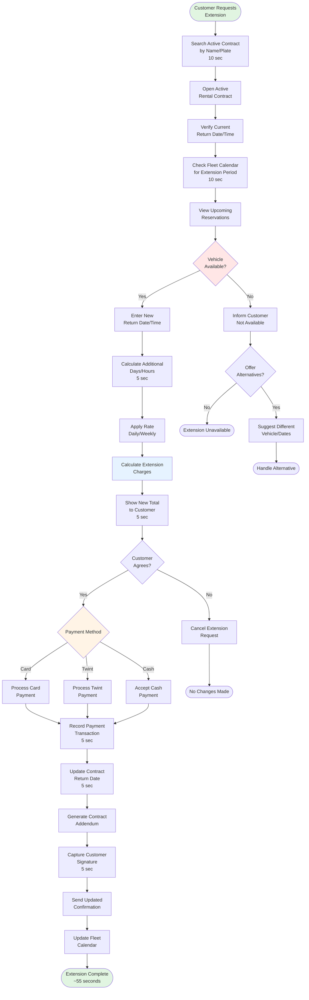

# Contract Extension

**Actor:** Staff Member  
**Trigger:** Customer requests to extend active rental

## Journey Steps

### 1. Locate Active Contract (10 seconds)
- Search by customer name or vehicle plate
- Open active rental contract
- Verify current return date/time

### 2. Check Availability (10 seconds)
- View fleet calendar for requested extension period
- Check for upcoming reservations
- Verify vehicle availability

### 3. Calculate Extension Charges (15 seconds)
- Enter new return date/time
- System calculates additional days/hours
- Apply appropriate rate (daily/weekly)
- Add to existing contract total
- Show new total to customer

### 4. Process Additional Payment (10 seconds)
- Collect payment for extension
- Select payment method (Card/Twint/Cash)
- Process transaction
- Update payment records

### 5. Update Contract (10 seconds)
- Modify return date/time in system
- Generate contract addendum
- Capture customer signature
- Send updated confirmation

## Time Estimate
Total time: ~55 seconds for extension process

## Key Features Required
- Active contract search
- Fleet calendar integration
- Extension calculation logic
- Rate application rules
- Payment processing
- Contract modification capability
- Addendum generation
- Digital signature capture

## Visual Flow Chart

