# Rental Return - Standard

**Actor:** Staff Member  
**Trigger:** Customer returns rental vehicle

## Journey Steps

### 1. Contract Lookup (15 seconds)

- Search active rentals by customer name or plate number
- Open active contract

### 2. Return Inspection (20 seconds)

- Take 4 photos of vehicle condition (front, back, sides)
- Enter return odometer reading
- Enter return fuel level
- Compare with initial rental photos
- Document any new damage if found

### 3. Calculate Charges (15 seconds)

- System calculates kilometer overage (if any)
- System calculates fuel difference charge (if applicable)
- Add any damage charges
- Show total additional charges

### 4. Finalize Return (15 seconds)

- Select payment method for additional charges (if any)
- Process payment (Card/Twint/Cash)
- Generate final invoice PDF with charges
- Mark vehicle as available in system
- Close contract

## Time Estimate

Total time: ~65 seconds for complete return process

## Key Features Required

- Active rental search functionality
- Photo capture capability (4 photos: front, back, sides)
- Photo comparison with initial rental photos
- Odometer and fuel tracking
- Automatic charge calculations
- Additional charge processing
- Invoice generation
- Vehicle status management
- Contract closure system

## Visual Flow Chart

```mermaid
flowchart TD
    Start([Customer Returns Vehicle]) --> Search[Search Active Rentals<br/>by Name or Plate]
    Search --> Open[Open Active Contract]

    Open --> ReturnPhotos[📸 Take 4 Vehicle Photos<br/>Front, Back, Sides]
    ReturnPhotos --> Odometer[Enter Return<br/>Odometer Reading]
    Odometer --> Fuel[Enter Return<br/>Fuel Level]
    Fuel --> Compare[Compare with<br/>Initial Rental Photos]
    Compare --> CheckDamage{New Damage?}
    CheckDamage -->|Yes| DocDamage[Document Damage<br/>in System]
    CheckDamage -->|No| Calculate
    DocDamage --> Calculate

    Calculate --> CalcKm[System Calculates<br/>Kilometer Overage]
    CalcKm --> CalcFuel[System Calculates<br/>Fuel Difference]
    CalcFuel --> CalcDamage[Add Damage Charges<br/>if Applicable]
    CalcDamage --> ShowTotal[Show Total<br/>Additional Charges]

    ShowTotal --> Charges{Additional<br/>Charges?}
    Charges -->|Yes| Payment[Select Payment Method<br/>Card / Twint / Cash]
    Charges -->|No| Invoice
    Payment --> Process[Process Payment]
    Process --> Invoice[Generate Final<br/>Invoice PDF]

    Invoice --> MarkAvail[Mark Vehicle<br/>as Available]
    MarkAvail --> Close[Close Contract]
    Close --> End([Return Complete<br/>~65 seconds])

    style Start fill:#e1f5e1
    style End fill:#e1f5e1
    style Calculate fill:#fff4e6
    style ShowTotal fill:#ffe6e6
    style Invoice fill:#f0e6ff
```

