# Rental Return - With Issues

**Actor:** Staff Member  
**Trigger:** Customer returns vehicle with damage/issues

## Journey Steps

### 1. Document Issues (45 seconds)

- Take detailed photos of damage
- Add annotations to damage photos
- Write damage description notes

### 2. Calculate Charges (30 seconds)

- Enter repair cost estimate
- Add administrative fees
- Calculate total with fuel/km charges

### 3. Customer Resolution (30 seconds)

- Show charges breakdown to customer
- Capture customer acknowledgment signature
- Select payment method (Card/Twint/Cash)
- Process payment
- Generate detailed invoice with damage photos

### 4. Follow-up Actions (15 seconds)

- Flag vehicle for maintenance
- Create insurance claim note
- Update customer record

## Time Estimate

Total time: ~2 minutes for complete return with issues

## Key Features Required

- Advanced photo documentation with annotations
- Damage description system
- Repair cost estimation tools
- Administrative fee configuration
- Customer acknowledgment capture
- Detailed invoice generation with photos
- Vehicle maintenance flagging
- Insurance claim notes
- Customer record management

## Visual Flow Chart

```mermaid
flowchart TD
    A[Customer Returns Vehicle] --> B{Issues Detected?}
    B -->|Yes| C[📸 Take Photos of Damage<br/>~15s]
    B -->|No| Z[Standard Return Process]

    C --> D[Add Annotations to Photos<br/>~15s]
    D --> E[Write Damage Description<br/>~15s]

    E --> F[Enter Repair Cost Estimate<br/>~10s]
    F --> G[Add Administrative Fees<br/>~10s]
    G --> H[Calculate Total Charges<br/>~10s]

    H --> I[Show Charges to Customer<br/>~15s]
    I --> J{Customer Agrees?}
    J -->|No| K[Negotiate/Discuss]
    K --> I
    J -->|Yes| L[Capture Digital Signature<br/>~5s]

    L --> M[Select Payment Method<br/>~5s]
    M --> N[Process Payment<br/>~5s]
    N --> O[Generate Invoice with Photos<br/>~Auto]

    O --> P[⚠️ Flag Vehicle for Maintenance<br/>~5s]
    P --> Q[Create Insurance Claim Note<br/>~5s]
    Q --> R[Update Customer Record<br/>~5s]

    R --> S[Return Complete ✅]

    style A fill:#e1f5fe
    style B fill:#fff3e0
    style C fill:#f3e5f5
    style J fill:#fff3e0
    style S fill:#e8f5e8
    style P fill:#ffebee
```

