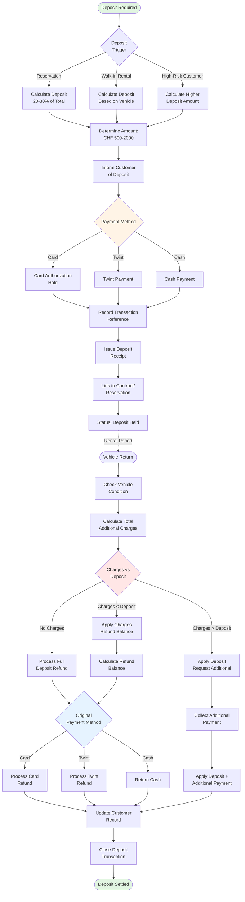

# Deposit Management

**Actor:** Staff Member  
**Trigger:** Various points in rental lifecycle requiring deposit handling

## Journey Steps

### 1. Deposit Collection (At Booking/Rental)
- Calculate deposit amount based on:
  - Vehicle value/category
  - Rental duration
  - Customer history
- Typical: CHF 500-2000 or 20-30% of rental
- Process payment (Card/Twint/Cash)
- Issue deposit receipt

### 2. Deposit Holding (During Rental)
- Track deposit in system
- Link to active contract
- Maintain payment reference
- Show as pending/held funds

### 3. Deposit Application (At Return)
- Review return condition
- Check for damages
- Calculate additional charges
- Apply deposit against charges

### 4. Deposit Settlement (Final)
- If no charges: Full refund
- If charges < deposit: Partial refund
- If charges > deposit: Additional payment required
- Process refund to original payment method

## Time Estimate
- Collection: ~20 seconds
- Application: ~15 seconds
- Settlement: ~10 seconds
Total lifecycle: ~45 seconds of active work

## Key Features Required
- Deposit calculation rules
- Multi-payment method support
- Deposit receipt generation
- Deposit tracking system
- Automatic charge application
- Refund processing
- Payment method matching
- Deposit history tracking

## Visual Flow Chart

