# Quick Vehicle Status Check

**Actor:** Staff Member  
**Trigger:** Phone inquiry about vehicle availability

## Journey Steps

### 1. Calendar View (10 seconds)
- Open fleet calendar from staff dashboard
- Check specific date range
- See which vehicles are available

### 2. Provide Information (10 seconds)
- Quote hourly/daily/weekly rate
- Inform about vehicle types available
- Potentially pre-reserve vehicle

## Time Estimate
Total time: ~20 seconds for availability check and response

## Key Features Required
- Quick access fleet calendar
- Real-time availability display
- Rate information readily available
- Pre-reservation capability
- Fast date range checking

## Visual Flow Chart

```mermaid
flowchart TD
    A[📞 Phone Inquiry Received] --> B[Open Staff Dashboard<br/>~2s]
    B --> C[Access Fleet Calendar<br/>~3s]
    C --> D[Select Date Range<br/>~3s]
    D --> E[View Available Vehicles<br/>~2s]
    
    E --> F{Vehicles Available?}
    F -->|Yes| G[Quote Rates<br/>~5s]
    F -->|No| H[Inform No Availability<br/>~3s]
    
    G --> I[Inform Vehicle Types<br/>~3s]
    I --> J{Customer Interested?}
    J -->|Yes| K[Pre-Reserve Vehicle<br/>~2s]
    J -->|No| L[End Call]
    
    K --> M[Confirm Reservation Details<br/>~5s]
    M --> N[Inquiry Complete ✅]
    
    H --> L
    L --> O[Call Ended]
    
    style A fill:#e1f5fe
    style F fill:#fff3e0
    style J fill:#fff3e0
    style N fill:#e8f5e8
    style O fill:#f5f5f5
```

