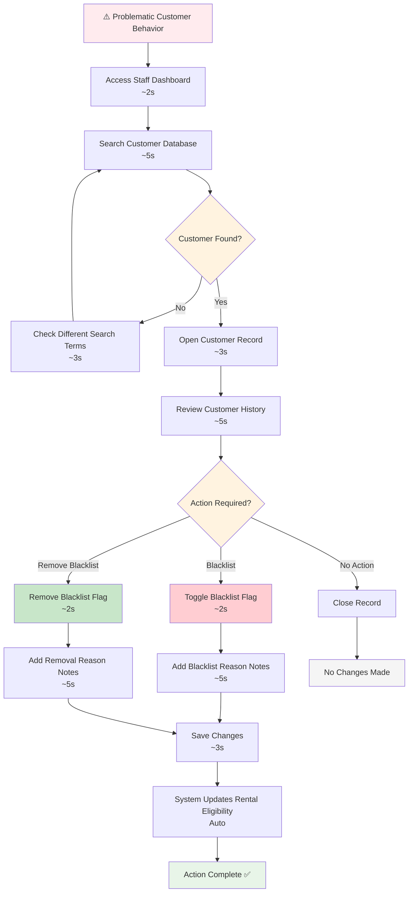

# Customer Blacklist Management

**Actor:** Staff Member  
**Trigger:** Problematic customer behavior

## Journey Steps

### 1. Find Customer (10 seconds)
- Search customer database
- Open customer record

### 2. Set Blacklist Status (10 seconds)
- Toggle blacklist flag
- Add note about reason
- Save changes

## Time Estimate
Total time: ~20 seconds for blacklist management

## Key Features Required
- Customer search functionality
- Blacklist flag toggle
- Notes/reason field for blacklisting
- Audit trail for blacklist changes
- Immediate effect on rental eligibility

## Visual Flow Chart

