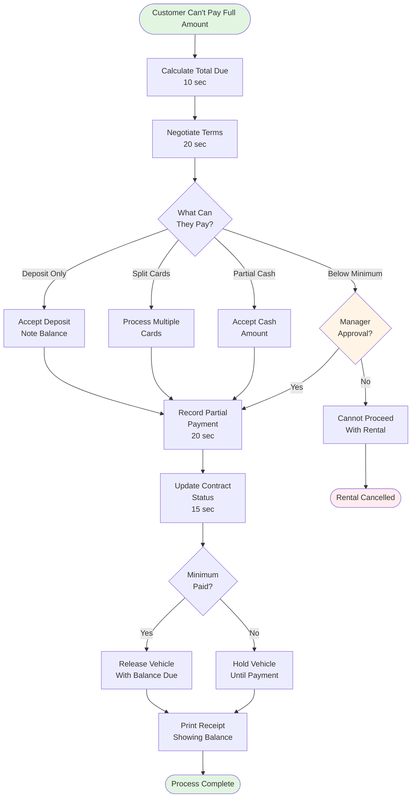

# Partial Payment Processing

**Actor:** Staff Member  
**Trigger:** Customer cannot pay full amount at once **Frequency:** Daily (5-10% of rentals)

## Journey Steps

### 1. Calculate Total Due (10 seconds)

- Review total rental amount
- Include deposits if required
- Show breakdown to customer
- Identify payment shortage

### 2. Negotiate Payment Terms (20 seconds)

- Determine what customer can pay now
- Options:
  - Pay deposit only, rest on return
  - Split between multiple cards
  - Partial cash, rest later
  - Reduced deposit with approval

### 3. Record Partial Payment (20 seconds)

- Enter amount received
- Select payment method
- Mark as partial payment
- Calculate remaining balance
- Set payment due date

### 4. Update Contract Status (15 seconds)

- Set status to "Partial Payment"
- Add payment note
- Flag for follow-up
- Print receipt showing balance

### 5. Decision Point (15 seconds)

- If deposit covered → Release vehicle
- If below minimum → Hold vehicle
- Manager override option
- Document decision

## Time Estimate

Total: ~80 seconds

## Why This is MVP Critical

- **Common scenario:** Not everyone has full amount ready
- **Business flexibility:** Don't lose rentals over payment timing
- **Risk management:** Get at least deposit upfront
- **Cash flow:** Something is better than nothing

## Key Features Required

- Partial payment tracking
- Balance due calculation
- Payment schedule notes
- Multiple payment recording
- Status flags for follow-up
- Manager override capability

## Visual Flow Chart

## Common Scenarios

### Tourist with Card Limit

- Card limit: CHF 1000
- Rental total: CHF 1500
- Solution: CHF 1000 on card, CHF 500 cash or second card

### Corporate Rental

- Company pays base rate
- Driver pays extras/fuel
- Split billing in system

### Young Driver

- High deposit required
- Can only pay half
- Manager approves reduced deposit

## Edge Cases Handled

- Multiple payment methods
- Different payers (company + personal)
- Foreign currency considerations
- Payment plan setup
- Deposit-only rentals
