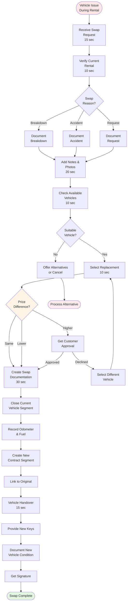

# Vehicle Swap Mid-Rental

**Actor:** Staff Member  
**Trigger:** Vehicle breakdown, accident, or customer request during active rental **Frequency:**
Weekly (2-3 times)

## Journey Steps

### 1. Receive Swap Request (15 seconds)

- Customer calls/arrives with issue
- Common reasons:
  - Mechanical breakdown
  - Accident damage
  - Wrong vehicle size
  - Vehicle uncomfortable

### 2. Verify Current Rental (10 seconds)

- Look up active contract
- Check rental terms
- Note current vehicle status
- Review days remaining

### 3. Document Swap Reason (20 seconds)

- Select swap reason:
  - Breakdown
  - Accident
  - Customer request
  - Upgrade/downgrade
- Add detailed notes
- Take photos if damage/issue

### 4. Select Replacement Vehicle (20 seconds)

- Check available vehicles
- Match or upgrade category
- Consider price differences
- Get customer approval

### 5. Create Swap Documentation (30 seconds)

- Close current vehicle rental
- Record final odometer/fuel
- Create new contract segment
- Link to original contract
- Calculate any price adjustments

### 6. Vehicle Handover (15 seconds)

- Provide new keys
- Document new vehicle condition
- Update customer on any changes
- Get signature for swap

## Time Estimate

Total: ~110 seconds (under 2 minutes)

## Why This is MVP Critical

- **Breakdown reality:** Cars break, need immediate replacement
- **Customer retention:** Quick swap prevents losing customer
- **Legal continuity:** Must document vehicle changes
- **Revenue protection:** Track different rates/vehicles

## Key Features Required

- Active contract modification
- Vehicle swap linking
- Price adjustment calculation
- Multi-segment contracts
- Condition documentation
- Reason tracking

## Visual Flow Chart

## Common Scenarios

### Breakdown on Highway

- Customer calls from roadside
- Arrange towing for broken vehicle
- Prepare replacement
- Customer continues journey

### Minor Accident

- Cosmetic damage but driveable
- Swap for customer confidence
- Document for insurance
- Original vehicle to repair

### Size Upgrade

- Customer realizes needs bigger vehicle
- Check availability
- Calculate price difference
- Process upgrade

## Edge Cases Handled

- No equivalent vehicle available
- Price disputes on replacement
- Multi-day rental with swap midway
- Insurance implications
- Remote breakdown locations
