# Accident Report

**Actor:** Staff Member  
**Trigger:** Customer reports accident or damage during rental
**Frequency:** Weekly (1-2 times)

## Journey Steps

### 1. Initial Contact (30 seconds)
- Customer calls or arrives
- Ensure customer safety first
- Ask about injuries
- Get location if remote

### 2. Gather Basic Information (60 seconds)
- Date and time of accident
- Location (address/coordinates)
- Other parties involved
- Police report filed?
- Injuries reported?
- Vehicle driveable?

### 3. Document Details (90 seconds)
- Customer's description of events
- Other driver information:
  - Name and contact
  - Insurance details
  - Vehicle information
- Witness information
- Weather/road conditions
- Speed and direction

### 4. Photo Documentation (60 seconds)
- Damage to rental vehicle (all angles)
- Other vehicle damage
- Accident scene if possible
- Skid marks/debris
- Traffic signs/signals
- License plates

### 5. Create Official Report (60 seconds)
- Fill accident report form
- Attach all photos
- Include police report number
- Customer statement
- Witness statements
- Generate report PDF

### 6. Insurance & Next Steps (30 seconds)
- Notify insurance company
- Arrange vehicle recovery if needed
- Provide replacement vehicle
- Give customer copy of report
- Explain next steps

## Time Estimate
Total: ~5-6 minutes (critical process)

## Why This is MVP Critical
- **Legal requirement:** Must document accidents properly
- **Insurance claims:** Need complete information
- **Liability protection:** Protect business from false claims
- **Customer support:** Help customer through stressful situation

## Key Features Required
- Accident report template
- Photo attachment system
- PDF report generation
- Insurance company fields
- Police report tracking
- Claim reference numbers

## Visual Flow Chart

```mermaid
flowchart TD
    Start([Accident Reported]) --> Safety[Ensure Customer<br/>Safety First<br/>30 sec]
    Safety --> Injured{Anyone<br/>Injured?}
    
    Injured -->|Yes| Emergency[Call Emergency<br/>Services]
    Injured -->|No| BasicInfo
    Emergency --> BasicInfo[Gather Basic<br/>Information<br/>60 sec]
    
    BasicInfo --> DateTime[Date/Time/Location]
    DateTime --> Parties[Other Parties<br/>Involved]
    Parties --> Police{Police<br/>Report?}
    
    Police -->|Yes| GetReport[Get Report<br/>Number]
    Police -->|No| AdvisePolice[Advise to File]
    
    GetReport --> Details[Document All<br/>Details<br/>90 sec]
    AdvisePolice --> Details
    
    Details --> Description[Customer's<br/>Description]
    Description --> OtherDriver[Other Driver<br/>Information]
    OtherDriver --> Witnesses[Witness<br/>Information]
    Witnesses --> Conditions[Weather/Road<br/>Conditions]
    
    Conditions --> Photos[Photo Documentation<br/>60 sec]
    Photos --> RentalDamage[Rental Vehicle<br/>Damage]
    RentalDamage --> OtherDamage[Other Vehicle<br/>Damage]
    OtherDamage --> Scene[Accident Scene]
    Scene --> Evidence[Physical Evidence]
    
    Evidence --> CreateReport[Create Official<br/>Report<br/>60 sec]
    CreateReport --> FillForm[Fill Report Form]
    FillForm --> AttachPhotos[Attach All Photos]
    AttachPhotos --> AddStatements[Add Statements]
    AddStatements --> GeneratePDF[Generate PDF]
    
    GeneratePDF --> Insurance[Notify Insurance<br/>30 sec]
    Insurance --> Recovery{Vehicle<br/>Driveable?}
    
    Recovery -->|No| ArrangeTow[Arrange Towing]
    Recovery -->|Yes| AssessDamage[Assess if Safe]
    
    ArrangeTow --> Replacement[Provide Replacement<br/>Vehicle]
    AssessDamage --> Replacement
    
    Replacement --> ProvideoCopy[Give Customer<br/>Report Copy]
    ProvideCopy --> NextSteps[Explain Next<br/>Steps]
    NextSteps --> End([Report Complete])
    
    style Start fill:#ffe6e6
    style End fill:#e1f5e1
    style Injured fill:#ffcccc
    style Emergency fill:#ff9999
```

## Common Scenarios

### Parking Lot Bump
- Minor damage
- Other driver present
- Exchange information
- Document everything
- Usually no police

### Highway Collision
- Police involved
- Multiple vehicles
- Towing required
- Injuries possible
- Complex documentation

### Hit and Run
- No other driver info
- Police report essential
- Witness crucial
- Security footage check
- Insurance complexity

## Critical Information to Capture
- Exact time and location
- All parties' insurance info
- Police report number
- Witness contacts
- Photos from multiple angles
- Weather conditions
- Traffic conditions
- Diagram of accident

## Edge Cases Handled
- Customer at fault vs. other party
- Multiple vehicle accidents
- Foreign driver involvement
- No insurance situations
- Disputed fault