# After-Hours Return

**Actor:** Staff Member (next day processing)  
**Trigger:** Customer returns vehicle outside business hours **Frequency:** Daily (20% of returns)

## Journey Steps

### 1. Morning Check (30 seconds)

- Check key drop box
- Count keys returned
- Match to expected returns
- Note any missing returns

### 2. Locate Vehicles (60 seconds)

- Find each returned vehicle
- Check parking location
- Verify correct vehicles
- Note any obvious issues

### 3. Process Each Return (90 seconds per vehicle)

- Find contract in system
- Mark return time (actual drop time if known)
- Inspect vehicle condition
- Check fuel level
- Record odometer
- Take photos if damage

### 4. Calculate Charges (30 seconds)

- System calculates based on:
  - Actual return time
  - Fuel difference
  - Kilometer overage
  - Any visible damage

### 5. Finalize Contract (30 seconds)

- Close contract in system
- Generate final invoice
- Send to customer email
- Process any additional charges
- Note for follow-up if issues

### 6. Vehicle Ready (15 seconds)

- Mark vehicle available
- Schedule cleaning if needed
- Update fleet status
- Ready for next rental

## Time Estimate

Total: ~4 minutes per vehicle

## Why This is MVP Critical

- **Customer convenience:** 20% need after-hours return
- **Business efficiency:** Don't lose rentals due to hours
- **Competitive requirement:** Others offer this
- **Revenue protection:** Still capture all charges

## Key Features Required

- After-hours return flag
- Time override capability
- Batch processing mode
- Photo attachment for condition
- Automated invoice sending
- Exception reporting

## Visual Flow Chart

```mermaid
flowchart TD
    Start([Next Morning<br/>Arrival]) --> CheckBox[Check Key<br/>Drop Box<br/>30 sec]
    CheckBox --> CountKeys{Keys<br/>Found?}

    CountKeys -->|No| NoReturns[No After-Hours<br/>Returns]
    CountKeys -->|Yes| MatchExpected[Match to Expected<br/>Returns]

    MatchExpected --> Missing{Any<br/>Missing?}
    Missing -->|Yes| ContactCustomer[Contact Missing<br/>Customers]
    Missing -->|No| LocateVehicles

    ContactCustomer --> LocateVehicles[Locate Vehicles<br/>in Lot<br/>60 sec]
    LocateVehicles --> ForEach[For Each Vehicle:]

    ForEach --> FindContract[Find Contract<br/>in System<br/>15 sec]
    FindContract --> MarkReturn[Mark Return Time<br/>15 sec]
    MarkReturn --> Inspect[Inspect Vehicle<br/>Condition<br/>30 sec]

    Inspect --> Damage{Any<br/>Damage?}
    Damage -->|Yes| PhotoDoc[Take Photos<br/>Document Issues<br/>30 sec]
    Damage -->|No| CheckFuel

    PhotoDoc --> CheckFuel[Check Fuel<br/>Level<br/>10 sec]
    CheckFuel --> RecordOdo[Record Odometer<br/>10 sec]
    RecordOdo --> Calculate[Calculate All<br/>Charges<br/>30 sec]

    Calculate --> FuelCharge[Fuel Difference]
    FuelCharge --> KmCharge[Kilometer Overage]
    KmCharge --> DamageCharge[Damage Charges]
    DamageCharge --> TotalCharges[Total Additional]

    TotalCharges --> Finalize[Finalize Contract<br/>30 sec]
    Finalize --> GenerateInvoice[Generate Invoice]
    GenerateInvoice --> SendEmail[Email to Customer]
    SendEmail --> ProcessPayment{Payment<br/>on File?}

    ProcessPayment -->|Yes| ChargeCard[Charge Card]
    ProcessPayment -->|No| NoteFollowUp[Note for<br/>Follow-up]

    ChargeCard --> UpdateFleet
    NoteFollowUp --> UpdateFleet[Update Fleet<br/>Status<br/>15 sec]

    UpdateFleet --> MarkAvailable[Mark Available]
    MarkAvailable --> NextVehicle{More<br/>Vehicles?}

    NextVehicle -->|Yes| ForEach
    NextVehicle -->|No| End([All Returns<br/>Processed])

    NoReturns --> End

    style Start fill:#fff4e6
    style End fill:#e1f5e1
    style Damage fill:#ffe6e6
```

## Common Scenarios

### Business Traveler

- Late flight arrival
- Returns at midnight
- Drops keys in box
- Processes next morning

### Weekend Return

- Closed Sundays
- Customer drops Saturday night
- Processed Monday morning
- Three days of returns together

### Damage Found

- Customer didn't report
- Discovered during inspection
- Document thoroughly
- Contact customer immediately

## Setup Requirements

- Secure key drop box
- Clear instructions posted
- Designated parking area
- Security cameras (ideal)
- After-hours return agreement

## Edge Cases Handled

- Keys dropped but car not returned
- Wrong parking location
- Multiple returns same customer
- Damage disputes (no check-in)
- Lost keys in drop box
