# Duplicate Customer Merge

**Actor:** Staff Member / Admin  
**Trigger:** Same customer found with multiple records
**Frequency:** Weekly (data quality maintenance)

## Journey Steps

### 1. Identify Duplicates (30 seconds)
- Notice during customer search
- Multiple results for same person
- Common indicators:
  - Same name, different spelling
  - Same phone number
  - Same license number
  - Same email

### 2. Verify Same Person (20 seconds)
- Compare details:
  - ID/License numbers
  - Phone numbers
  - Addresses
  - Rental history dates
- Confirm it's truly duplicate

### 3. Choose Primary Record (15 seconds)
- Select most complete record
- Usually most recent
- Or most rentals
- Best data quality

### 4. Merge Process (45 seconds)
- System shows both records
- Select what to keep:
  - Contact information
  - Preferences
  - Notes
  - Blacklist status
- Merge rental history
- Combine all contracts

### 5. Confirm Merge (20 seconds)
- Review merged record
- Check history complete
- Verify data correct
- Confirm merge action

### 6. Cleanup (10 seconds)
- Secondary record marked merged
- Audit trail created
- Redirect references
- Update search index

## Time Estimate
Total: ~2-3 minutes per merge

## Why This is MVP Critical
- **Data quality:** Duplicates cause confusion
- **Customer experience:** See full history
- **Accurate reporting:** Avoid double-counting
- **Blacklist effectiveness:** Can't avoid with duplicate

## Key Features Required
- Duplicate detection hints
- Side-by-side comparison
- Selective merge fields
- History combination
- Audit trail
- Undo capability (within session)

## Visual Flow Chart

```mermaid
flowchart TD
    Start([Duplicate Customers<br/>Detected]) --> Identify[Identify During<br/>Search<br/>30 sec]
    Identify --> Multiple[Multiple Results<br/>Same Person]
    Multiple --> Compare[Compare Details<br/>20 sec]
    
    Compare --> CheckID[Check ID/License]
    CheckID --> CheckPhone[Check Phone]
    CheckPhone --> CheckHistory[Check History]
    CheckHistory --> Confirmed{Same<br/>Person?}
    
    Confirmed -->|No| NotDuplicate[Keep Separate<br/>Records]
    Confirmed -->|Yes| SelectPrimary[Choose Primary<br/>Record<br/>15 sec]
    
    SelectPrimary --> Criteria[Selection Criteria:]
    Criteria --> MostComplete[Most Complete]
    MostComplete --> MostRecent[Most Recent]
    MostRecent --> MostRentals[Most Rentals]
    
    MostRentals --> ShowRecords[Show Both Records<br/>Side-by-Side<br/>20 sec]
    ShowRecords --> SelectFields[Select Fields<br/>to Keep<br/>25 sec]
    
    SelectFields --> Contact[Contact Info]
    Contact --> Preferences[Preferences]
    Preferences --> Notes[Notes/Flags]
    Notes --> History[Rental History]
    
    History --> MergeData[Merge All Data]
    MergeData --> Preview[Preview Merged<br/>Record]
    Preview --> Verify{Looks<br/>Correct?}
    
    Verify -->|No| Adjust[Adjust Selections]
    Verify -->|Yes| ConfirmMerge[Confirm Merge<br/>Action<br/>20 sec]
    
    Adjust --> SelectFields
    
    ConfirmMerge --> Execute[Execute Merge]
    Execute --> MarkSecondary[Mark Secondary<br/>as Merged]
    MarkSecondary --> CreateAudit[Create Audit<br/>Trail]
    CreateAudit --> UpdateRefs[Update All<br/>References]
    UpdateRefs --> UpdateIndex[Update Search<br/>Index<br/>10 sec]
    
    UpdateIndex --> End([Merge Complete])
    NotDuplicate --> EndSkip([No Merge Needed])
    
    style Start fill:#ffe6e6
    style End fill:#e1f5e1
    style EndSkip fill:#fff4e6
    style Confirmed fill:#fff4e6
```

## Common Scenarios

### Name Variations
- John Smith vs. Jon Smith
- With/without middle name
- Married name change
- Typos in entry

### Multiple Locations
- Customer at different branches
- Created new instead of search
- Different staff entered

### Data Import
- Legacy system migration
- Multiple old databases
- Excel import duplicates

## Merge Rules
- Keep most complete phone/email
- Combine all rental history
- Preserve blacklist if any
- Keep highest loyalty status
- Merge all notes

## Edge Cases Handled
- Three or more duplicates
- Conflicting blacklist status
- Different payment methods
- Active rental on duplicate
- Corporate vs. personal accounts