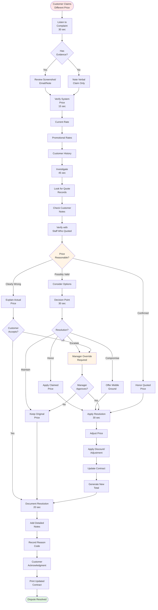

# Price Dispute Resolution

**Actor:** Staff Member / Manager  
**Trigger:** Customer claims different price was quoted or agreed **Frequency:** Daily (2-3 times)

## Journey Steps

### 1. Listen to Complaint (30 seconds)

- Customer states expected price
- Claims different quote given
- May have evidence:
  - Screenshot
  - Email
  - Written note
  - Verbal quote memory

### 2. Verify Current Price (15 seconds)

- Check system price
- Review contract price
- Check for promotions
- Look for special rates

### 3. Investigation (45 seconds)

- Check if promotional rate
- Review customer history
- Check for notes/quotes
- Verify staff who quoted
- Look for system changes

### 4. Decision Point (30 seconds)

Options:

- **Honor claimed price** (if reasonable)
- **Meet halfway** (compromise)
- **Explain and maintain** (if clearly wrong)
- **Manager override** (if needed)

### 5. Apply Resolution (30 seconds)

- Adjust price if approved
- Document reason
- Apply discount/adjustment
- Update contract
- Generate new total

### 6. Document & Close (20 seconds)

- Add detailed notes
- Record resolution
- Customer acknowledgment
- Print updated contract
- Track for patterns

## Time Estimate

Total: ~3 minutes

## Why This is MVP Critical

- **Customer satisfaction:** Disputes kill relationships
- **Revenue protection:** Balance fairness with profit
- **Staff empowerment:** Clear resolution process
- **Pattern detection:** Identify systemic issues

## Key Features Required

- Price adjustment capability
- Discount application
- Manager override function
- Detailed notes system
- Adjustment reason codes
- Audit trail

## Visual Flow Chart

## Common Scenarios

### Phone Quote

- Customer called yesterday
- Staff quoted approximate price
- Didn't include all fees
- Honor base, explain extras

### Online Price

- Saw different price online
- May be old/cached page
- Competitor price confusion
- Show current website

### Repeat Customer

- "I always pay X"
- Rates have changed
- Explain increase
- Offer loyalty discount

## Resolution Guidelines

- Under CHF 20 difference: Staff can approve
- CHF 20-50 difference: Supervisor approval
- Over CHF 50: Manager only
- Document all adjustments
- Track patterns by staff

## Edge Cases Handled

- Multiple price disputes same customer
- Staff member gave wrong quote
- System showed wrong price
- Promotional period ended
- Currency confusion
