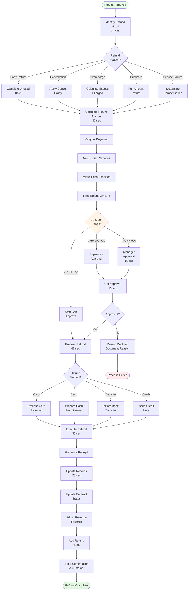

# Refund Processing

**Actor:** Staff Member / Manager  
**Trigger:** Customer entitled to refund (overpayment, early return, cancellation) **Frequency:**
Daily (3-5 times)

## Journey Steps

### 1. Identify Refund Need (20 seconds)

- Scenarios requiring refund:
  - Early return with payment
  - Cancellation within policy
  - Overcharge discovered
  - Duplicate payment
  - Service failure

### 2. Calculate Refund Amount (30 seconds)

- Original payment amount
- Services used/days rental
- Applicable fees/penalties
- Refund policy application
- Final refund amount

### 3. Get Approval (15 seconds)

- Under CHF 100: Staff approval
- CHF 100-500: Supervisor
- Over CHF 500: Manager
- Document approval

### 4. Process Refund (45 seconds)

- Select refund method:
  - Original payment method
  - Cash if card not available
  - Bank transfer
  - Credit note
- Enter refund amount
- Add reason code

### 5. Execute Refund (30 seconds)

- For card: Process reversal
- For cash: Count from drawer
- For transfer: Initiate transfer
- Generate receipt

### 6. Update Records (20 seconds)

- Update contract status
- Adjust revenue records
- Add refund notes
- Send confirmation
- File documentation

## Time Estimate

Total: ~3 minutes

## Why This is MVP Critical

- **Legal requirement:** Must refund when owed
- **Customer trust:** Quick refunds build loyalty
- **Financial accuracy:** Correct revenue reporting
- **Dispute prevention:** Avoid chargebacks

## Key Features Required

- Refund calculation logic
- Approval workflow
- Multiple refund methods
- Receipt generation
- Revenue adjustment
- Audit trail

## Visual Flow Chart

## Common Scenarios

### Early Return

- 5-day rental, returned after 3
- Refund 2 days
- Minus early return fee
- Process to card

### Cancellation

- Booked for next week
- Cancels within 48 hours
- Full refund policy
- Return deposit

### System Error

- Charged twice by mistake
- Full refund of duplicate
- Immediate processing
- Apology included

## Refund Policies

- 48+ hours cancel: 100% refund
- 24-48 hours: 50% refund
- <24 hours: No refund
- Early return: Pro-rata minus fee
- Service failure: Case by case

## Edge Cases Handled

- Card expired since payment
- Original payer unavailable
- Partial refunds
- Foreign currency considerations
- Refund exceeds daily limit
