# Daily Revenue Check

**Actor:** Owner  
**Trigger:** Morning routine or end-of-day review

## Journey Steps

### 1. Access Dashboard (5 seconds)

- Login with owner credentials
- Dashboard loads automatically

### 2. Review Metrics (30 seconds)

- View today's revenue by payment type (Card/Twint/Cash)
- See number of contracts created
- Check additional revenue from fuel/km
- Compare to yesterday/last week

### 3. Identify Opportunities (15 seconds)

- See which vehicles are most utilized
- Identify under-performing vehicles
- Note peak rental times

## Time Estimate

Total time: ~50 seconds for complete revenue review

## Key Features Required

- Owner-specific dashboard
- Real-time revenue tracking
- Payment method breakdown
- Contract counting
- Additional charges tracking
- Historical comparison tools
- Vehicle utilization metrics
- Peak time analysis

## Visual Flow Chart

```mermaid
flowchart TD
    Start([Owner starts morning/evening routine]) --> Login[🔐 Login with owner credentials<br/>5 seconds]
    Login --> Dashboard[📊 Dashboard loads automatically]
    Dashboard --> ReviewMetrics[💰 Review Today's Metrics<br/>30 seconds]

    ReviewMetrics --> Revenue[View revenue by payment type<br/>Card/Twint/Cash]
    ReviewMetrics --> Contracts[Check contracts created]
    ReviewMetrics --> AdditionalRev[Check fuel/km revenue]
    ReviewMetrics --> Compare[Compare to yesterday/last week]

    Revenue --> Opportunities[🎯 Identify Opportunities<br/>15 seconds]
    Contracts --> Opportunities
    AdditionalRev --> Opportunities
    Compare --> Opportunities

    Opportunities --> TopVehicles[See most utilized vehicles]
    Opportunities --> UnderPerform[Identify underperforming vehicles]
    Opportunities --> PeakTimes[Note peak rental times]

    TopVehicles --> Complete[✅ Complete revenue review<br/>Total: ~50 seconds]
    UnderPerform --> Complete
    PeakTimes --> Complete

    Complete --> End([End])

    classDef loginStyle fill:#e1f5fe,stroke:#01579b,stroke-width:2px
    classDef dashboardStyle fill:#f3e5f5,stroke:#4a148c,stroke-width:2px
    classDef reviewStyle fill:#e8f5e8,stroke:#1b5e20,stroke-width:2px
    classDef opportunityStyle fill:#fff3e0,stroke:#e65100,stroke-width:2px
    classDef completeStyle fill:#f1f8e9,stroke:#33691e,stroke-width:2px

    class Login loginStyle
    class Dashboard dashboardStyle
    class ReviewMetrics,Revenue,Contracts,AdditionalRev,Compare reviewStyle
    class Opportunities,TopVehicles,UnderPerform,PeakTimes opportunityStyle
    class Complete completeStyle
```

