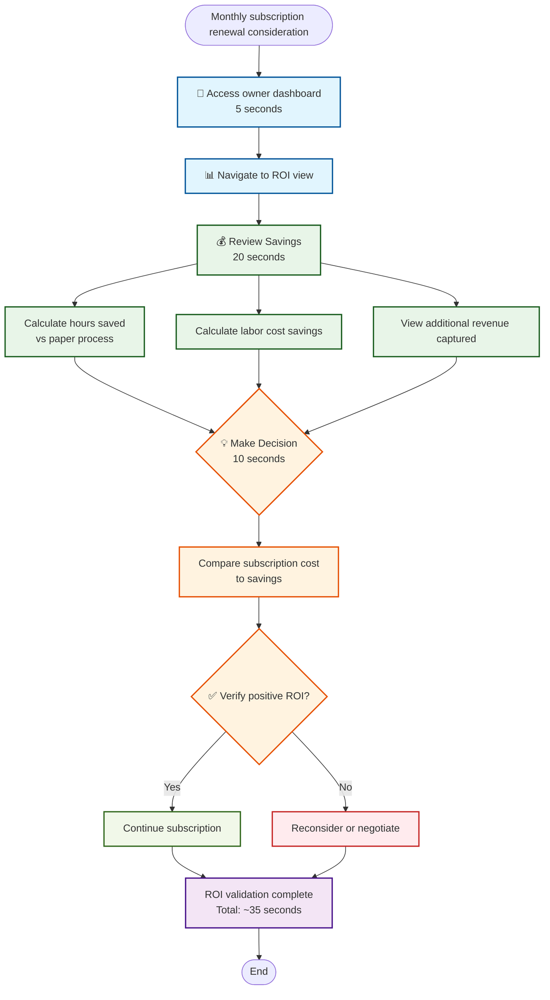

# ROI Validation

**Actor:** Owner  
**Trigger:** Monthly subscription renewal consideration

## Journey Steps

### 1. Open ROI Dashboard (5 seconds)
- Access owner dashboard
- Navigate to ROI view

### 2. Review Savings (20 seconds)
- See hours saved vs paper process
- Calculate labor cost savings
- View additional revenue captured

### 3. Make Decision (10 seconds)
- Compare subscription cost to savings
- Verify positive ROI
- Continue subscription

## Time Estimate
Total time: ~35 seconds for ROI review

## Key Features Required
- ROI-specific dashboard view
- Time savings calculator
- Labor cost analysis
- Revenue capture metrics
- Subscription cost comparison
- Clear ROI visualization
- Historical trend data

## Visual Flow Chart

