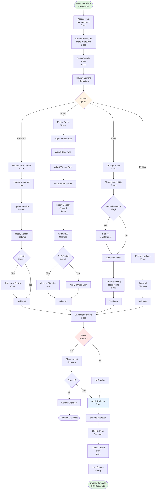

# Update Vehicle Information

**Actor:** Owner/Admin  
**Trigger:** Need to modify vehicle details, rates, or status

## Journey Steps

### 1. Locate Vehicle (15 seconds)

- Access fleet management
- Search by plate number or browse list
- Select vehicle to edit
- Review current information

### 2. Update Information (varies by change type)

- **Basic Details** (20 seconds)
  - Modify insurance information
  - Update service records
  - Change vehicle features
  - Update photos if needed

- **Rate Changes** (15 seconds)
  - Adjust hourly/daily/weekly/monthly rates
  - Modify deposit requirements
  - Update kilometer charges
  - Set seasonal pricing

- **Status Updates** (10 seconds)
  - Change availability status
  - Set maintenance flags
  - Update location
  - Modify booking restrictions

### 3. Validate Changes (10 seconds)

- System checks for conflicts
- Verify no active rentals affected
- Confirm rate changes for future bookings
- Review impact summary

### 4. Apply Updates (10 seconds)

- Save changes to database
- Update fleet calendar
- Notify affected staff
- Log change history

## Time Estimate

- Basic updates: ~30 seconds
- Rate changes: ~40 seconds
- Complete overhaul: ~60 seconds

## Key Features Required

- Vehicle search and filtering
- Edit mode with field validation
- Conflict detection for active rentals
- Rate change effective dating
- Change history logging
- Staff notification system
- Calendar synchronization
- Bulk update capability

## Visual Flow Chart

