# Quick Contract Lookup

**Actor:** Owner or Staff  
**Trigger:** Customer dispute or insurance claim

## Journey Steps

### 1. Search Contracts (15 seconds)

- Search by customer name, date, or vehicle
- Find specific contract

### 2. Review Documentation (30 seconds)

- Open PDF contract
- Review embedded photos
- Check signatures and timestamps
- Check payment method and amount
- Use for dispute resolution

## Time Estimate

Total time: ~45 seconds for contract lookup and review

## Key Features Required

- Advanced contract search functionality
- Multiple search criteria (name, date, vehicle)
- PDF viewing capability
- Photo display within contracts
- Signature verification
- Timestamp tracking
- Payment details display
- Print/export options for disputes

## Visual Flow Chart

```mermaid
flowchart TD
    Start([Customer dispute or insurance claim]) --> SearchContracts[🔍 Search Contracts<br/>15 seconds]

    SearchContracts --> SearchBy{Search criteria}

    SearchBy -->|Customer Name| SearchName[Search by customer name]
    SearchBy -->|Date| SearchDate[Search by date]
    SearchBy -->|Vehicle| SearchVehicle[Search by vehicle]

    SearchName --> FindContract[Find specific contract]
    SearchDate --> FindContract
    SearchVehicle --> FindContract

    FindContract --> ContractFound{Contract found?}

    ContractFound -->|Yes| ReviewDocs[📋 Review Documentation<br/>30 seconds]
    ContractFound -->|No| RefineSearch[Refine search criteria]

    RefineSearch --> SearchBy

    ReviewDocs --> OpenPDF[📄 Open PDF contract]
    ReviewDocs --> ViewPhotos[📷 Review embedded photos]
    ReviewDocs --> CheckSignatures[✍️ Check signatures and timestamps]
    ReviewDocs --> CheckPayment[💳 Check payment method and amount]

    OpenPDF --> UseForDispute[⚖️ Use for dispute resolution]
    ViewPhotos --> UseForDispute
    CheckSignatures --> UseForDispute
    CheckPayment --> UseForDispute

    UseForDispute --> ExportOption{Export needed?}

    ExportOption -->|Yes| ExportContract[📤 Print/export contract]
    ExportOption -->|No| Complete[Contract lookup complete<br/>Total: ~45 seconds]

    ExportContract --> Complete
    Complete --> End([End])

    classDef searchStyle fill:#e1f5fe,stroke:#01579b,stroke-width:2px
    classDef criteriaStyle fill:#fff3e0,stroke:#e65100,stroke-width:2px
    classDef reviewStyle fill:#e8f5e8,stroke:#1b5e20,stroke-width:2px
    classDef documentStyle fill:#f3e5f5,stroke:#4a148c,stroke-width:2px
    classDef decisionStyle fill:#ede7f6,stroke:#512da8,stroke-width:2px
    classDef disputeStyle fill:#ffecb3,stroke:#f57f17,stroke-width:2px
    classDef completeStyle fill:#f1f8e9,stroke:#33691e,stroke-width:2px
    classDef errorStyle fill:#ffebee,stroke:#c62828,stroke-width:2px

    class SearchContracts,FindContract searchStyle
    class SearchName,SearchDate,SearchVehicle criteriaStyle
    class ReviewDocs,OpenPDF,ViewPhotos,CheckSignatures,CheckPayment reviewStyle
    class SearchBy,ContractFound,ExportOption decisionStyle
    class UseForDispute,ExportContract disputeStyle
    class Complete completeStyle
    class RefineSearch errorStyle
```

