# Staff Account Management

**Actor:** Owner/Admin  
**Trigger:** New employee or role change

## Journey Steps

### 1. Access User Management (10 seconds)
- Login as owner
- Navigate to users section

### 2. Create/Modify Account (30 seconds)
- Add new staff member
- Set username and password
- Assign Staff role (limited permissions)
- Configure dashboard access
- Save account

## Time Estimate
Total time: ~40 seconds for account management

## Key Features Required
- User management interface
- Account creation/modification
- Role-based access control
- Permission configuration
- Dashboard access settings
- Secure password management
- Account activation/deactivation

## Visual Flow Chart

```mermaid
flowchart TD
    Start([New employee or role change]) --> Login[🔐 Login as owner<br/>10 seconds]
    Login --> Navigate[👥 Navigate to users section]
    Navigate --> AccountAction{Account Action Type}
    
    AccountAction -->|Create New| CreateAccount[➕ Add new staff member]
    AccountAction -->|Modify Existing| ModifyAccount[✏️ Modify existing account]
    
    CreateAccount --> SetCredentials[🔑 Set username and password<br/>30 seconds]
    ModifyAccount --> UpdateDetails[Update account details]
    
    SetCredentials --> AssignRole[👤 Assign Staff role<br/>limited permissions]
    UpdateDetails --> AssignRole
    
    AssignRole --> ConfigureDashboard[📊 Configure dashboard access]
    ConfigureDashboard --> SaveAccount[💾 Save account]
    
    SaveAccount --> Verification{✅ Account created/updated successfully?}
    
    Verification -->|Yes| Complete[Account management complete<br/>Total: ~40 seconds]
    Verification -->|No| ErrorHandle[Handle error and retry]
    
    ErrorHandle --> SetCredentials
    Complete --> End([End])
    
    classDef loginStyle fill:#e1f5fe,stroke:#01579b,stroke-width:2px
    classDef actionStyle fill:#fff3e0,stroke:#e65100,stroke-width:2px
    classDef configStyle fill:#e8f5e8,stroke:#1b5e20,stroke-width:2px
    classDef decisionStyle fill:#f3e5f5,stroke:#4a148c,stroke-width:2px
    classDef successStyle fill:#f1f8e9,stroke:#33691e,stroke-width:2px
    classDef errorStyle fill:#ffebee,stroke:#c62828,stroke-width:2px
    
    class Login,Navigate loginStyle
    class CreateAccount,ModifyAccount,SetCredentials,UpdateDetails actionStyle
    class AssignRole,ConfigureDashboard,SaveAccount configStyle
    class AccountAction,Verification decisionStyle
    class Complete successStyle
    class ErrorHandle errorStyle
```

