# Lost Key Process

**Actor:** Staff Member  
**Trigger:** Customer reports lost vehicle keys
**Frequency:** Weekly (1-2 times)

## Journey Steps

### 1. Receive Report (20 seconds)
- Customer reports lost keys
- Get details:
  - When noticed missing
  - Last known location
  - Where searched
  - Any spare key used

### 2. Verify Rental (10 seconds)
- Confirm active rental
- Check vehicle details
- Note key type (standard/smart)
- Check if spare exists

### 3. Document Loss (30 seconds)
- Create incident report
- Record circumstances
- Customer statement
- Search efforts made
- Time reported

### 4. Determine Solution (30 seconds)
Options:
- **Spare available:** Use spare key
- **No spare:** Order replacement
- **Smart key:** Dealer involvement
- **Urgent need:** Swap vehicle

### 5. Calculate Charges (20 seconds)
- Key replacement cost
- Programming fee (smart keys)
- Delivery/service charges
- Administrative fee
- Show total to customer

### 6. Process & Resolve (40 seconds)
- Get customer approval
- Process payment/deposit
- Arrange key replacement
- Provide temporary solution
- Update contract

## Time Estimate
Total: ~2.5 minutes (plus wait for replacement)

## Why This is MVP Critical
- **Weekly occurrence:** Common enough to need process
- **Revenue impact:** Keys cost CHF 200-800
- **Operational continuity:** Need vehicle back in service
- **Customer service:** Quick resolution needed

## Key Features Required
- Incident reporting
- Charge calculation
- Key replacement tracking
- Contract amendments
- Payment processing
- Vehicle status update

## Visual Flow Chart

```mermaid
flowchart TD
    Start([Customer Reports<br/>Lost Keys]) --> Receive[Receive Report<br/>20 sec]
    Receive --> GetDetails[When/Where Lost]
    GetDetails --> LastLocation[Last Known Location]
    LastLocation --> SearchDone[Areas Searched]
    
    SearchDone --> Verify[Verify Rental<br/>10 sec]
    Verify --> CheckContract[Check Active Contract]
    CheckContract --> VehicleDetails[Get Vehicle Details]
    VehicleDetails --> KeyType{Key Type?}
    
    KeyType -->|Standard| StandardKey[Regular Key]
    KeyType -->|Smart| SmartKey[Electronic Key]
    KeyType -->|Luxury| LuxuryKey[Special Key]
    
    StandardKey --> Document[Document Loss<br/>30 sec]
    SmartKey --> Document
    LuxuryKey --> Document
    
    Document --> CreateReport[Create Incident<br/>Report]
    CreateReport --> RecordDetails[Record All<br/>Circumstances]
    RecordDetails --> Statement[Customer Statement]
    Statement --> TimeReported[Time/Date Reported]
    
    TimeReported --> Solution[Determine Solution<br/>30 sec]
    Solution --> SpareAvail{Spare Key<br/>Available?}
    
    SpareAvail -->|Yes| UseSpare[Use Spare Key]
    SpareAvail -->|No| OrderNew[Order Replacement]
    
    UseSpare --> MinimalCharge[Charge Service<br/>Fee Only]
    OrderNew --> KeyCost[Calculate Costs<br/>20 sec]
    
    KeyCost --> ReplaceCost[Key Replacement:<br/>CHF 200-800]
    ReplaceCost --> Programming[Programming Fee:<br/>CHF 50-200]
    Programming --> Delivery[Delivery/Service:<br/>CHF 50-100]
    Delivery --> AdminFee[Admin Fee:<br/>CHF 50]
    AdminFee --> TotalCost[Show Total Cost]
    
    MinimalCharge --> GetApproval
    TotalCost --> GetApproval{Customer<br/>Approves?}
    
    GetApproval -->|No| Alternative[Discuss Alternatives]
    GetApproval -->|Yes| Process[Process Payment<br/>40 sec]
    
    Alternative --> SwapVehicle[Offer Vehicle Swap]
    SwapVehicle --> GetApproval
    
    Process --> Payment[Process Payment/<br/>Deposit]
    Payment --> Arrange[Arrange Replacement]
    Arrange --> Immediate{Immediate<br/>Need?}
    
    Immediate -->|Yes| TempSolution[Provide Temporary<br/>Solution]
    Immediate -->|No| Schedule[Schedule Replacement]
    
    TempSolution --> Update
    Schedule --> Update[Update Contract]
    Update --> AddCharges[Add Key Charges]
    AddCharges --> NotesAdd[Add Incident Notes]
    NotesAdd --> StatusUpdate[Update Vehicle<br/>Status if Needed]
    
    StatusUpdate --> End([Process Complete])
    
    style Start fill:#ffe6e6
    style End fill:#e1f5e1
    style KeyType fill:#fff4e6
    style GetApproval fill:#fff4e6
```

## Common Scenarios

### Standard Key Lost
- Regular metal key
- CHF 200-300 replacement
- Local locksmith can help
- 1-2 days for replacement

### Smart Key Lost
- Electronic/proximity key
- CHF 500-800 replacement
- Dealer programming required
- 3-5 days typical

### Lost During Rental
- Customer on vacation
- Needs vehicle urgently
- Use spare or swap vehicle
- Handle replacement later

## Cost Structure
| Key Type | Replacement | Programming | Total |
|----------|-------------|-------------|-------|
| Standard | CHF 200 | - | CHF 250 |
| Smart | CHF 500 | CHF 150 | CHF 700 |
| Luxury | CHF 800 | CHF 200 | CHF 1050 |

## Edge Cases Handled
- Both keys lost
- Key locked in vehicle
- Key damaged (not lost)
- Found after replacement ordered
- Customer disputes charges