# Automatic Backup

**Actor:** System  
**Trigger:** Daily at 2 AM

## Journey Steps

### 1. Backup Process (automatic)

- System creates database backup
- Stores in secure location
- Maintains 30-day backup history
- Sends confirmation to owner email

## Time Estimate

Automated process - runs in background

## Key Features Required

- Automated backup scheduler
- Database backup functionality
- Secure backup storage
- Backup rotation (30-day history)
- Email notification system
- Backup verification
- Restore capability (when needed)
- Backup monitoring and alerts

## Visual Flow Chart

```mermaid
flowchart TD
    A[⏰ Daily Schedule: 2 AM] --> B{System Ready?}
    B -->|Yes| C[💾 Create Database Backup]
    B -->|No| D[📝 Log Error & Retry Later]

    C --> E{Backup Successful?}
    E -->|Yes| F[🗄️ Store in Secure Location]
    E -->|No| G[⚠️ Generate Alert]

    F --> H[📅 Check Backup History]
    H --> I{More than 30 days?}
    I -->|Yes| J[🗑️ Delete Old Backups]
    I -->|No| K[✅ Verify Backup Integrity]

    J --> K
    K --> L{Verification Pass?}
    L -->|Yes| M[📧 Send Success Email to Owner]
    L -->|No| N[❌ Send Failure Alert]

    M --> O[📊 Update Backup Logs]
    G --> P[🔄 Schedule Retry]
    N --> P
    D --> P

    O --> Q[✅ Process Complete]
    P --> Q

    style A fill:#e1f5fe
    style C fill:#f3e5f5
    style F fill:#e8f5e8
    style M fill:#fff3e0
    style G fill:#ffebee
    style N fill:#ffebee
    style D fill:#ffebee
```

