# Session Timeout

**Actor:** System  
**Trigger:** 10 minutes of inactivity

## Journey Steps

### 1. Security Process (automatic)

- System detects inactivity
- Logs out user automatically
- Requires re-authentication
- Preserves any draft contract data

## Time Estimate

Automated process - instant execution

## Key Features Required

- Inactivity detection
- Automatic logout mechanism
- Session management
- Draft data preservation
- Re-authentication flow
- Security event logging
- Configurable timeout duration
- Warning notifications before timeout

## Visual Flow Chart

```mermaid
flowchart TD
    A[👤 User Active Session] --> B[⏰ Monitor Activity]
    B --> C{Activity Detected?}
    C -->|Yes| D[🔄 Reset Timer]
    C -->|No| E[📊 Count Inactive Time]

    D --> B
    E --> F{8 Minutes Passed?}
    F -->|No| G[⏳ Continue Monitoring]
    F -->|Yes| H[⚠️ Show Warning Notification]

    G --> C
    H --> I[⏰ Start 2-Minute Countdown]
    I --> J{User Responds?}
    J -->|Yes| K[🔄 Extend Session]
    J -->|No| L[📝 Preserve Draft Data]

    K --> D
    L --> M[🔒 Automatic Logout]
    M --> N[🗑️ Clear Session Data]
    N --> O[📊 Log Security Event]
    O --> P[🔐 Redirect to Login]

    P --> Q{User Returns?}
    Q -->|Yes| R[🔑 Re-authentication Required]
    Q -->|No| S[💾 Data Remains Preserved]

    R --> T{Auth Successful?}
    T -->|Yes| U[📄 Restore Draft Data]
    T -->|No| V[❌ Access Denied]

    U --> W[✅ Session Restored]

    style A fill:#e8f5e8
    style H fill:#fff3e0
    style M fill:#ffecb3
    style P fill:#e1f5fe
    style R fill:#f3e5f5
    style L fill:#e8f5e8
    style V fill:#ffebee
```

