# User Journey Visualizations

## Journey Flow Diagrams

### Critical Path: Complete Rental Lifecycle

```mermaid
graph TB
    Start([Customer Arrives]) --> Greet[Staff Greets Customer<br/>5 sec]
    Greet --> Check{New Customer?}
    
    %% New Customer Path
    Check -->|Yes| NewCust[Click 'New Customer'<br/>5 sec]
    NewCust --> EnterDetails[Enter Details:<br/>Name, ID, Phone,<br/>Email, Address<br/>20 sec]
    EnterDetails --> PhotoID[📸 Take Photo of<br/>ID Document<br/>5 sec]
    PhotoID --> PhotoLicense[📸 Take Photo of<br/>Driver's License<br/>Both Sides<br/>10 sec]
    PhotoLicense --> VerifyLicense[Verify License<br/>Validity & Expiration<br/>5 sec]
    VerifyLicense --> SaveCust[Save to Database<br/>5 sec]
    
    %% Returning Customer Path
    Check -->|No| SearchCust[Search by Name/<br/>ID Number<br/>10 sec]
    SearchCust --> SelectCust[Select from Results<br/>5 sec]
    SelectCust --> CheckBlacklist{Blacklisted?}
    CheckBlacklist -->|Yes| Reject[❌ Cannot Rent<br/>Notify Customer]
    CheckBlacklist -->|No| ReviewHistory[Review Rental<br/>History<br/>10 sec]
    
    %% Vehicle Selection
    SaveCust --> ViewFleet[View Fleet Calendar/<br/>Available Vehicles<br/>10 sec]
    ReviewHistory --> ViewFleet
    ViewFleet --> FilterVehicle{Need Filter?}
    FilterVehicle -->|Yes| ApplyFilter[Filter by Type<br/>5 sec]
    FilterVehicle -->|No| SelectVehicle
    ApplyFilter --> SelectVehicle[Select Vehicle<br/>10 sec]
    SelectVehicle --> VerifyClean[Verify Vehicle<br/>Clean & Ready<br/>5 sec]
    
    %% Contract Details
    VerifyClean --> EnterDates[Enter Start/End<br/>Dates & Times<br/>10 sec]
    EnterDates --> SelectRate[Select Rate Type:<br/>Hourly/Daily/<br/>Weekly/Monthly<br/>5 sec]
    SelectRate --> AddExtras{Add Extras?}
    AddExtras -->|Yes| SelectExtras[GPS, Child Seat,<br/>Insurance, etc.<br/>10 sec]
    AddExtras -->|No| CalcPrice
    SelectExtras --> CalcPrice[System Calculates<br/>Total with VAT<br/>5 sec]
    CalcPrice --> EnterMetrics[Enter Current:<br/>Fuel Level &<br/>Odometer<br/>10 sec]
    
    %% Documentation
    EnterMetrics --> VehiclePhotos[📸 Take 4 Photos:<br/>Front, Back,<br/>Both Sides<br/>20 sec]
    VehiclePhotos --> CheckDamage{Existing Damage?}
    CheckDamage -->|Yes| MarkDamage[Mark Damage<br/>on Photos<br/>15 sec]
    CheckDamage -->|No| Signatures
    MarkDamage --> Signatures[Capture Signatures:<br/>Customer & Staff<br/>10 sec]
    
    %% Payment
    Signatures --> Payment{Payment Method}
    Payment -->|Card| CardDetails[Enter Card Info<br/>10 sec]
    Payment -->|Twint| TwintQR[Show QR Code<br/>5 sec]
    Payment -->|Cash| CountCash[Count Cash &<br/>Give Change<br/>15 sec]
    
    CardDetails --> ProcessCard[Process Card<br/>Transaction<br/>10 sec]
    TwintQR --> VerifyTwint[Verify Twint<br/>Payment<br/>10 sec]
    CountCash --> RecordCash[Record Cash<br/>Payment<br/>5 sec]
    
    ProcessCard --> GenPDF
    VerifyTwint --> GenPDF
    RecordCash --> GenPDF[Generate PDF<br/>with Photos<br/>10 sec]
    
    GenPDF --> Deliver{Delivery Method}
    Deliver -->|Print| PrintContract[Print Contract<br/>15 sec]
    Deliver -->|Email| EmailContract[Email Contract<br/>5 sec]
    Deliver -->|Both| BothDelivery[Print & Email<br/>20 sec]
    
    PrintContract --> HandKeys
    EmailContract --> HandKeys
    BothDelivery --> HandKeys[Hand Over Keys<br/>5 sec]
    
    %% Rental Period
    HandKeys -.->|Rental Period| ReturnArrival([Customer Returns<br/>Vehicle])
    
    %% Return Process
    ReturnArrival --> SearchReturn[Search Active Rentals<br/>by Name/Plate<br/>10 sec]
    SearchReturn --> OpenContract[Open Active<br/>Contract<br/>5 sec]
    OpenContract --> ReturnPhotos[📸 Take 4 Photos:<br/>Front, Back,<br/>Both Sides<br/>20 sec]
    ReturnPhotos --> EnterReturn[Enter Return:<br/>Odometer &<br/>Fuel Level<br/>10 sec]
    EnterReturn --> ComparePhotos[Compare with<br/>Initial Photos<br/>15 sec]
    ComparePhotos --> NewDamage{New Damage?}
    
    NewDamage -->|Yes| DocDamage[Document Damage<br/>with Photos &<br/>Description<br/>30 sec]
    NewDamage -->|No| CalcCharges
    
    DocDamage --> EstRepair[Enter Repair<br/>Cost Estimate<br/>10 sec]
    EstRepair --> CalcCharges[Calculate Charges:<br/>KM Overage,<br/>Fuel Difference<br/>10 sec]
    
    CalcCharges --> ShowCharges[Show Total<br/>Additional Charges<br/>5 sec]
    ShowCharges --> AdditionalDue{Charges Due?}
    
    AdditionalDue -->|Yes| CustAgree{Customer<br/>Agrees?}
    AdditionalDue -->|No| FinalInvoice
    
    CustAgree -->|Yes| AckSign[Capture Customer<br/>Acknowledgment<br/>10 sec]
    CustAgree -->|No| Dispute[Create Dispute<br/>Note & Flag<br/>20 sec]
    
    AckSign --> PayExtra{Payment Method}
    PayExtra -->|Card| ExtraCard[Process Card<br/>10 sec]
    PayExtra -->|Twint| ExtraTwint[Process Twint<br/>10 sec]
    PayExtra -->|Cash| ExtraCash[Accept Cash<br/>10 sec]
    
    ExtraCard --> FinalInvoice
    ExtraTwint --> FinalInvoice
    ExtraCash --> FinalInvoice
    Dispute --> FinalInvoice[Generate Final<br/>Invoice PDF<br/>10 sec]
    
    FinalInvoice --> UpdateStatus[Mark Vehicle<br/>as Available<br/>5 sec]
    UpdateStatus --> CloseContract[Close Contract<br/>5 sec]
    
    CloseContract --> CheckMaint{Needs<br/>Maintenance?}
    CheckMaint -->|Yes| FlagMaint[Flag for<br/>Maintenance<br/>5 sec]
    CheckMaint -->|No| Complete
    
    FlagMaint --> InsuranceNote[Create Insurance<br/>Claim Note<br/>10 sec]
    InsuranceNote --> Complete([Rental Complete<br/>Vehicle Available])
    
    Reject --> End([Process Terminated])
    
    style Start fill:#e1f5fe
    style Complete fill:#c8e6c9
    style End fill:#ffebee
    style Payment fill:#fff3e0
    style PayExtra fill:#fff3e0
    style Reject fill:#ffebee
    style Dispute fill:#ffe6cc
```

### Staff Dashboard Daily Flow

## User Journey Map - New Rental

### Journey Stages & Touchpoints

## Service Blueprint - Rental Process

## Owner Dashboard - Information Architecture

## Decision Flow - Payment Processing

## State Diagram - Vehicle Lifecycle

## Customer Experience Map

## Pain Points & Solutions Matrix

| Journey Stage | Traditional Pain Point | CRMS Solution | Time Saved |
|--------------|------------------------|---------------|------------|
| Customer Search | Manual paper filing | Digital search < 15s | 5-10 min |
| Contract Creation | Handwritten forms | Auto-populated fields | 10-15 min |
| Pricing Calculation | Manual calculator | Automatic with VAT | 3-5 min |
| Photo Documentation | Separate camera + filing | Embedded in PDF | 5-10 min |
| Payment Tracking | Manual ledger | Digital tracking | 2-3 min |
| Vehicle Availability | Physical logbook | Real-time calendar | 3-5 min |
| Revenue Tracking | End-of-day counting | Automatic dashboard | 15-20 min |

## Implementation Priority Matrix

## Best Practices Applied

### 1. **Journey Mapping**
- Shows emotional highs/lows
- Identifies pain points
- Highlights opportunities

### 2. **Service Blueprint**
- Front-stage vs back-stage actions
- System touchpoints
- Support processes

### 3. **Flow Diagrams**
- Decision points
- Process steps
- Time estimates

### 4. **State Diagrams**
- Object lifecycle
- Status transitions
- Business rules

### 5. **Information Architecture**
- Dashboard organization
- Data hierarchy
- User mental models

## Usage Notes

These diagrams can be:
- **Embedded in documentation** - Mermaid renders in GitHub, GitLab, and most modern markdown viewers
- **Exported as images** - For presentations and external documents
- **Used for development** - Developers can follow the exact flows
- **Updated iteratively** - Easy to modify as requirements evolve
- **Shared with stakeholders** - Visual communication of system behavior

## Tools for Creating Journey Visualizations

1. **Mermaid** (used here) - Text-based, version-controlled, embedded in markdown
2. **Figma/FigJam** - Collaborative, visual journey mapping
3. **Miro/Mural** - Workshop-friendly, template-rich
4. **Lucidchart** - Professional diagrams, integrations
5. **Draw.io** - Free, extensive shape libraries